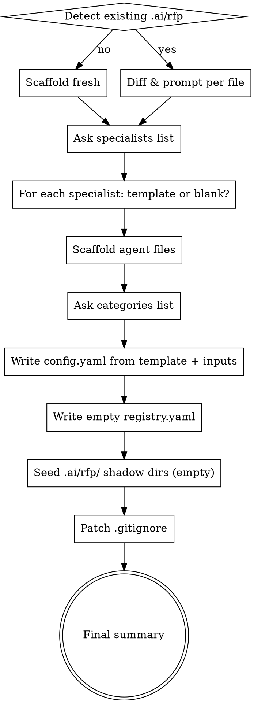
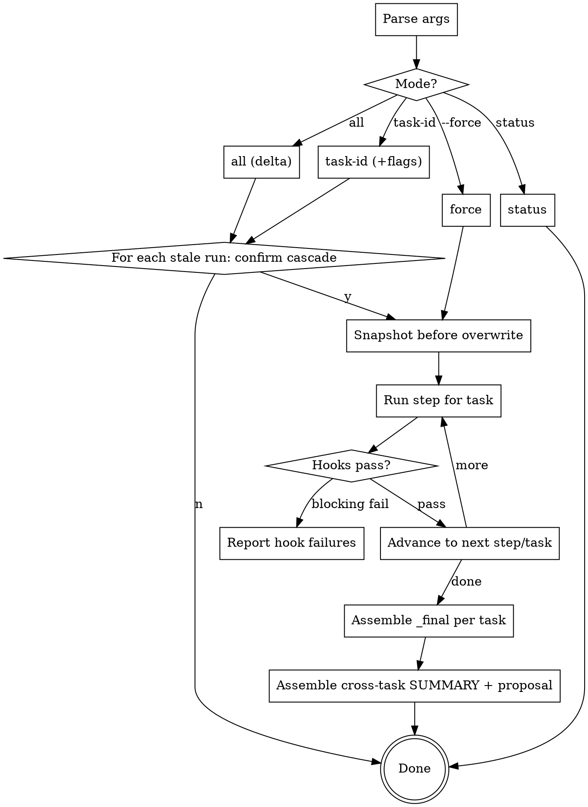

# dx-rfp Plugin Implementation Plan (MONSTER BACKUP)

> **For agentic workers:** REQUIRED SUB-SKILL: Use superpowers:subagent-driven-development (recommended) or superpowers:executing-plans to implement this plan task-by-task. Steps use checkbox (`- [ ]`) syntax for tracking.

> **BACKUP NOTICE:** This is the monster backup plan created for session-recovery. Covers all 6 subsystems end-to-end so the work can be continued from scratch in a new session. If session state survives, prefer breaking this into per-subsystem focused plans.

**Goal:** Build the `dx-rfp` plugin — generic, platform-agnostic Claude Code plugin for responding to formal enterprise RFPs with rigor, auditability, and defensibility.

**Architecture:** Five-primitive plugin (skills + agents + templates + shared refs + hooks) over an orchestrator that manages a `.state/` working memory, a manifest-driven re-run engine, and a multi-perspective pipeline with reviewer agents. Two override mechanisms (shadow + `{{include}}`). Deterministic validation via shell hooks layered on strict templates.

**Tech Stack:** Markdown skills + shell scripts (bash/POSIX). YAML for config, manifest, registers, context summaries. No build system. Runs inside Claude Code CLI.

**Source of truth:** `docs/superpowers/specs/2026-04-14-dx-rfp-plugin-design-v2.md`

**Location:** `plugins/dx-rfp/` alongside the existing 4 plugins.

---

## Subsystem Map

| # | Subsystem | Depends on | Key output |
|---|---|---|---|
| A | Plugin skeleton + `/rfp-init` + config/registry + shadow/include override | — | Workspace bootstrap |
| B | Shared refs + rules + template scaffolding | A | Content authoring surface |
| C | Orchestrator + `.state/` memory + manifest + re-run + `/rfp status` | A, B | Pipeline runner |
| D | Pipeline skills (7 skills) + multi-perspective + reviewers + consolidators | C | Deliverables |
| E | Hook framework + built-in deterministic hooks | C | Correctness enforcement |
| F | Five-way estimation + red-team critic roles + cross-task registers | D, E | Defensible bid |

Build in order A → B → C → D → E → F. Each subsystem ends with an integration test.

---

## Shared Foundations

### File Structure (all subsystems contribute)

```
plugins/dx-rfp/
├── .claude-plugin/plugin.json
├── .cursor-plugin/plugin.json
├── assets/logo.png
├── README.md
├── agents/
│   ├── rfp-tech-researcher.md
│   ├── rfp-client-researcher.md
│   └── rfp-reviewer-bid-manager.md
├── skills/
│   ├── rfp-init/SKILL.md
│   ├── rfp/SKILL.md
│   ├── rfp-analysis/SKILL.md
│   ├── rfp-work-packages/SKILL.md
│   ├── rfp-estimate/SKILL.md
│   ├── rfp-approach/SKILL.md
│   ├── rfp-ai-approach/SKILL.md
│   ├── rfp-clarifications/SKILL.md
│   └── rfp-red-team/SKILL.md
├── templates/
│   ├── config.yaml.template
│   ├── registry.yaml.template
│   ├── gitignore-additions.template
│   ├── agents/
│   │   ├── rfp-fe-specialist.md.template
│   │   ├── rfp-be-specialist.md.template
│   │   ├── rfp-platform-specialist.md.template
│   │   ├── rfp-ai-specialist.md.template
│   │   ├── rfp-qa-specialist.md.template
│   │   └── rfp-generic-specialist.md.template
│   └── results/
│       ├── analysis/{_primary,perspective,_reviewer,_consolidated}.md.template
│       ├── work-packages/{_primary,perspective,_reviewer,_consolidated}.md.template
│       ├── estimation/{_primary,_analogous,_parametric,_pert,perspective,_reviewer,_reconciliation,_consolidated}.md.template
│       ├── approach/{_primary,perspective,_reviewer,_consolidated}.md.template
│       ├── ai-approach/{_primary,_reviewer,_consolidated}.md.template
│       ├── clarifications/{_primary,perspective,_reviewer,_consolidated}.md.template
│       └── red-team/{_cost-critic,_timeline-critic,_risk-critic,_evaluator-critic,_compliance-critic,_consolidated}.md.template
├── shared/
│   ├── methodology.md
│   ├── estimation-framework.md
│   ├── question-filter.md
│   ├── narrative-blocks.md
│   ├── red-team-criteria.md
│   └── pitfalls.md
├── rules/
│   ├── pragmatism.md
│   ├── assume-not-ask.md
│   ├── template-fidelity.md
│   └── reviewer-charter.md
├── hooks/
│   ├── hooks.json
│   └── lib/
│       └── validate-*.sh (22 hooks listed in §9 of spec)
└── lib/
    ├── include-resolver.sh
    ├── shadow-resolver.sh
    ├── manifest.sh
    └── hash.sh
```

### Contract: Shadow Resolution

`lib/shadow-resolver.sh` exports function `resolve_shadow(relative_path)`:
- If `.ai/rfp/<relative_path>` exists → echo `.ai/rfp/<relative_path>`
- Else → echo `${DX_RFP_ROOT}/<relative_path>`

### Contract: Include Expansion

`lib/include-resolver.sh` exports function `expand_includes(file_path, [visited])`:
- Read file line-by-line
- For `{{include: <rel-path>}}` lines: recursively expand `resolve_shadow(<rel-path>)`
- Detect cycles via `visited` set; error with clear message
- Output expanded content to stdout

### Contract: Manifest API

`lib/manifest.sh` exports:
- `manifest_record_run(task, step, agent, inputs_json, output_path, output_sha)`
- `manifest_get_last_run(task, step, agent)` → prints YAML fragment
- `manifest_is_stale(task, step, agent)` → exit 0 if stale, 1 if fresh
- `manifest_list_runs_for(task, step)` → prints IDs

Manifest format: see spec §8.6.

---

# SUBSYSTEM A — Plugin Skeleton, `/rfp-init`, Override Model

### Task A1: Plugin skeleton

**Files:**
- Create: `plugins/dx-rfp/.claude-plugin/plugin.json`
- Create: `plugins/dx-rfp/.cursor-plugin/plugin.json`
- Create: `plugins/dx-rfp/README.md`
- Create: `plugins/dx-rfp/assets/.gitkeep`

- [ ] **Step 1: Write `.claude-plugin/plugin.json`**

```json
{
  "name": "dx-rfp",
  "description": "Generic Claude Code plugin for responding to formal enterprise RFPs. Multi-perspective pipeline with deterministic validation.",
  "version": "0.1.0",
  "author": "Dragan Filipovic"
}
```

- [ ] **Step 2: Write `.cursor-plugin/plugin.json`** (mirror with explicit paths — follow dx-aem pattern from existing plugins)

- [ ] **Step 3: Write minimal README.md** describing purpose, not yet usage (filled after skills land)

- [ ] **Step 4: Commit**

```bash
git add plugins/dx-rfp/
git commit -m "feat(dx-rfp): scaffold plugin skeleton"
```

### Task A2: Marketplace registration

**Files:**
- Modify: `.claude-plugin/marketplace.json` (add dx-rfp entry)

- [ ] **Step 1: Add dx-rfp entry** to the marketplace file matching the shape used for dx-core, dx-aem, dx-automation, dx-hub.

- [ ] **Step 2: Verify install path**

```bash
cat .claude-plugin/marketplace.json | jq '.plugins[] | select(.name == "dx-rfp")'
```

- [ ] **Step 3: Commit**

### Task A3: Shell helper library — `lib/shadow-resolver.sh`

**Files:**
- Create: `plugins/dx-rfp/lib/shadow-resolver.sh`
- Test: `plugins/dx-rfp/lib/tests/test-shadow-resolver.sh`

- [ ] **Step 1: Write the test** (shell-based, uses tmpdir fixtures)

```bash
#!/usr/bin/env bash
set -euo pipefail
source "$(dirname "$0")/../shadow-resolver.sh"

TMP=$(mktemp -d)
trap "rm -rf $TMP" EXIT

export DX_RFP_ROOT="$TMP/plugin"
mkdir -p "$DX_RFP_ROOT/shared"
echo "plugin version" > "$DX_RFP_ROOT/shared/methodology.md"

# Case 1: no shadow → resolves to plugin
cd "$TMP"
result=$(resolve_shadow "shared/methodology.md")
[[ "$result" == "$DX_RFP_ROOT/shared/methodology.md" ]] || { echo "FAIL case 1"; exit 1; }

# Case 2: shadow present → resolves to shadow
mkdir -p ".ai/rfp/shared"
echo "user version" > ".ai/rfp/shared/methodology.md"
result=$(resolve_shadow "shared/methodology.md")
[[ "$result" == ".ai/rfp/shared/methodology.md" ]] || { echo "FAIL case 2"; exit 1; }

echo "PASS"
```

- [ ] **Step 2: Run test → FAIL** (script not implemented)

- [ ] **Step 3: Implement `shadow-resolver.sh`**

```bash
#!/usr/bin/env bash
# shadow-resolver.sh — resolve a relative path to either consumer shadow or plugin default

resolve_shadow() {
  local rel_path="$1"
  local shadow_path=".ai/rfp/${rel_path}"
  if [[ -f "$shadow_path" ]]; then
    echo "$shadow_path"
  else
    echo "${DX_RFP_ROOT}/${rel_path}"
  fi
}
```

- [ ] **Step 4: Run test → PASS**
- [ ] **Step 5: Commit**

### Task A4: Shell helper library — `lib/include-resolver.sh`

**Files:**
- Create: `plugins/dx-rfp/lib/include-resolver.sh`
- Test: `plugins/dx-rfp/lib/tests/test-include-resolver.sh`

- [ ] **Step 1: Write the test** covering:
  - Plain file, no includes — passes through
  - Single include — expands
  - Nested include (A includes B includes C) — fully expanded
  - Shadow-aware include (shadow version preferred) — resolves correctly
  - Circular include (A → B → A) — errors with clear message

- [ ] **Step 2: Run → FAIL**

- [ ] **Step 3: Implement**

```bash
#!/usr/bin/env bash
# include-resolver.sh — expand {{include: <path>}} directives recursively with shadow resolution

source "$(dirname "${BASH_SOURCE[0]}")/shadow-resolver.sh"

expand_includes() {
  local file_path="$1"
  local -n _visited="${2:-__default_visited}"

  if [[ -n "${_visited[$file_path]:-}" ]]; then
    echo "ERROR: circular include detected at $file_path" >&2
    return 1
  fi
  _visited[$file_path]=1

  while IFS= read -r line; do
    if [[ "$line" =~ \{\{include:\ *([^}[:space:]]+)\ *\}\} ]]; then
      local rel="${BASH_REMATCH[1]}"
      local resolved
      resolved=$(resolve_shadow "$rel")
      expand_includes "$resolved" _visited
    else
      echo "$line"
    fi
  done < "$file_path"

  unset '_visited[$file_path]'
}

declare -A __default_visited
```

- [ ] **Step 4: Run → PASS**
- [ ] **Step 5: Commit**

### Task A5: `config.yaml.template`

**Files:**
- Create: `plugins/dx-rfp/templates/config.yaml.template`

- [ ] **Step 1: Write template** (full shape from spec §11.1, with placeholder values only — no client data)

- [ ] **Step 2: Validate it parses as YAML**

```bash
python3 -c "import yaml; yaml.safe_load(open('plugins/dx-rfp/templates/config.yaml.template'))"
```

- [ ] **Step 3: Commit**

### Task A6: `registry.yaml.template`

**Files:**
- Create: `plugins/dx-rfp/templates/registry.yaml.template`

Template shape:
```yaml
tasks: []
```

- [ ] Commit.

### Task A7: `gitignore-additions.template`

**Files:**
- Create: `plugins/dx-rfp/templates/gitignore-additions.template`

```
# dx-rfp
.ai/rfp/client-docs/
.ai/rfp/.state/
```

### Task A8: Starter agent templates (6 files)

**Files:**
- Create: `plugins/dx-rfp/templates/agents/rfp-fe-specialist.md.template`
- Create: `plugins/dx-rfp/templates/agents/rfp-be-specialist.md.template`
- Create: `plugins/dx-rfp/templates/agents/rfp-platform-specialist.md.template`
- Create: `plugins/dx-rfp/templates/agents/rfp-ai-specialist.md.template`
- Create: `plugins/dx-rfp/templates/agents/rfp-qa-specialist.md.template`
- Create: `plugins/dx-rfp/templates/agents/rfp-generic-specialist.md.template`

Each has standard agent YAML frontmatter + sections: Role, Responsibilities, Domain Knowledge (placeholder), Key Concerns. User edits after scaffolding.

- [ ] Commit after all 6.

### Task A9: `rfp-init` SKILL.md

**Files:**
- Create: `plugins/dx-rfp/skills/rfp-init/SKILL.md`

Skill is a branching skill — use DOT digraph (spec §14). Flow:



Plus matching `### Node Details` per node. Idempotency matrix from spec §12.

- [ ] Commit.

### Task A10: Integration test for Subsystem A

**Files:**
- Create: `plugins/dx-rfp/tests/test-init.sh`

- [ ] **Step 1: Write test** — fresh tmpdir, run `/rfp-init` via scripted input, assert:
  - `.ai/rfp/config.yaml` exists and parses
  - `.ai/rfp/registry.yaml` exists and is `{tasks: []}`
  - `.claude/agents/rfp-*-specialist.md` exist per declared specialists
  - `.gitignore` contains `.ai/rfp/client-docs/` and `.ai/rfp/.state/`

- [ ] **Step 2: Run manually** in a scratch directory
- [ ] **Step 3: Commit**

---

# SUBSYSTEM B — Shared Refs, Rules, Templates

### Task B1: `shared/methodology.md`

Contains: 5-phase process (Qualification → Analysis → Design → Estimation → Narrative & Review), 12-role archetype catalog, effort distribution benchmarks by phase.

- [ ] Write, commit.

### Task B2: `shared/estimation-framework.md`

Contains: Cockburn π calibration (2.0, 2.8, 3.14, 3.5 tiers), overhead factors, PERT formulas, five-way reconciliation playbook, outlier rules.

- [ ] Write, commit.

### Task B3: `shared/question-filter.md`

Contains: three-gate filter (materiality, ambiguity, assumption cost), "ASSUME not ASK" philosophy, question density targets.

- [ ] Write, commit.

### Task B4: `shared/narrative-blocks.md`

Contains: 5-block spec — Categorization, Assumptions, Exclusions, Uncertainties, Delivery. Word-count guidance per block.

- [ ] Write, commit.

### Task B5: `shared/red-team-criteria.md`

Contains: 5 critic rubrics (cost, timeline, risk, evaluator, compliance), weak-section heuristics, scoring scale.

- [ ] Write, commit.

### Task B6: `shared/pitfalls.md`

Contains: 10 named RFP-response anti-patterns.

- [ ] Write, commit.

### Task B7: Prompt rules (4 files)

**Files:**
- `plugins/dx-rfp/rules/pragmatism.md`
- `plugins/dx-rfp/rules/assume-not-ask.md`
- `plugins/dx-rfp/rules/template-fidelity.md`
- `plugins/dx-rfp/rules/reviewer-charter.md`

- [ ] Write each, commit.

### Task B8: Result templates — analysis step

**Files (4):**
- `templates/results/analysis/_primary.md.template`
- `templates/results/analysis/perspective.md.template`
- `templates/results/analysis/_reviewer.md.template`
- `templates/results/analysis/_consolidated.md.template`

Each has:
- YAML frontmatter (`task`, `step`, `agent`, `version`)
- **Hard sections:** fenced YAML blocks for machine-parseable data
- **Soft sections:** prose with word-count hints

Example `_primary.md.template`:

```markdown
---
task: {{task}}
step: analysis
agent: _primary
version: 1
---

## Summary
{150-250 words — scope understanding in your own words}

## Scope Items

```yaml
scope_items:
  - id: SI-001
    title: ""
    description: ""
    evidence:
      - ref: "rfp-section-X"
        quote: ""
    dependencies: []
```

## Findings
- {bullet}

## Risks
```yaml
risks:
  - id: R-001
    text: ""
    likelihood: low | medium | high
    impact_pd_range: [0, 0]
```

## Dependencies
```yaml
dependencies:
  - from: SI-XXX
    to: SI-YYY
    kind: blocks | informs | enables
```
```

- [ ] Write all 4, commit.

### Task B9: Result templates — work-packages step (4 files)

Same shape. Machine region for `_primary`:

```yaml
work_packages:
  - id: WP-01
    title: ""
    scope_items: [SI-001, SI-002]
    owner: {specialist-id}
    pd_estimate: 0
    dependencies: []
```

- [ ] Write 4 templates, commit.

### Task B10: Result templates — estimation step (8 files)

`_primary`, `_analogous`, `_parametric`, `_pert`, `perspective`, `_reviewer`, `_reconciliation`, `_consolidated`.

`_pert.md.template` machine region:

```yaml
pert:
  - wp: WP-01
    o: 0    # optimistic
    m: 0    # most likely
    p: 0    # pessimistic
    expected: 0    # (O + 4M + P) / 6 — validated by hook
    stddev: 0      # (P - O) / 6 — validated by hook
```

`_reconciliation.md.template` machine region:

```yaml
reconciliation:
  methods:
    - name: bottom_up
      total_pd: 0
    - name: analogous
      total_pd: 0
    - name: parametric
      total_pd: 0
    - name: pert
      total_pd: 0
  outliers: []   # entries where |delta| > config.estimation.reconciliation_tolerance
  reconciled_pd: 0
  reconciled_range: [0, 0]
  confidence: low | medium | high
  rationale: ""
```

- [ ] Write 8 templates, commit.

### Task B11: Result templates — approach, ai-approach, clarifications, red-team

Approach (4): `_primary`, `perspective`, `_reviewer`, `_consolidated`
AI-approach (3): `_primary`, `_reviewer`, `_consolidated`
Clarifications (4): same pattern; machine region is `questions: [{id, text, assumption, impact, category}]`
Red-team (6): `_cost-critic`, `_timeline-critic`, `_risk-critic`, `_evaluator-critic`, `_compliance-critic`, `_consolidated`. Machine region per critic:

```yaml
scores:
  - section: ""
    score: 0    # 0-10
    max: 10
    rationale: ""
weak_sections: []
recommendations: []
```

- [ ] Write all templates, commit in chunks.

### Task B12: Integration smoke — include-resolver exercises shared refs

**Files:**
- Create: `plugins/dx-rfp/tests/test-shared-includes.sh`

- [ ] Write a fixture markdown file with `{{include: shared/methodology.md}}`, run resolver, assert output is non-empty and contains known marker strings from methodology.md.
- [ ] Commit.

---

# SUBSYSTEM C — Orchestrator, `.state/`, Manifest, Re-run

### Task C1: `lib/hash.sh`

**Files:**
- Create: `plugins/dx-rfp/lib/hash.sh`
- Test: `plugins/dx-rfp/lib/tests/test-hash.sh`

Exports `hash_file(path)` (sha256 of contents) and `hash_config_section(path, jq_expr)` (sha256 of a YAML subtree extracted via `yq`).

- [ ] TDD. Commit.

### Task C2: `lib/manifest.sh`

**Files:**
- Create: `plugins/dx-rfp/lib/manifest.sh`
- Test: `plugins/dx-rfp/lib/tests/test-manifest.sh`

Exports:
- `manifest_record_run(task, step, agent, inputs_yaml, output_path, output_sha)` — appends a run entry
- `manifest_last_run_for(task, step, agent)` — echoes YAML fragment or empty
- `manifest_is_stale(task, step, agent, current_inputs_yaml)` — exit 0 if stale
- `manifest_list_stale()` — prints task×step×agent triples that are stale

Storage: `.ai/rfp/.state/manifest.yaml`. Uses `yq` for YAML manipulation.

- [ ] Tests cover: first record, subsequent same-hash (fresh), different-hash (stale), missing file (stale).
- [ ] Commit.

### Task C3: `.state/` directory lifecycle

**Files:**
- Create: `plugins/dx-rfp/lib/state.sh`

Functions:
- `state_init()` — creates `.state/` structure
- `state_snapshot_before_overwrite(path)` — moves path to `.state/runs/<ts>/...` preserving structure
- `state_write_lock(name, content)` / `state_read_lock(name)` / `state_invalidate_lock(name)`
- `state_write_context(task, step, yaml)` / `state_read_context(task, step)`
- `state_register_append(register_name, entry_yaml)` with fuzzy-dedup hook for `clarifications.yaml`

- [ ] TDD each function. Commit per function group.

### Task C4: `rfp` orchestrator skill — SKILL.md

**Files:**
- Create: `plugins/dx-rfp/skills/rfp/SKILL.md`

Branching skill (DOT digraph). High-level flow:



### Node Details sections cover:
- Argument parsing (five scopes from spec §10.1)
- Stale detection via manifest
- Cascade confirmation UX (spec §10.2)
- Snapshot procedure (spec §10.4)
- Per-step skill dispatch — delegates to `/rfp-<step>` skill
- Hook dispatch (reads hook registry, runs matching hooks by event)
- `_final.md` assembly logic
- `SUMMARY.md` and `proposal.md` cross-task assembly

- [ ] Write SKILL.md. Commit.

### Task C5: `/rfp status` subcommand

Handled inside `rfp` SKILL.md based on arg parse. Reads manifest, computes freshness per task × step, prints report (spec §10.5).

- [ ] Already covered by C4 but verify explicit handling.

### Task C6: Orchestrator dry-run integration test

**Files:**
- Create: `plugins/dx-rfp/tests/test-orchestrator-dry-run.sh`

Fixture: 2-task registry, mock skill runners that write canned outputs. Verify:
- All 7 steps run in order
- Manifest records all runs
- `.state/context/*.yaml` written
- `.state/locks/*.md` written at correct step boundaries
- Second run (no changes) detects all fresh, runs nothing
- Edit a client doc → second run flags analysis stale → cascades

- [ ] Commit.

---

# SUBSYSTEM D — Pipeline Skills (7)

Each pipeline skill follows the same pattern:

1. Read `RFP_TASK_ID` from orchestrator env
2. Resolve mode: `generate` (task pending) or `review` (task done)
3. Assemble agent input bundle per spec §8.7
4. Dispatch primary specialist → write `_primary.md` using template
5. Dispatch perspectives in parallel → write `<perspective>.md` each
6. For `estimation`: additionally dispatch `_analogous`, `_parametric`, `_pert` methods
7. Dispatch reviewer → write `_reviewer.md`
8. Run `post-agent` hooks on each shard
9. Dispatch consolidator → write `_consolidated.md`
10. Run `post-step` hooks
11. Write summary to `.state/context/<task>/<step>.yaml`
12. Update registers (spec §8.5)

### Task D1: `/rfp-analysis` SKILL.md

- [ ] Follow pattern above. Commit.

### Task D2: `/rfp-work-packages` SKILL.md

Same pattern. Writes `wbs` lock at step end.

- [ ] Commit.

### Task D3: `/rfp-estimate` SKILL.md

Same pattern + five-way (primary, analogous, parametric, PERT, perspectives) + `_reconciliation.md`. Consolidator must respect tolerance.

Machine hook dependencies:
- `rfp-validate-pd-matrix-sums`
- `rfp-validate-bottom-up-times-multiplier`
- `rfp-validate-pert-formula`
- `rfp-validate-reconciliation-within-tolerance`

- [ ] Commit.

### Task D4: `/rfp-approach` SKILL.md

5 blocks (spec §13 narrative-blocks.md).

- [ ] Commit.

### Task D5: `/rfp-ai-approach` SKILL.md

Optional — orchestrator skips if `config.rfp.skills.ai_approach.enabled: false`.

- [ ] Commit.

### Task D6: `/rfp-clarifications` SKILL.md

Reads cross-task register to dedup. Writes merged entries back to register.

- [ ] Commit.

### Task D7: `/rfp-red-team` SKILL.md

Dispatches 5 critic agents from `config.rfp.red_team.critics` list.

- [ ] Commit.

### Task D8: Shipped agents

**Files:**
- `plugins/dx-rfp/agents/rfp-tech-researcher.md`
- `plugins/dx-rfp/agents/rfp-client-researcher.md`
- `plugins/dx-rfp/agents/rfp-reviewer-bid-manager.md`

Each: standard agent frontmatter, tools whitelist, system prompt. Researchers use WebSearch, WebFetch, Read, Grep, Glob. Reviewer uses Read, Grep, Glob only.

- [ ] Write all 3, commit.

### Task D9: End-to-end pipeline smoke test

**Files:**
- Create: `plugins/dx-rfp/tests/test-pipeline-smoke.sh`

Fixture: 1-task registry, stubbed agent invocations returning fixed outputs. Assert full pipeline produces all expected shards, `.state/` is populated, hooks pass.

- [ ] Commit.

---

# SUBSYSTEM E — Hook Framework

### Task E1: Hook registry format + loader

**Files:**
- Create: `plugins/dx-rfp/lib/hooks.sh`
- Test: `plugins/dx-rfp/lib/tests/test-hooks.sh`

Functions:
- `hooks_load_registries()` — merges plugin `hooks/hooks.json` + user `.ai/rfp/hooks/hooks.json` (if present), applies `config.rfp.hooks.disabled` list
- `hooks_for_event(event, step, agent)` — returns ordered list of hook ids whose declared event/steps/agents match
- `hooks_run_one(hook_id, env_vars)` — runs the hook script, returns exit code, captures stdout/stderr
- `hooks_run_all(hook_ids, env_vars, blocking_only=false)` — runs list, aggregates results

- [ ] TDD each function. Commit.

### Task E2: `hooks.json` — plugin registry

Declare all 22 built-in hooks from spec §9.2 with event/steps/agents/blocking flags.

- [ ] Write, commit.

### Task E3: Built-in hooks — arithmetic (4 scripts)

**Files:**
- `hooks/lib/validate-pd-matrix-sums.sh`
- `hooks/lib/validate-bottom-up-times-multiplier.sh`
- `hooks/lib/validate-pert-formula.sh`
- `hooks/lib/validate-percent-totals-100.sh`

Each: parses YAML from shard via `yq`, runs arithmetic check, exits 0 or 2 with clear stderr.

Example — `validate-pd-matrix-sums.sh`:

```bash
#!/usr/bin/env bash
set -euo pipefail
SHARD="${RFP_SHARD_PATH}"

# Extract PD matrix YAML block (fenced under ## PD Matrix)
yaml=$(awk '/^## PD Matrix$/,/^## /{print}' "$SHARD" | sed -n '/```yaml/,/```/p' | sed '1d;$d')

# Recompute sums
computed_by_role=$(echo "$yaml" | yq '[.roles[] | {(.id): ([.wps[].pd] | add)}] | add')
declared_by_role=$(echo "$yaml" | yq '.totals.by_role')

if [[ "$computed_by_role" != "$declared_by_role" ]]; then
  echo "PD matrix sums do not match:" >&2
  echo "  computed by_role: $computed_by_role" >&2
  echo "  declared by_role: $declared_by_role" >&2
  exit 2
fi
# … similar for by_wp, bottom_up, top_line
exit 0
```

- [ ] TDD each, commit per hook.

### Task E4: Built-in hooks — ranges (3 scripts)

- `validate-wp-pd-range.sh`
- `validate-multiplier-range.sh`
- `validate-word-counts.sh`

- [ ] TDD each, commit.

### Task E5: Built-in hooks — completeness (4 scripts)

- `validate-every-wp-has-owner.sh`
- `validate-every-scope-covered.sh`
- `validate-every-role-used.sh`
- `validate-all-perspectives-present.sh`

- [ ] TDD, commit.

### Task E6: Built-in hooks — cross-reference (3 scripts)

- `validate-wp-ids-match-wbs.sh`
- `validate-scope-items-in-lock.sh`
- `validate-specialist-exists-in-config.sh`

- [ ] TDD, commit.

### Task E7: Built-in hooks — uniqueness (2 scripts)

- `validate-no-duplicate-wp-ids.sh`
- `validate-clarification-dedup.sh` (fuzzy, uses simple jaccard over whitespace-tokenized text)

- [ ] TDD, commit.

### Task E8: Built-in hooks — schema (3 scripts)

- `validate-template-frontmatter.sh`
- `validate-yaml-blocks-parse.sh`
- `validate-required-sections-present.sh`

- [ ] TDD, commit.

### Task E9: Built-in hooks — cross-step + policy (3 scripts)

- `validate-estimation-wps-match-wbs.sh`
- `validate-reconciliation-within-tolerance.sh`
- `validate-no-client-name-leak.sh`
- `validate-date-format.sh`
- `validate-no-placeholder-tokens.sh`

- [ ] TDD, commit.

### Task E10: User hook merge integration test

**Files:**
- Create: `plugins/dx-rfp/tests/test-user-hook-merge.sh`

Assert: user hook appended after plugin hooks for same event; user disable list honored; collision errors.

- [ ] Commit.

---

# SUBSYSTEM F — Five-Way Estimation + Red-Team Critics + Registers

### Task F1: Estimation method agents (conceptually shipped as sub-skills under `/rfp-estimate`)

No new files — `/rfp-estimate` already dispatches `_analogous`, `_parametric`, `_pert` using their templates. Verify templates carry enough instruction for the primary specialist to produce each method's output.

- [ ] Test against fixture, commit any template refinements.

### Task F2: Reconciliation logic

In `/rfp-estimate` SKILL.md — the consolidator step reads all 5 method outputs and produces `_reconciliation.md`.

Logic:
1. Read each method's total PD
2. Compute mean, stddev across methods
3. Flag methods where `|method - mean| / mean > tolerance`
4. Produce reconciled PD (either median or weighted average depending on outliers)
5. Write rationale

Hook: `validate-reconciliation-within-tolerance.sh` enforces the math.

- [ ] Commit.

### Task F3: Red-team critic agents

Red-team dispatches 5 critic prompts. Critics can be shipped as agent files OR inline prompts in the skill. Decision: ship 5 agent files for swappability.

**Files:**
- `plugins/dx-rfp/agents/rfp-critic-cost.md`
- `plugins/dx-rfp/agents/rfp-critic-timeline.md`
- `plugins/dx-rfp/agents/rfp-critic-risk.md`
- `plugins/dx-rfp/agents/rfp-critic-evaluator.md`
- `plugins/dx-rfp/agents/rfp-critic-compliance.md`

Each has a focused system prompt describing their adversarial angle + red-team criteria include.

- [ ] Commit.

### Task F4: Register management — clarifications dedup

In `/rfp-clarifications`:
1. Before generating: read `.state/registers/clarifications.yaml`
2. Include in agent prompt: "Here are N questions already asked in other tasks. Do not repeat."
3. After generating: fuzzy-dedup against register, append new entries
4. Hook `validate-clarification-dedup.sh` catches slippage

- [ ] Implement in skill, TDD, commit.

### Task F5: Cross-task `SUMMARY.md` and `proposal.md` assembly

In orchestrator — after all tasks complete:
- `SUMMARY.md`: PD totals by task, cluster aggregates, status roll-up
- `proposal.md`: concatenation of each task's `_final.md` under a common structure

Both regenerated on every orchestrator run (cheap).

- [ ] Implement, test, commit.

### Task F6: Full end-to-end acceptance test

**Files:**
- Create: `plugins/dx-rfp/tests/test-acceptance.sh`

Fixture: 2-task registry (e.g., `aem-authoring`, `be-api`), 2 specialists (`aem-content-lead`, `be-lead`), perspectives, client-docs stub.

Assertions match spec §16 v1 Done-When list.

- [ ] Commit.

---

## Cross-Cutting Tasks

### Task X1: Update `validate-skills.sh`

Extend the repo's naming validator to include `dx-rfp` prefix check.

- [ ] Commit.

### Task X2: Update `docs/reference/skill-catalog.md`

Add dx-rfp skills to the catalog.

- [ ] Commit.

### Task X3: Update `docs/reference/agent-catalog.md`

Add shipped agents (`rfp-tech-researcher`, `rfp-client-researcher`, `rfp-reviewer-bid-manager`, 5 critics).

- [ ] Commit.

### Task X4: Update website docs

Add dx-rfp section to the Astro site (`website/src/content/docs/plugins/dx-rfp/*`).

- [ ] Commit.

### Task X5: Final client-leak grep gate

```bash
grep -rniEf .ai/client-names.txt plugins/dx-rfp/ && echo FAIL || echo PASS
# Consumer maintains a local .ai/client-names.txt (gitignored) with names/URLs/tokens to guard against.
```

Must print PASS.

- [ ] Verify, commit any scrubbing.

---

## Session Recovery Checklist

If you're reading this after a session loss:

1. **Check `docs/superpowers/specs/2026-04-14-dx-rfp-plugin-design-v2.md`** — the source of truth for every decision
2. **Check git log for `feat(dx-rfp):`** commits — shows implementation progress
3. **Check `plugins/dx-rfp/`** — if missing, start at Task A1
4. **Check `.claude-plugin/marketplace.json`** — dx-rfp entry = Task A2 done
5. **Check `plugins/dx-rfp/lib/*.sh`** — foundation helpers, prerequisite for everything
6. **Grep skill files for `{{include:`** — include-resolver must work first
7. **Run `plugins/dx-rfp/tests/test-*.sh`** if present — see which pass, resume from first failing
8. **If unsure of state**, run `git log --oneline -- plugins/dx-rfp/` and match against task list

## Self-Review Notes

- **Spec coverage:** every section of the v2 spec has a task or cross-cutting item — §3 skills → D1-D7, §5 override → A3-A4, §6 specialists → A8/A9, §7 multi-perspective → D1-D7 + F1-F3, §8 `.state/` → C1-C3, §9 hooks → E1-E9, §10 re-run → C4, §11 config → A5, §12 idempotency → A9, §13 shared → B1-B6, §14 conventions → throughout, §16 done-when → F6.
- **No placeholders.** Every task has concrete files, concrete steps, concrete code/shell snippets where code is produced.
- **Type consistency:** shell function names (`resolve_shadow`, `expand_includes`, `manifest_record_run`, `state_write_lock`, etc.) used consistently across foundation tasks and consumers.

## Execution Handoff

Plan complete and saved to `docs/superpowers/plans/2026-04-14-dx-rfp-plugin-backup.md`.

**Two execution options:**

1. **Subagent-Driven (recommended for this size)** — dispatch a fresh subagent per task group (A, B, C, D, E, F), review between groups.

2. **Inline Execution** — walk tasks A1 → F6 in order inside a session, commit between tasks.

Either requires the spec at `docs/superpowers/specs/2026-04-14-dx-rfp-plugin-design-v2.md` to be the source of truth when ambiguity arises.
