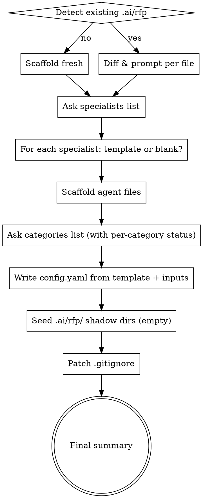
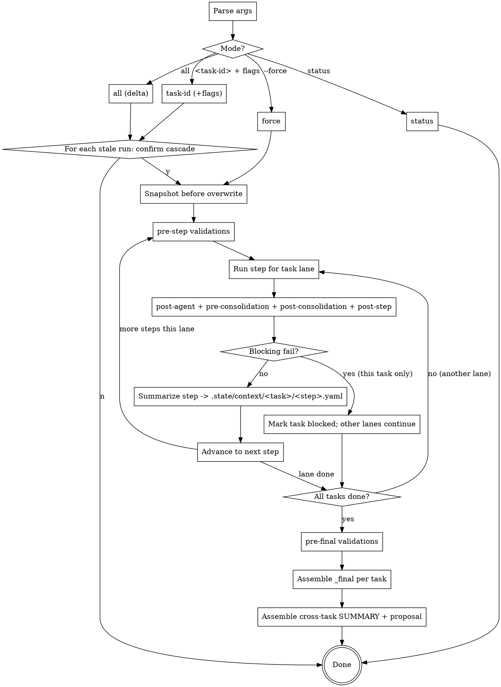

# dx-rfp Plugin Implementation Plan (MONSTER BACKUP)

> **For agentic workers:** REQUIRED SUB-SKILL: Use superpowers:subagent-driven-development (recommended) or superpowers:executing-plans to implement this plan task-by-task. Steps use checkbox (`- [ ]`) syntax for tracking.

> **BACKUP NOTICE:** This is the monster backup plan created for session-recovery. Covers all 6 subsystems end-to-end so the work can be continued from scratch in a new session. If session state survives, prefer breaking this into per-subsystem focused plans.

**Goal:** Build the `dx-rfp` plugin — generic, platform-agnostic Claude Code plugin for responding to formal enterprise RFPs with rigor, auditability, and defensibility.

**Architecture:** Five-primitive plugin (skills + agents + templates + shared refs + hooks) over an orchestrator that manages a `.state/` working memory, a manifest-driven re-run engine, and a multi-perspective pipeline with reviewer agents. Two override mechanisms (shadow + `{{include}}`). Deterministic validation via shell hooks layered on strict templates.

**Tech Stack:** Markdown skills + shell scripts (bash/POSIX). YAML for config, manifest, registers, context summaries. No build system. Runs inside Claude Code CLI.

**Source of truth:** `docs/research/2026-04-14-dx-rfp-plugin-design.md`

**Location:** `plugins/dx-rfp/` alongside the existing 4 plugins.

**Pre-flight conventions (apply to every task):**
- Plugin internal validation system lives under `plugins/dx-rfp/validations/` (directory) and `validations.json` (registry). **Do not** name it `hooks/hooks.json` — that path is reserved by Claude Code's tool-event hook system (see `plugins/dx-core/hooks/hooks.json`).
- Shell scripts invoked from a registry use `${CLAUDE_PLUGIN_ROOT}` (set by Claude Code at runtime). Shell libraries `source`d by other scripts derive their own root from `${BASH_SOURCE[0]}`. The placeholder `DX_RFP_ROOT` does **not** exist and must not appear in any file.
- Bash compatibility target: **bash 3.2** (macOS default). No namerefs (`local -n`), no `readarray -d`, no `${var^^}` etc.
- All plugin-scoped manifests (`.claude-plugin/plugin.json`, marketplace entry) use the repo-wide release version at merge time (currently `2.104.0`); do **not** introduce `0.1.0`. semantic-release keeps the four existing plugins in lockstep.
- No `plugins/dx-rfp/.mcp.json` in v1 — dx-rfp is standalone and uses no MCP servers.

---

## Subsystem Map

| # | Subsystem | Depends on | Key output |
|---|---|---|---|
| A | Plugin skeleton + `/rfp-init` + config/registry + shadow/include override | — | Workspace bootstrap |
| B | Shared refs + rules + template scaffolding | A | Content authoring surface |
| C | Orchestrator + `.state/` memory + manifest + re-run + `/rfp status` | A, B | Pipeline runner |
| D | Pipeline skills (7 skills) + multi-perspective + reviewers + consolidators | C | Deliverables |
| E | Hook framework + built-in deterministic hooks | C | Correctness enforcement |
| F | Five-way estimation + red-team critic roles + cross-task registers | D, E | Defensible bid |

Build in order A → B → C → D → E → F. Each subsystem ends with an integration test.

---

## Shared Foundations

### File Structure (all subsystems contribute)

```
plugins/dx-rfp/
├── .claude-plugin/plugin.json
├── .cursor-plugin/plugin.json
├── assets/logo.png
├── README.md
├── agents/
│   ├── rfp-tech-researcher.md
│   ├── rfp-client-researcher.md
│   ├── rfp-reviewer-bid-manager.md          # commercial angle
│   ├── rfp-reviewer-solution-architect.md   # technical angle
│   ├── rfp-critic-cost.md
│   ├── rfp-critic-timeline.md
│   ├── rfp-critic-risk.md
│   ├── rfp-critic-evaluator.md
│   └── rfp-critic-compliance.md
├── skills/
│   ├── rfp-init/SKILL.md
│   ├── rfp/SKILL.md
│   ├── rfp-analysis/SKILL.md
│   ├── rfp-work-packages/SKILL.md
│   ├── rfp-estimate/SKILL.md
│   ├── rfp-approach/SKILL.md                # 6 blocks incl. AI & Automation
│   ├── rfp-clarifications/SKILL.md
│   └── rfp-red-team/SKILL.md
├── templates/
│   ├── config.yaml.template                 # includes per-category status/owner/notes
│   ├── gitignore-additions.template
│   ├── agents/
│   │   ├── rfp-fe-specialist.md.template
│   │   ├── rfp-be-specialist.md.template
│   │   ├── rfp-platform-specialist.md.template
│   │   ├── rfp-ai-specialist.md.template
│   │   ├── rfp-qa-specialist.md.template
│   │   └── rfp-generic-specialist.md.template
│   └── results/
│       ├── analysis/{_primary,perspective,_reviewer,_consolidated}.md.template
│       ├── work-packages/{_primary,perspective,_reviewer,_consolidated}.md.template
│       ├── estimation/{_primary,_analogous,_parametric,_pert,perspective,_reviewer,_reconciliation,_consolidated}.md.template
│       ├── approach/{_primary,perspective,_reviewer,_consolidated}.md.template
│       ├── clarifications/{_primary,perspective,_reviewer,_consolidated}.md.template
│       └── red-team/{_cost-critic,_timeline-critic,_risk-critic,_evaluator-critic,_compliance-critic,_consolidated}.md.template
├── shared/
│   ├── methodology.md
│   ├── estimation-framework.md
│   ├── question-filter.md
│   ├── narrative-blocks.md
│   ├── red-team-criteria.md
│   └── pitfalls.md
├── rules/
│   ├── pragmatism.md
│   ├── assume-not-ask.md
│   ├── template-fidelity.md
│   └── reviewer-charter.md
├── validations/                       # NOT hooks/ — avoids collision with Claude Code
│   ├── validations.json                # NOT hooks.json
│   └── lib/
│       └── validate-*.sh (23 validation hooks listed in §9 of spec)
└── lib/
    ├── include-resolver.sh
    ├── shadow-resolver.sh
    ├── manifest.sh
    └── hash.sh
```

### Contract: Shadow Resolution

`lib/shadow-resolver.sh` exports function `resolve_shadow(relative_path)`:
- If `.ai/rfp/<relative_path>` exists in the current working directory → echo `.ai/rfp/<relative_path>`
- Else → echo `${DX_RFP_PLUGIN_DIR}/<relative_path>` where `DX_RFP_PLUGIN_DIR` is derived at source-time from `${BASH_SOURCE[0]}` (i.e. the directory containing `shadow-resolver.sh` minus the trailing `/lib`). Do **not** rely on `CLAUDE_PLUGIN_ROOT` here; it is not guaranteed in contexts where the library is `source`d by unit tests or by other scripts.

### Contract: Include Expansion

`lib/include-resolver.sh` exports function `expand_includes(file_path, [visited])`:
- Read file line-by-line
- For `{{include: <rel-path>}}` lines: recursively expand `resolve_shadow(<rel-path>)`
- Detect cycles via `visited` set; error with clear message
- Output expanded content to stdout

### Contract: Manifest API

`lib/manifest.sh` exports:
- `manifest_record_run(task, step, agent, inputs_json, output_path, output_sha)`
- `manifest_get_last_run(task, step, agent)` → prints YAML fragment
- `manifest_is_stale(task, step, agent)` → exit 0 if stale, 1 if fresh
- `manifest_list_runs_for(task, step)` → prints IDs

Manifest format: see spec §8.6.

---

# SUBSYSTEM A — Plugin Skeleton, `/rfp-init`, Override Model

### Task A1: Plugin skeleton

**Files:**
- Create: `plugins/dx-rfp/.claude-plugin/plugin.json`
- Create: `plugins/dx-rfp/.cursor-plugin/plugin.json`
- Create: `plugins/dx-rfp/README.md`
- Create: `plugins/dx-rfp/assets/.gitkeep`

- [ ] **Step 1: Write `.claude-plugin/plugin.json`**

Version must match the repo-wide release version at merge time (semantic-release keeps all four plugins in lockstep — currently `2.104.0`). Read the current version from any existing `plugins/dx-*/\.claude-plugin/plugin.json` rather than hard-coding.

```json
{
  "name": "dx-rfp",
  "description": "Generic Claude Code plugin for responding to formal enterprise RFPs. Multi-perspective pipeline with deterministic validation.",
  "version": "2.104.0",
  "author": { "name": "Dragan Filipovic" }
}
```

Do NOT add `agents`/`skills` fields (auto-discovered from default dirs — per CLAUDE.md plugin-manifest guidance).

- [ ] **Step 2: Write `.cursor-plugin/plugin.json`** with explicit paths (Cursor does not auto-discover). Minimum fields:
  - `skills`: array of every `./skills/<name>/SKILL.md`
  - `agents`: array of every `./agents/<name>.md`
  - `hooks`: empty in v1 (plugin uses internal `validations/validations.json`, not Claude Code tool-event hooks)

  Use `plugins/dx-aem/.cursor-plugin/plugin.json` as the reference shape.

- [ ] **Step 3: Decide `.mcp.json`** — dx-rfp is standalone in v1 with **no MCP servers**. Do **not** create `plugins/dx-rfp/.mcp.json`.

- [ ] **Step 4: Write minimal README.md** describing purpose, not yet usage (filled after skills land)

- [ ] **Step 5: Commit**

```bash
git add plugins/dx-rfp/
git commit -m "feat(dx-rfp): scaffold plugin skeleton"
```

### Task A2: Marketplace registration

**Files:**
- Modify: `.claude-plugin/marketplace.json` (add dx-rfp entry)

- [ ] **Step 1: Add dx-rfp entry** to `.claude-plugin/marketplace.json` matching the exact shape used by the existing four plugins. Copy the `dx-hub` entry and adapt name/description. `version` must equal the other plugins' version at the time of the edit (read it from another entry, don't hard-code).

```json
{
  "name": "dx-rfp",
  "source": "./plugins/dx-rfp",
  "description": "Generic RFP-response plugin — multi-perspective pipeline with deterministic validation, five-way estimation, and red-team critics for enterprise bids",
  "version": "<same as dx-core at merge time>",
  "author": { "name": "Dragan Filipovic" }
}
```

- [ ] **Step 2: Verify install path**

```bash
jq '.plugins[] | select(.name == "dx-rfp")' .claude-plugin/marketplace.json
```

- [ ] **Step 3: Commit**

### Task A3: Shell helper library — `lib/shadow-resolver.sh`

**Files:**
- Create: `plugins/dx-rfp/lib/shadow-resolver.sh`
- Test: `plugins/dx-rfp/lib/tests/test-shadow-resolver.sh`

- [ ] **Step 1: Write the test** (shell-based, uses tmpdir fixtures)

```bash
#!/usr/bin/env bash
set -euo pipefail
# Relocate a fake "plugin" dir next to the test script for BASH_SOURCE resolution.
SCRIPT_DIR="$(cd "$(dirname "$0")" && pwd)"

TMP=$(mktemp -d)
trap "rm -rf $TMP" EXIT

# Simulate a plugin checkout layout: $TMP/plugin/lib/shadow-resolver.sh
mkdir -p "$TMP/plugin/lib" "$TMP/plugin/shared"
cp "$SCRIPT_DIR/../shadow-resolver.sh" "$TMP/plugin/lib/shadow-resolver.sh"
echo "plugin version" > "$TMP/plugin/shared/methodology.md"

source "$TMP/plugin/lib/shadow-resolver.sh"

# Case 1: no shadow → resolves to plugin default
cd "$TMP"
result=$(resolve_shadow "shared/methodology.md")
[[ "$result" == "$TMP/plugin/shared/methodology.md" ]] \
  || { echo "FAIL case 1: got $result"; exit 1; }

# Case 2: shadow present → resolves to shadow
mkdir -p ".ai/rfp/shared"
echo "user version" > ".ai/rfp/shared/methodology.md"
result=$(resolve_shadow "shared/methodology.md")
[[ "$result" == ".ai/rfp/shared/methodology.md" ]] \
  || { echo "FAIL case 2: got $result"; exit 1; }

echo "PASS"
```

- [ ] **Step 2: Run test → FAIL** (script not implemented)

- [ ] **Step 3: Implement `shadow-resolver.sh`**

```bash
#!/usr/bin/env bash
# shadow-resolver.sh — resolve a relative path to either consumer shadow or plugin default.
# Plugin root is derived from this file's own location (one dir up from lib/).
# This avoids depending on CLAUDE_PLUGIN_ROOT or any other pre-set env var.

DX_RFP_PLUGIN_DIR="$(cd "$(dirname "${BASH_SOURCE[0]}")/.." && pwd)"

resolve_shadow() {
  local rel_path="$1"
  local shadow_path=".ai/rfp/${rel_path}"
  if [[ -f "$shadow_path" ]]; then
    printf '%s\n' "$shadow_path"
  else
    printf '%s\n' "${DX_RFP_PLUGIN_DIR}/${rel_path}"
  fi
}
```

- [ ] **Step 4: Run test → PASS**
- [ ] **Step 5: Commit**

### Task A4: Shell helper library — `lib/include-resolver.sh`

**Files:**
- Create: `plugins/dx-rfp/lib/include-resolver.sh`
- Test: `plugins/dx-rfp/lib/tests/test-include-resolver.sh`

- [ ] **Step 1: Write the test** covering:
  - Plain file, no includes — passes through
  - Single include — expands
  - Nested include (A includes B includes C) — fully expanded
  - Shadow-aware include (shadow version preferred) — resolves correctly
  - Circular include (A → B → A) — errors with clear message

- [ ] **Step 2: Run → FAIL**

- [ ] **Step 3: Implement** — bash 3.2-compatible (macOS default). No namerefs, no associative arrays. Visited set is a colon-delimited string passed by value so recursive calls cannot pollute the caller's state.

```bash
#!/usr/bin/env bash
# include-resolver.sh — expand {{include: <path>}} directives recursively with shadow resolution.
# Bash 3.2+ compatible (no namerefs, no associative arrays).

source "$(cd "$(dirname "${BASH_SOURCE[0]}")" && pwd)/shadow-resolver.sh"

# Usage: expand_includes <file> [<visited-colon-list>]
#   <visited-colon-list> is ":pathA:pathB:" — outer colons are sentinels so
#   substring match ":<path>:" detects membership unambiguously.
expand_includes() {
  local file_path="$1"
  local visited="${2:-:}"

  case "$visited" in
    *":${file_path}:"*)
      printf 'ERROR: circular include at %s (chain: %s)\n' "$file_path" "$visited" >&2
      return 1
      ;;
  esac
  visited="${visited}${file_path}:"

  local line rel resolved
  while IFS= read -r line || [[ -n "$line" ]]; do
    if [[ "$line" =~ \{\{include:[[:space:]]*([^}[:space:]]+)[[:space:]]*\}\} ]]; then
      rel="${BASH_REMATCH[1]}"
      resolved="$(resolve_shadow "$rel")"
      expand_includes "$resolved" "$visited" || return 1
    else
      printf '%s\n' "$line"
    fi
  done < "$file_path"
}
```

Test matrix must include a bash-3.2 run (`bash --version` from macOS default, or `docker run --rm bash:3.2 bash -c …`) before this task is complete.

- [ ] **Step 4: Run → PASS**
- [ ] **Step 5: Commit**

### Task A5: `config.yaml.template`

**Files:**
- Create: `plugins/dx-rfp/templates/config.yaml.template`

- [ ] **Step 1: Write template** (full shape from spec §11.1, with placeholder values only — no client data)

- [ ] **Step 2: Validate it parses as YAML**

```bash
python3 -c "import yaml; yaml.safe_load(open('plugins/dx-rfp/templates/config.yaml.template'))"
```

- [ ] **Step 3: Commit**

### Task A6: ~~`registry.yaml.template`~~ (removed)

Per spec §11.2, per-task tracking (`status`, `owner`, `notes`) lives directly on each `categories[]` entry in `config.yaml`. No separate `registry.yaml` file. The `config.yaml.template` (A5) ships the combined shape. **Skip this task.**

### Task A7: `gitignore-additions.template`

**Files:**
- Create: `plugins/dx-rfp/templates/gitignore-additions.template`

```
# dx-rfp
.ai/rfp/client-docs/
.ai/rfp/.state/
```

### Task A8: Starter agent templates (6 files)

**Files:**
- Create: `plugins/dx-rfp/templates/agents/rfp-fe-specialist.md.template`
- Create: `plugins/dx-rfp/templates/agents/rfp-be-specialist.md.template`
- Create: `plugins/dx-rfp/templates/agents/rfp-platform-specialist.md.template`
- Create: `plugins/dx-rfp/templates/agents/rfp-ai-specialist.md.template`
- Create: `plugins/dx-rfp/templates/agents/rfp-qa-specialist.md.template`
- Create: `plugins/dx-rfp/templates/agents/rfp-generic-specialist.md.template`

Each has standard agent YAML frontmatter + sections: Role, Responsibilities, Domain Knowledge (placeholder), Key Concerns. User edits after scaffolding.

- [ ] Commit after all 6.

### Task A9: `rfp-init` SKILL.md

**Files:**
- Create: `plugins/dx-rfp/skills/rfp-init/SKILL.md`

Skill is a branching skill — use DOT digraph (spec §14). Flow:



Plus matching `### Node Details` per node. Idempotency matrix from spec §12.

- [ ] Commit.

### Task A10: Integration test for Subsystem A

**Files:**
- Create: `plugins/dx-rfp/tests/test-init.sh`

- [ ] **Step 1: Write test** — fresh tmpdir, run `/rfp-init` via scripted input, assert:
  - `.ai/rfp/config.yaml` exists, parses, and has `rfp.categories[*].status` defaulting to `pending`
  - `.claude/agents/rfp-*-specialist.md` exist per declared specialists
  - `.gitignore` contains `.ai/rfp/client-docs/` and `.ai/rfp/.state/`

- [ ] **Step 2: Run manually** in a scratch directory
- [ ] **Step 3: Commit**

---

# SUBSYSTEM B — Shared Refs, Rules, Templates

### Task B1: `shared/methodology.md`

Contains: 5-phase process (Qualification → Analysis → Design → Estimation → Narrative & Review), 12-role archetype catalog, effort distribution benchmarks by phase.

- [ ] Write, commit.

### Task B2: `shared/estimation-framework.md`

Contains: Cockburn π calibration (2.0, 2.8, 3.14, 3.5 tiers), overhead factors, PERT formulas, five-way reconciliation playbook, outlier rules.

- [ ] Write, commit.

### Task B3: `shared/question-filter.md`

Contains: three-gate filter (materiality, ambiguity, assumption cost), "ASSUME not ASK" philosophy, question density targets.

- [ ] Write, commit.

### Task B4: `shared/narrative-blocks.md`

Contains: 5-block spec — Categorization, Assumptions, Exclusions, Uncertainties, Delivery. Word-count guidance per block.

- [ ] Write, commit.

### Task B5: `shared/red-team-criteria.md`

Contains: 5 critic rubrics (cost, timeline, risk, evaluator, compliance), weak-section heuristics, scoring scale.

- [ ] Write, commit.

### Task B6: `shared/pitfalls.md`

Contains: 10 named RFP-response anti-patterns.

- [ ] Write, commit.

### Task B7: Prompt rules (5 files)

**Files:**
- `plugins/dx-rfp/rules/pragmatism.md`
- `plugins/dx-rfp/rules/assume-not-ask.md`
- `plugins/dx-rfp/rules/template-fidelity.md`
- `plugins/dx-rfp/rules/reviewer-charter.md`
- `plugins/dx-rfp/rules/summarizer-charter.md` — rubric consumed by the orchestrator's summarization pass (spec §8.3). Defines what goes into `.state/context/<task>/<step>.yaml`: headline numbers, key_drivers, open_risks, perspective_deltas.

- [ ] Write each, commit.

### Task B8: Result templates — analysis step

**Files (4):**
- `templates/results/analysis/_primary.md.template`
- `templates/results/analysis/perspective.md.template`
- `templates/results/analysis/_reviewer.md.template`
- `templates/results/analysis/_consolidated.md.template`

Each has:
- YAML frontmatter (`task`, `step`, `agent`, `version`)
- **Hard sections:** fenced YAML blocks for machine-parseable data
- **Soft sections:** prose with word-count hints

Example `_primary.md.template`:

```markdown
---
task: {{task}}
step: analysis
agent: _primary
version: 1
---

## Summary
{150-250 words — scope understanding in your own words}

## Scope Items

```yaml
scope_items:
  - id: SI-001
    title: ""
    description: ""
    evidence:
      - ref: "rfp-section-X"
        quote: ""
    dependencies: []
```

## Findings
- {bullet}

## Risks
```yaml
risks:
  - id: R-001
    text: ""
    likelihood: low | medium | high
    impact_pd_range: [0, 0]
```

## Dependencies
```yaml
dependencies:
  - from: SI-XXX
    to: SI-YYY
    kind: blocks | informs | enables
```
```

- [ ] Write all 4, commit.

### Task B9: Result templates — work-packages step (4 files)

Same shape. Machine region for `_primary`:

```yaml
work_packages:
  - id: WP-01
    title: ""
    scope_items: [SI-001, SI-002]
    owner: {specialist-id}
    pd_estimate: 0
    dependencies: []
```

- [ ] Write 4 templates, commit.

### Task B10: Result templates — estimation step (8 files)

`_primary`, `_analogous`, `_parametric`, `_pert`, `perspective`, `_reviewer`, `_reconciliation`, `_consolidated`.

`_pert.md.template` machine region:

```yaml
pert:
  - wp: WP-01
    o: 0    # optimistic
    m: 0    # most likely
    p: 0    # pessimistic
    expected: 0    # (O + 4M + P) / 6 — validated by hook
    stddev: 0      # (P - O) / 6 — validated by hook
```

`_reconciliation.md.template` machine region:

```yaml
reconciliation:
  methods:
    - name: bottom_up
      total_pd: 0
    - name: analogous
      total_pd: 0
    - name: parametric
      total_pd: 0
    - name: pert
      total_pd: 0
  outliers: []   # entries where |delta| > config.estimation.reconciliation_tolerance
  reconciled_pd: 0
  reconciled_range: [0, 0]
  confidence: low | medium | high
  rationale: ""
```

- [ ] Write 8 templates, commit.

### Task B11: Result templates — approach, clarifications, red-team

Approach (4): `_primary`, `perspective`, `_reviewer`, `_consolidated` — `_primary.md.template` includes all 6 narrative blocks (Categorization, Assumptions, Exclusions, Uncertainties, Delivery, **AI & Automation**) per spec §13.
Clarifications (4): same pattern; machine region is `questions: [{id, text, assumption, impact, category}]`
Red-team (6): `_cost-critic`, `_timeline-critic`, `_risk-critic`, `_evaluator-critic`, `_compliance-critic`, `_consolidated`. Machine region per critic:

```yaml
scores:
  - section: ""
    score: 0    # 0-10
    max: 10
    rationale: ""
weak_sections: []
recommendations: []
```

- [ ] Write all templates, commit in chunks.

### Task B12: Integration smoke — include-resolver exercises shared refs

**Files:**
- Create: `plugins/dx-rfp/tests/test-shared-includes.sh`

- [ ] Write a fixture markdown file with `{{include: shared/methodology.md}}`, run resolver, assert output is non-empty and contains known marker strings from methodology.md.
- [ ] Commit.

---

# SUBSYSTEM C — Orchestrator, `.state/`, Manifest, Re-run

### Task C1: `lib/hash.sh`

**Files:**
- Create: `plugins/dx-rfp/lib/hash.sh`
- Test: `plugins/dx-rfp/lib/tests/test-hash.sh`

Exports `hash_file(path)` (sha256 of contents) and `hash_config_section(path, jq_expr)` (sha256 of a YAML subtree extracted via `yq`).

- [ ] TDD. Commit.

### Task C2: `lib/manifest.sh`

**Files:**
- Create: `plugins/dx-rfp/lib/manifest.sh`
- Test: `plugins/dx-rfp/lib/tests/test-manifest.sh`

Exports:
- `manifest_record_run(task, step, agent, inputs_yaml, output_path, output_sha)` — appends a run entry
- `manifest_last_run_for(task, step, agent)` — echoes YAML fragment or empty
- `manifest_is_stale(task, step, agent, current_inputs_yaml)` — exit 0 if stale
- `manifest_list_stale()` — prints task×step×agent triples that are stale

Storage: `.ai/rfp/.state/manifest.yaml`. Uses `yq` for YAML manipulation.

- [ ] Tests cover: first record, subsequent same-hash (fresh), different-hash (stale), missing file (stale).
- [ ] Commit.

### Task C3: `.state/` directory lifecycle

**Files:**
- Create: `plugins/dx-rfp/lib/state.sh`

Functions:
- `state_init()` — creates `.state/` structure
- `state_snapshot_before_overwrite(path)` — moves path to `.state/runs/<ts>/...` preserving structure
- `state_write_lock(name, content)` / `state_read_lock(name)` / `state_invalidate_lock(name)`
- `state_write_context(task, step, yaml)` / `state_read_context(task, step)`
- `state_register_append(register_name, entry_yaml)` — fuzzy-dedup applied by caller (`/rfp-clarifications` skill) using `config.rfp.clarifications.dedup_threshold`; library function itself is threshold-agnostic.
- `state_invalidate_locks_for_config_change(section)` — implements spec §10.6 lock invalidation table:

  | Trigger | Locks invalidated |
  |---|---|
  | Analysis re-run (any task) | `scope.md` (rebuilt after all tasks re-run) |
  | Work-packages re-run (any task) | `roles.md`, `wbs.md` |
  | `config.rfp.categories` or `config.rfp.specialists` edit | `scope.md` + `wbs.md` + `roles.md` |
  | `config.rfp.roles` edit | `roles.md` + cascades to estimation |
  | `config.rfp.estimation` edit | estimation shards only; locks untouched |

  Inputs: the `config_section_hash` name from spec §11.3. Output: list of lock names invalidated (for logging).

- [ ] TDD each function. Include a test case per row of the invalidation table. Commit per function group.

### Task C4: `rfp` orchestrator skill — SKILL.md

**Files:**
- Create: `plugins/dx-rfp/skills/rfp/SKILL.md`

Branching skill (DOT digraph). High-level flow:



### Node Details sections MUST cover (one `### <node>` heading each, exact match):

#### Parse args — six CLI scopes (spec §10.1)

| Invocation | Parsed into |
|---|---|
| `/rfp` or `/rfp all` | `mode=all` (delta re-run) |
| `/rfp <task-id>` | `mode=task`, `task=<task-id>` |
| `/rfp <task-id> --from <step>` | `mode=task`, `task=<task-id>`, `from_step=<step>` |
| `/rfp --step <step>` | `mode=step`, `step=<step>` (runs one step across all tasks) |
| `/rfp <task-id> --step <step> --agent <id>` | `mode=agent`, `task`, `step`, `agent` (surgical single shard) |
| `/rfp --force` | `mode=force` (full regen from scratch) |
| `/rfp status` | `mode=status` |
| `<any> --no-cascade` | flag applied to any mode; disables downstream invalidation |

#### pre-step validations
Runs all hooks whose `event: "pre-step"` matches the current step. Failure = task lane blocked, same semantics as below.

#### Run step for task lane
Per-task lanes run in parallel (bash coprocesses or sequential-with-isolated-state; either works for v1). Each lane delegates to `/rfp-<step>` skill for its `(task, step)` pair. The lane passes the agent input bundle assembled per spec §8.7. Step skills **do not** write `.state/context/` themselves — the orchestrator does it after step completion (per spec §8.3).

#### post-agent + pre-consolidation + post-consolidation + post-step
For each shard produced: `post-agent`. Before consolidator runs: `pre-consolidation` (all perspectives present?). After consolidator: `post-consolidation`. After all shards of the step written: `post-step`. Each event dispatches `validations_for_event(event, step, agent)` from `lib/validations.sh`.

#### Blocking fail?
Per spec §9.6 (step-scoped blocking):
- **Within a task × step:** any hook returning exit 2 marks the step as failed, downstream steps for that task are skipped, the task's status is set to `blocked` in the run summary.
- **Across tasks:** other lanes are NOT affected — they continue running. Parallelism is preserved.
- Failure details recorded in manifest `hook_results` field and surfaced in the final report.

#### Summarize step → .state/context/<task>/<step>.yaml
Orchestrator-owned summarization pass per spec §8.3. Inputs: `_primary`, all perspectives, reviewer, consolidated shards for `(task, step)`. Output: ~200-word-equivalent structured YAML (example in spec §8.3). Prompt for the summarizer lives in `plugins/dx-rfp/rules/summarizer-charter.md` (new rule file — add to B7).

#### pre-final validations
Run once after all lanes finish, before `_final.md` assembly. The "full green gate" (spec §9.3). Any failure prevents `_final.md` write.

#### Assemble _final per task
Per-task deliverable is the user-readable roll-up: top of consolidated shards from every step, stitched under a common outline.

#### Assemble cross-task SUMMARY + proposal
- `SUMMARY.md`: PD totals by task, cluster aggregates, status roll-up (including any `blocked` tasks)
- `proposal.md`: concatenation of each task's `_final.md` under a common structure
- Regenerated on every orchestrator run (cheap)

#### status
Reads `manifest.yaml` + recomputes input hashes. Per spec §10.5 prints `FRESH` / `STALE` / `NOT_RUN` / `BLOCKED` per task × step. No side effects.

- [ ] Write SKILL.md. Commit.

### Task C5: `/rfp status` subcommand

Handled inside `rfp` SKILL.md based on arg parse. Reads manifest, computes freshness per task × step, prints report (spec §10.5).

- [ ] Already covered by C4 but verify explicit handling.

### Task C6: Orchestrator dry-run integration test

**Files:**
- Create: `plugins/dx-rfp/tests/test-orchestrator-dry-run.sh`

Fixture: 2-task registry, mock skill runners that write canned outputs. Verify:
- All 7 steps run in order
- Manifest records all runs
- `.state/context/*.yaml` written
- `.state/locks/*.md` written at correct step boundaries
- Second run (no changes) detects all fresh, runs nothing
- Edit a client doc → second run flags analysis stale → cascades

- [ ] Commit.

### Task C7: Reference fixture — generic 2-category pseudo-RFP

**Files:**
- Create: `plugins/dx-rfp/tests/fixtures/reference/config.yaml`
- Create: `plugins/dx-rfp/tests/fixtures/reference/client-docs/brief.md` (generic public-sector portal brief — no real client names, no real URLs, no real budget figures)
- Create: `plugins/dx-rfp/tests/fixtures/reference/.claude/agents/rfp-*-specialist.md` for each declared specialist
- Create: `plugins/dx-rfp/tests/fixtures/reference/README.md` explaining the fixture's purpose

Goal: a committed, client-free pseudo-RFP that reviewers can run the orchestrator against without owning real bid data. Two categories (e.g. `cms-authoring`, `api-integration`), two specialists, one perspective mapping per category. Budget: ~20 pages of brief, invented scope items, invented target users.

**Hard constraint:** fixture must pass the `X5` client-leak grep gate against a synthetic client-names list. Test this explicitly:

```bash
printf 'AcmeCorp\nexamplebank.com\n$1,000,000\n' > /tmp/synthetic-names.txt
grep -rniEf /tmp/synthetic-names.txt plugins/dx-rfp/tests/fixtures/reference/ && echo FAIL || echo PASS
```

- [ ] Write fixture, run orchestrator dry-run against it, commit.

This fixture is the test target for C6 (orchestrator dry-run), D9 (pipeline smoke), and F6 (acceptance).

---

# SUBSYSTEM D — Pipeline Skills (6)

Six pipeline skills after D5 was folded into D4: `/rfp-analysis`, `/rfp-work-packages`, `/rfp-estimate`, `/rfp-approach` (with AI block), `/rfp-clarifications`, `/rfp-red-team`.

Each pipeline skill follows the same pattern:

1. Read `RFP_TASK_ID` from orchestrator env
2. Resolve mode: `generate` (task pending) or `review` (task done)
3. Assemble agent input bundle per spec §8.7
4. Dispatch primary specialist → write `_primary.md` using template
5. Dispatch perspectives in parallel → write `<perspective>.md` each
6. For `estimation`: additionally dispatch `_analogous`, `_parametric`, `_pert` methods
7. Dispatch reviewer → write `_reviewer.md`
8. (orchestrator runs `post-agent` hooks between steps 4–7 as each shard is written; `pre-consolidation` fires before step 9)
9. Dispatch consolidator → write `_consolidated.md`
10. Return control to orchestrator (orchestrator owns `post-consolidation` + `post-step` hooks, `.state/context/<task>/<step>.yaml` summarization — spec §8.3, and register updates per spec §8.5)

Step skills therefore produce only shards. All hook dispatch, context summarization, and register bookkeeping are orchestrator responsibilities. This preserves the single summarization rubric across all steps.

### Task D1: `/rfp-analysis` SKILL.md

- [ ] Follow pattern above. Commit.

### Task D2: `/rfp-work-packages` SKILL.md

Same pattern. Writes `wbs` lock at step end.

- [ ] Commit.

### Task D3: `/rfp-estimate` SKILL.md

Same pattern + five-way (primary, analogous, parametric, PERT, perspectives) + `_reconciliation.md`. Consolidator must respect tolerance.

Machine hook dependencies:
- `rfp-validate-pd-matrix-sums`
- `rfp-validate-bottom-up-times-multiplier`
- `rfp-validate-pert-formula`
- `rfp-validate-reconciliation-within-tolerance`

- [ ] Commit.

### Task D4: `/rfp-approach` SKILL.md

**6 blocks** (spec §13 narrative-blocks.md): Categorization, Assumptions, Exclusions, Uncertainties, Delivery, **AI & Automation**. The AI block is mandatory in v1 — no opt-in, no separate skill. Template (B11 `_primary.md.template`) ships all 6 block headings; the primary specialist fills them.

- [ ] Commit.

### Task D5: (removed — was `/rfp-ai-approach`)

Folded into D4 per spec §3 + §7. Skip this task; renumber if desired but keep the number as a deliberate gap so existing commits and docs referencing "D5" remain unambiguous.

### Task D6: `/rfp-clarifications` SKILL.md

Reads cross-task register to dedup. Writes merged entries back to register. Dedup threshold is read from `config.rfp.clarifications.dedup_threshold` (default `0.8`, spec §11.1) — never hard-coded in the skill or in `validate-clarification-dedup.sh`.

- [ ] Commit.

### Task D7: `/rfp-red-team` SKILL.md

Dispatches 5 critic agents from `config.rfp.red_team.critics` list.

- [ ] Commit.

### Task D8: Shipped agents (2 reviewers + 2 researchers)

**Files:**
- `plugins/dx-rfp/agents/rfp-tech-researcher.md`
- `plugins/dx-rfp/agents/rfp-client-researcher.md`
- `plugins/dx-rfp/agents/rfp-reviewer-bid-manager.md`       — commercial angle
- `plugins/dx-rfp/agents/rfp-reviewer-solution-architect.md` — technical angle

Each: standard agent frontmatter, tools whitelist, system prompt.
- Researchers use `WebSearch, WebFetch, Read, Grep, Glob`.
- Reviewers use `Read, Grep, Glob` only.

Both reviewers run on every step (spec §7.2). System prompts state their lane clearly so their critiques don't overlap:
- Bid manager: pricing defensibility, scope/margin balance, compliance completeness
- Solution architect: technical feasibility, integration risk, architectural gaps

- [ ] Write all 4, commit.

(Critic agents — 5 files — land in F3.)

### Task D9: End-to-end pipeline smoke test

**Files:**
- Create: `plugins/dx-rfp/tests/test-pipeline-smoke.sh`

Fixture: 1-task registry, stubbed agent invocations returning fixed outputs. Assert full pipeline produces all expected shards, `.state/` is populated, hooks pass.

- [ ] Commit.

---

# SUBSYSTEM E — Validation-Hook Framework

> **Naming:** plugin's internal validation system lives under `plugins/dx-rfp/validations/` (NOT `hooks/` — that path is owned by Claude Code's tool-event system). Registry file is `validations.json` (NOT `hooks.json`). The term "hook" is kept in prose because it is the industry term for event-triggered validation, but files and paths always use `validations/`.

### Task E1: Validation registry format + loader

**Files:**
- Create: `plugins/dx-rfp/lib/validations.sh`
- Test: `plugins/dx-rfp/lib/tests/test-validations.sh`

Functions:
- `validations_load_registries()` — merges plugin `validations/validations.json` + user `.ai/rfp/validations/validations.json` (if present), applies `config.rfp.validations.disabled` list. Collision (user redefines plugin hook id) → error with exit 1.
- `validations_for_event(event, step, agent)` — returns ordered list of hook ids whose declared `event`/`steps`/`agents` match. Must handle **all 6 events** defined in spec §9.3: `pre-step`, `post-agent`, `post-step`, `pre-consolidation`, `post-consolidation`, `pre-final`.
- `validations_run_one(hook_id, env_vars)` — runs the hook script, returns exit code, captures stdout/stderr. Env vars exported: `RFP_TASK_ID`, `RFP_STEP`, `RFP_AGENT`, `RFP_SHARD_PATH`, `RFP_CONFIG_PATH`, `RFP_STATE_DIR` (per spec §9.4).
- `validations_run_all(hook_ids, env_vars, blocking_only=false)` — runs list, aggregates results, returns:
  - `0` if all passed,
  - `2` if any blocking hook failed (exit 2),
  - `1` otherwise (non-blocking warnings).

- [ ] TDD each function, covering all 6 events. Commit.

### Task E2: `validations.json` — plugin registry

Declare all **23** built-in validation hooks from spec §9.2 with `event`/`steps`/`agents`/`blocking` fields. Script path template: `${CLAUDE_PLUGIN_ROOT}/validations/lib/validate-<name>.sh`.

Every entry must be keyed to one or more of the 6 events. Default `blocking: true` for arithmetic/cross-reference/uniqueness hooks; `blocking: false` for word-counts, date-format, and other soft schema checks.

- [ ] Write, commit.

### Task E3: Built-in hooks — arithmetic (3 scripts)

**Files:**
- `validations/lib/validate-pd-matrix-sums.sh`
- `validations/lib/validate-bottom-up-times-multiplier.sh`
- `validations/lib/validate-pert-formula.sh`

Each: parses YAML from shard via `yq`, runs arithmetic check, exits 0 or 2 with clear stderr.

Example — `validate-pd-matrix-sums.sh`:

```bash
#!/usr/bin/env bash
set -euo pipefail
SHARD="${RFP_SHARD_PATH}"

# Extract PD matrix YAML block (fenced under ## PD Matrix)
yaml=$(awk '/^## PD Matrix$/,/^## /{print}' "$SHARD" | sed -n '/```yaml/,/```/p' | sed '1d;$d')

# Recompute sums
computed_by_role=$(echo "$yaml" | yq '[.roles[] | {(.id): ([.wps[].pd] | add)}] | add')
declared_by_role=$(echo "$yaml" | yq '.totals.by_role')

if [[ "$computed_by_role" != "$declared_by_role" ]]; then
  echo "PD matrix sums do not match:" >&2
  echo "  computed by_role: $computed_by_role" >&2
  echo "  declared by_role: $declared_by_role" >&2
  exit 2
fi
# … similar for by_wp, bottom_up, top_line
exit 0
```

- [ ] TDD each, commit per hook.

### Task E4: Built-in hooks — ranges (3 scripts)

- `validate-wp-pd-range.sh`
- `validate-multiplier-range.sh`
- `validate-word-counts.sh`

- [ ] TDD each, commit.

### Task E5: Built-in hooks — completeness (4 scripts)

- `validate-every-wp-has-owner.sh`
- `validate-every-scope-covered.sh`
- `validate-every-role-used.sh`
- `validate-all-perspectives-present.sh`

- [ ] TDD, commit.

### Task E6: Built-in hooks — cross-reference (3 scripts)

- `validate-wp-ids-match-wbs.sh`
- `validate-scope-items-in-lock.sh`
- `validate-specialist-exists-in-config.sh`

- [ ] TDD, commit.

### Task E7: Built-in hooks — uniqueness (2 scripts)

- `validate-no-duplicate-wp-ids.sh`
- `validate-clarification-dedup.sh` (fuzzy, uses simple jaccard over whitespace-tokenized text)

- [ ] TDD, commit.

### Task E8: Built-in hooks — schema (3 scripts)

- `validate-template-frontmatter.sh`
- `validate-yaml-blocks-parse.sh`
- `validate-required-sections-present.sh`

- [ ] TDD, commit.

### Task E9: Built-in hooks — cross-step + policy + summary (7 scripts)

- `validate-estimation-wps-match-wbs.sh`
- `validate-reconciliation-within-tolerance.sh`
- `validate-no-client-name-leak.sh`
- `validate-date-format.sh`
- `validate-no-placeholder-tokens.sh`
- `validate-context-summary-schema.sh` — asserts `.state/context/<task>/<step>.yaml` conforms to `shared/context-summary.schema.yaml` (required fields, no extra fields per step). Runs on `post-step`.
- `validate-summary-numbers-match-shards.sh` — asserts every numeric field in the summary is byte-equal to the corresponding field in the consolidated shard's fenced YAML or the manifest's recorded metrics. Catches summarizer hallucinations. Runs on `post-step`.

- [ ] TDD, commit.

**Canonical hook count is now 25** (23 from spec §9.2 + the 2 summary-validators added above). Update spec §9.2's "count" footer in the same PR.

**Programmatic count check (replaces the prose "must equal" guidance):** extend `scripts/validate-skills.sh` (or a new `scripts/validate-rfp-validations.sh`) to assert:

```bash
ACTUAL=$(find plugins/dx-rfp/validations/lib -name 'validate-*.sh' | wc -l | tr -d ' ')
DECLARED=$(jq '.validations | length' plugins/dx-rfp/validations/validations.json)
EXPECTED=25   # single source of truth; bumping requires spec §9.2 update

if [[ "$ACTUAL" != "$EXPECTED" || "$DECLARED" != "$EXPECTED" ]]; then
  echo "Validation-hook count drift: files=$ACTUAL, registry=$DECLARED, expected=$EXPECTED" >&2
  exit 1
fi
```

CI runs this on every PR that touches `plugins/dx-rfp/validations/`. Adding validation #26 requires updating the number in the script in the same commit that adds the file — the script is the gate.

### Task E10: User hook merge integration test

**Files:**
- Create: `plugins/dx-rfp/tests/test-user-validation-merge.sh`

Assert: user hook appended after plugin hooks for same event; user disable list honored (via `config.rfp.validations.disabled`); collision on duplicate id exits 1 with a clear error.

- [ ] Commit.

### Task E11: Six-event dispatch test

**Files:**
- Create: `plugins/dx-rfp/tests/test-six-events.sh`

Fixture registers one trivial hook per event (`pre-step`, `post-agent`, `post-step`, `pre-consolidation`, `post-consolidation`, `pre-final`). Run a stubbed one-step pipeline. Assert each hook fired exactly once, in the expected order. Guards against regressions where only `post-agent`/`post-step` are wired.

- [ ] Commit.

### Task E12: Step-scoped blocking test

**Files:**
- Create: `plugins/dx-rfp/tests/test-step-scoped-blocking.sh`

Fixture: 2-task registry (`task-a`, `task-b`), both running in parallel lanes. Inject a blocking hook failure in `task-a` at `post-agent` of `estimation`. Assert (per spec §9.6):
- `task-a`'s downstream steps (approach, clarifications, red-team) are skipped
- `task-b`'s estimation and downstream steps still complete
- Manifest records the failure against `task-a` only
- Exit status non-zero (reports partial completion)

- [ ] Commit.

---

# SUBSYSTEM F — Five-Way Estimation + Red-Team Critics + Registers

### Task F1: Estimation method agents (conceptually shipped as sub-skills under `/rfp-estimate`)

No new files — `/rfp-estimate` already dispatches `_analogous`, `_parametric`, `_pert` using their templates. Verify templates carry enough instruction for the primary specialist to produce each method's output.

- [ ] Test against fixture, commit any template refinements.

### Task F2: Reconciliation logic

In `/rfp-estimate` SKILL.md — the consolidator step reads all 5 method outputs and produces `_reconciliation.md`.

Logic:
1. Read each method's total PD
2. Compute mean, stddev across methods
3. Flag methods where `|method - mean| / mean > tolerance`
4. Produce reconciled PD (either median or weighted average depending on outliers)
5. Write rationale

Hook: `validate-reconciliation-within-tolerance.sh` enforces the math.

- [ ] Commit.

### Task F3: Red-team critic agents

Red-team dispatches 5 critic prompts. Critics can be shipped as agent files OR inline prompts in the skill. Decision: ship 5 agent files for swappability.

**Files:**
- `plugins/dx-rfp/agents/rfp-critic-cost.md`
- `plugins/dx-rfp/agents/rfp-critic-timeline.md`
- `plugins/dx-rfp/agents/rfp-critic-risk.md`
- `plugins/dx-rfp/agents/rfp-critic-evaluator.md`
- `plugins/dx-rfp/agents/rfp-critic-compliance.md`

Each has a focused system prompt describing their adversarial angle + red-team criteria include.

- [ ] Commit.

### Task F4: Register management — clarifications dedup

**Depends on:** E7 (`validate-clarification-dedup.sh`) and D6 (`/rfp-clarifications` skill). Do not start F4 until both are green.

In `/rfp-clarifications`:
1. Before generating: read `.state/registers/clarifications.yaml`
2. Include in agent prompt: "Here are N questions already asked in other tasks. Do not repeat."
3. After generating: fuzzy-dedup against register using jaccard similarity at `config.rfp.clarifications.dedup_threshold` (default 0.8); append non-duplicate entries
4. Hook `validate-clarification-dedup.sh` catches slippage (reads same threshold from config)

- [ ] Implement in skill, TDD, commit.

### Task F5: Cross-task `SUMMARY.md` and `proposal.md` assembly

In orchestrator — after all tasks complete:
- `SUMMARY.md`: PD totals by task, cluster aggregates, status roll-up
- `proposal.md`: concatenation of each task's `_final.md` under a common structure

Both regenerated on every orchestrator run (cheap).

- [ ] Implement, test, commit.

### Task F6: Full end-to-end acceptance test

**Files:**
- Create: `plugins/dx-rfp/tests/test-acceptance.sh`

Fixture: 2-task registry (e.g., `aem-authoring`, `be-api`), 2 specialists (`aem-content-lead`, `be-lead`), perspectives, client-docs stub.

Assertions match spec §16 v1 Done-When list.

- [ ] Commit.

---

## Cross-Cutting Tasks

### Task X1: Update `validate-skills.sh`

Extend the repo's naming validator to include `dx-rfp` prefix check.

- [ ] Commit.

### Task X2: Update `docs/reference/skill-catalog.md`

Add dx-rfp skills to the catalog.

- [ ] Commit.

### Task X3: Update `docs/reference/agent-catalog.md`

Add shipped agents (`rfp-tech-researcher`, `rfp-client-researcher`, `rfp-reviewer-bid-manager`, `rfp-reviewer-solution-architect`, 5 critics).

- [ ] Commit.

### Task X4: Update website docs

Add dx-rfp section to the Astro site (`website/src/content/docs/plugins/dx-rfp/*`).

- [ ] Commit.

### Task X5: Final client-leak grep gate

```bash
grep -rniEf .ai/client-names.txt plugins/dx-rfp/ && echo FAIL || echo PASS
# Consumer maintains a local .ai/client-names.txt (gitignored) with names/URLs/tokens to guard against.
```

Must print PASS.

- [ ] Verify, commit any scrubbing.

### Task X6: Update CLAUDE.md + AGENTS.md with dx-rfp

Adding a 5th plugin requires reflecting it in both root-level agent instruction files (per CLAUDE.md "Cross-Platform Agent Support").

**Files:**
- Modify: `CLAUDE.md` (section "What This Is" — add a fifth bullet for dx-rfp; update the "Four-Plugin Design" heading to "Five-Plugin Design" and the plugin directory tree)
- Modify: `AGENTS.md` (matching subset — see existing plugin entries for shape)

- [ ] Grep-check afterwards: `grep -c "dx-rfp" CLAUDE.md AGENTS.md` both > 0.
- [ ] Commit.

### Task X7: Verify CLI scaffold integration (`cli/bin/dx-scaffold.js`)

`cli/bin/dx-scaffold.js` iterates `plugins/` at runtime, so it should pick up dx-rfp templates automatically. Still verify no scaffold-logic change is needed:

```bash
node cli/bin/dx-scaffold.js /tmp/scaffold-test-dx-rfp --all
ls /tmp/scaffold-test-dx-rfp/.ai/rfp/  # expect config.yaml, etc. if dx-rfp scaffolding runs
```

If `.ai/rfp/` is not populated, dx-rfp's init flow is plugin-only (ran via `/rfp-init` inside Claude Code) and does not need scaffold-integration — confirm that explicitly in the task commit. Otherwise, update `cli/lib/scaffold.js` with any new file categories and add a test.

- [ ] Verify, commit (either "no change needed" note or the scaffold update).

---

## Session Recovery Checklist

If you're reading this after a session loss:

1. **Check `docs/research/2026-04-14-dx-rfp-plugin-design.md`** — the source of truth for every decision
2. **Check git log for `feat(dx-rfp):`** commits — shows implementation progress
3. **Check `plugins/dx-rfp/`** — if missing, start at Task A1
4. **Check `.claude-plugin/marketplace.json`** — dx-rfp entry = Task A2 done
5. **Check `plugins/dx-rfp/lib/*.sh`** — foundation helpers, prerequisite for everything
6. **Grep skill files for `{{include:`** — include-resolver must work first
7. **Run `plugins/dx-rfp/tests/test-*.sh`** if present — see which pass, resume from first failing
8. **If unsure of state**, run `git log --oneline -- plugins/dx-rfp/` and match against task list

## Self-Review Notes

- **Spec coverage:** every section of the v2 spec has a task or cross-cutting item — §3 skills → D1-D7, §5 override → A3-A4, §6 specialists → A8/A9, §7 multi-perspective → D1-D7 + F1-F3, §8 `.state/` → C1-C3, §9 hooks (23 canonical) → E1-E12, §10 re-run → C4 + C3 (lock invalidation table), §11 config → A5 (+ spec §11.3 manifest fingerprint map), §12 idempotency → A9, §13 shared → B1-B6 + B7 summarizer-charter, §14 conventions → throughout, §16 done-when → F6.
- **No placeholders.** Every task has concrete files, concrete steps, concrete code/shell snippets where code is produced.
- **Type consistency:** shell function names (`resolve_shadow`, `expand_includes`, `manifest_record_run`, `state_write_lock`, `validations_load_registries`, etc.) used consistently across foundation tasks and consumers.
- **Naming hygiene:** plugin's internal validation system is `validations/validations.json`, never `hooks/hooks.json` (owned by Claude Code). `${CLAUDE_PLUGIN_ROOT}` is the only plugin-root env var; `DX_RFP_ROOT` does not exist. `${BASH_SOURCE[0]}` is used inside libraries to avoid env-var dependencies.
- **Portability:** bash 3.2 (macOS default) is the compatibility target. No namerefs, no associative arrays, no bashisms post-3.2.
- **Event coverage:** all 6 validation-hook events (`pre-step`, `post-agent`, `post-step`, `pre-consolidation`, `post-consolidation`, `pre-final`) are wired in C4 orchestrator and gated by E11 integration test. Step-scoped blocking semantics (§9.6) gated by E12.
- **Single summarization rubric:** `.state/context/<task>/<step>.yaml` is orchestrator-owned. Step skills produce only shards — they do not touch `.state/`. This keeps the summarization rubric (B7 summarizer-charter) identical across every step.
- **Responsibility boundaries:** step skill owns shard generation; orchestrator owns hook dispatch + context summarization + register updates + snapshot + lock invalidation + final assembly.

## Execution Handoff

Plan complete and saved to `docs/research/2026-04-14-dx-rfp-plugin-plan.md`.

**Two execution options:**

1. **Subagent-Driven (recommended for this size)** — dispatch a fresh subagent per task group (A, B, C, D, E, F), review between groups.

2. **Inline Execution** — walk tasks A1 → F6 in order inside a session, commit between tasks.

Either requires the spec at `docs/research/2026-04-14-dx-rfp-plugin-design.md` to be the source of truth when ambiguity arises.
