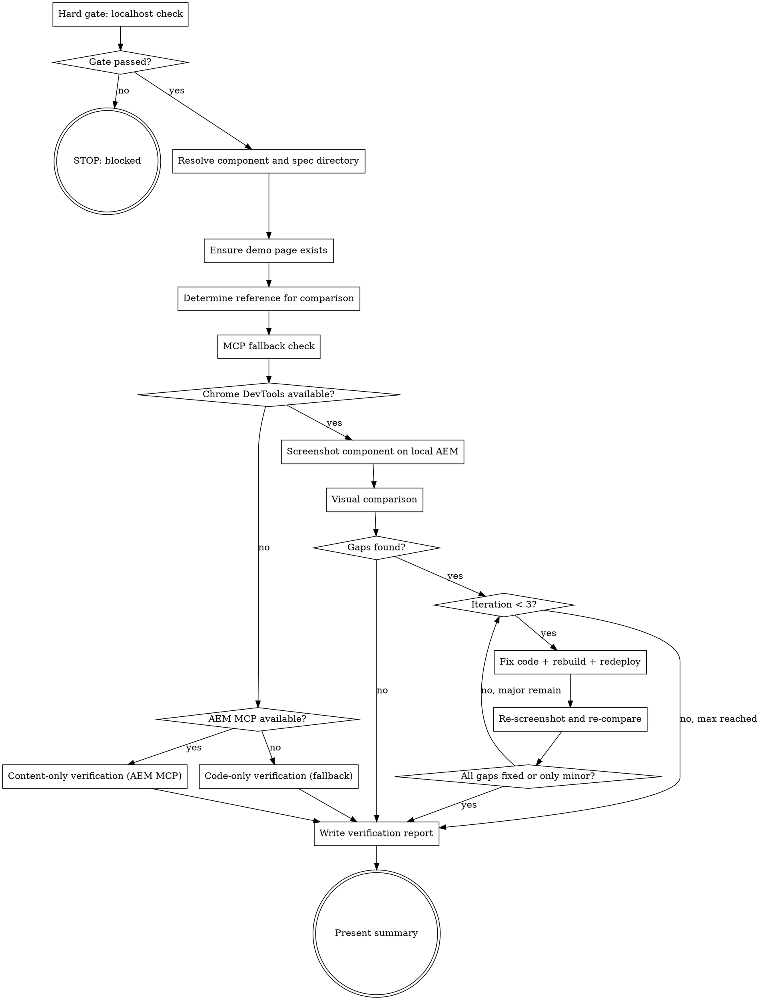

**Platform note:** This skill uses `context: fork` + `agent: aem-fe-verifier` for isolated execution. If subagent dispatch is unavailable (e.g., VS Code Chat), you may run inline but AEM MCP tools (`AEM/*`, `chrome-devtools-mcp/*`) must be available. If they are not, inform the user: "Frontend verification requires AEM and Chrome DevTools MCP servers. Please use Claude Code or Copilot CLI."

You visually verify a component's rendered output on a local AEM instance against the Figma design or requirements. You create/reuse a demo page, screenshot the component in `wcmmode=disabled`, compare using multimodal vision, and fix code gaps — up to 3 iterations.

Use ultrathink for visual comparison — identifying layout, spacing, and color differences between two screenshots requires careful analysis.

## Pipeline Position

| Field | Value |
|-------|-------|
| **Called by** | `/dx-agent-all` (Phase 4, after build), manual invocation |
| **Follows** | `/dx-step-build` (code deployed to local AEM) |
| **Precedes** | `/dx-step-verify` or `/dx-pr-commit` |
| **Output** | Verification report + screenshots in spec directory |
| **Idempotent** | No — re-runs produce fresh verification |

## Flow



## Node Details

### Hard gate: localhost check

**This skill ONLY runs against local AEM.** Code must be deployed locally before visual verification makes sense.

1. Read `aem.author-url` from `.ai/config.yaml` — it MUST contain `localhost` or `127.0.0.1`
2. Call `mcp__plugin_dx-aem_AEM__getNodeContent` with path `/content` and depth 1 to confirm AEM MCP responds
3. Call `mcp__plugin_dx-aem_chrome-devtools-mcp__list_pages` to confirm Chrome DevTools is available

### Gate passed?

All three checks must pass. If any fails, take the "no" path.

### STOP: blocked

Print the appropriate message:
- Non-localhost author-url: `BLOCKED: aem.author-url is <url> (not localhost). FE verification requires local AEM.`
- AEM MCP unavailable: `BLOCKED: AEM MCP not responding. Start the AEM MCP server connected to localhost.`
- Chrome DevTools unavailable: `BLOCKED: Chrome DevTools MCP not available. Start Chrome with DevTools Protocol enabled.`

STOP.

### Resolve component and spec directory

```bash
SPEC_DIR=$(bash .ai/lib/dx-common.sh find-spec-dir $ARGUMENTS)
```

If a component name was provided, use it. Otherwise infer from `implement.md` or `research.md` in the spec directory.

Read `.ai/config.yaml` for `aem.resource-type-pattern` to derive the full resource type.

Print: `[FE Verify] Component: <name>, Spec: <spec-dir>`

### Ensure demo page exists

Check if a demo page from prior `/aem-verify` already exists under `<demo-parent-path>/<slug>`.

- **If page exists:** reuse it. Verify the component is present via `mcp__plugin_dx-aem_AEM__scanPageComponents`.
- **If page does NOT exist:** create one following the aem-inspector conventions (discover language root, template, container chain from an existing page; add component; configure demo data from real instances).
- **If component missing from existing page:** add it and configure demo data.

See `references/demo-page-setup.md` for the full creation workflow.

Print: `[FE Verify] Demo page: <page-path> (<created|reused>)`

### Determine reference for comparison

Check for available references in priority order:

**Figma (preferred):** Look for `<spec-dir>/prototype/figma-reference.png` (single) or `figma-reference-desktop.png` / `figma-reference-mobile.png` (multi-viewport). If found, read `figma-extract.md` for design context and dynamic content markers (approximate tolerance).

**Requirements (fallback):** Read `explain.md`, `raw-story.md`, and `implement.md` for visual expectations.

Print: `[FE Verify] Reference: <figma (N viewports)|requirements>`

### MCP fallback check

Before attempting browser verification, determine what MCP tools are available.

### Chrome DevTools available?

Try calling `mcp__plugin_dx-aem_chrome-devtools-mcp__navigate_page` to the target URL. If successful, take the "yes" path. If unavailable, take the "no" path.

### AEM MCP available?

If Chrome DevTools was unavailable, check whether AEM MCP is available by calling `mcp__plugin_dx-aem_AEM__getComponentContent`. If available, take the "yes" path. If also unavailable, take the "no" path.

### Content-only verification (AEM MCP)

Use AEM MCP to verify component data is correct:
- Use `mcp__plugin_dx-aem_AEM__getComponentContent` to verify component data
- Use `mcp__plugin_dx-aem_AEM__searchContent` to verify the page renders the expected resource type

Set verification status: `Fix Verified (content only — visual check recommended)`

Report: "Visual verification skipped (Chrome DevTools MCP unavailable). Content verification passed via AEM MCP."

### Code-only verification (fallback)

Fall back to code-only verification:
- Re-read the fix diff and the acceptance criteria
- Verify the code change addresses each acceptance criterion logically

Set verification status: `Fix Partial (code review only — manual verification required)`

Report: "MCP verification unavailable. Code review verification only — manual visual check recommended."

### Screenshot component on local AEM

**For each viewport** (single if no multi-viewport Figma, otherwise iterate):

**Resize Chrome (if multi-viewport):**
Match Figma reference dimensions via `mcp__plugin_dx-aem_chrome-devtools-mcp__resize_page`.

**Navigate to demo page:**
```
mcp__plugin_dx-aem_chrome-devtools-mcp__navigate_page
  url: "<author-url><page-path>.html?wcmmode=disabled"
```

Handle AEM login redirect if needed (fill admin/admin credentials via `evaluate_script`).

**Wait for component to render:**
Use `evaluate_script` to find the component element in the DOM, scroll it into view. If not found, warn but continue — the full page screenshot is still useful evidence.

**Take screenshot:**
Save with viewport-aware naming:
- Single: `<spec-dir>/screenshots/aem-fe-verify.png`
- Multi: `<spec-dir>/screenshots/aem-fe-verify-<viewport>.png`

**Viewport Matrix:**

| Viewport | Width | Height | Rationale |
|----------|-------|--------|-----------|
| Mobile | 375 | 667 | iPhone SE — smallest common target |
| Tablet | 768 | 1024 | iPad portrait — breakpoint boundary |
| Desktop | 1440 | 900 | Standard desktop — full layout |

Use Chrome DevTools `resize_page` before each capture:
```
mcp__plugin_dx-aem_chrome-devtools-mcp__resize_page width=375 height=667
mcp__plugin_dx-aem_chrome-devtools-mcp__take_screenshot
```

Name screenshots with viewport suffix: `component-mobile.png`, `component-tablet.png`, `component-desktop.png`.

**Before/After Comparison:**

When verifying changes (not initial implementation):
1. **Before:** Capture screenshots on `development` branch deployment (QA AEM) or from pre-existing `aem-snapshot` baseline
2. **After:** Capture screenshots on the feature branch deployment (local AEM)
3. **Compare:** Use multimodal vision to compare before/after at each viewport
4. **Report:** Note regressions (unintended changes) separately from expected changes

Save before/after pairs in the spec directory:
```
.ai/specs/<id>-<slug>/screenshots/
  before-mobile.png
  before-tablet.png
  before-desktop.png
  after-mobile.png
  after-tablet.png
  after-desktop.png
```

### Visual comparison

**Figma mode:**
Read both the Figma reference and AEM screenshot. Compare across: layout, typography, colors, spacing, missing/extra elements, responsive fit. See `references/comparison-categories.md` for the full checklist.

**Content tolerance:** Figma shows mockup content, AEM shows real/demo data. Focus on **structural and styling** accuracy, not content. Properties marked with approximate tolerance in `figma-extract.md` allow ~30% deviation.

**Requirements mode:**
Compare the AEM screenshot against acceptance criteria from `explain.md`. Verify visual elements, layout structure, and responsive behavior match described expectations.

**For each gap, record:** category, description, severity (`major` or `minor`).

Print: `[FE Verify] Gaps: <N> (<major> major, <minor> minor)`

### Gaps found?

If no gaps, take the "no" path (skip to report). If gaps exist, take the "yes" path.

### Iteration < 3?

Track iteration count starting at 1. If current iteration is less than 3, take the "yes" path. If 3 iterations reached, take the "no, max reached" path.

### Fix code + rebuild + redeploy

**Identify and apply fixes:**
From the gaps, identify source files to change (SCSS, component JS, templates). Read files before editing. Make surgical, targeted edits — one gap at a time.

**Rebuild and redeploy:**
Read the deploy command from `.ai/config.yaml`:
- **Prefer `build.deploy`** — quick deploy without tests (e.g., `mvn clean install -PautoInstallPackage -DskipTests`)
- **Fall back to `build.command`** — full build if `build.deploy` is not configured

Tests are not needed here — this step just needs code deployed to AEM for screenshotting. Tests run separately in the build verification phase.

```bash
<build.deploy or build.command from config>
```

If build fails, fix the error (max 1 build fix per iteration).

### Re-screenshot and re-compare

Navigate to demo page again, take new screenshot, compare against reference. Update gap list — mark fixed gaps as fixed.

Print: `[FE Verify] Iteration <N>/3: <fixed> fixed, <remaining> remaining`

### All gaps fixed or only minor?

If all gaps are fixed or only minor gaps remain, take the "yes" path (break out of loop). If major gaps remain, take the "no, major remain" path (continue loop).

### Write verification report

Write `<spec-dir>/aem-fe-verify.md` with:
- Component name, AEM instance URL, demo page link, reference type, overall result
- Comparison summary table (per category: pass/minor/major)
- Gap list with status (fixed/remaining)
- Fix iteration log (files changed, gaps fixed per iteration)
- Screenshot paths
- Per-viewport results (if multi-viewport)
- Verification checklist

### Present summary

```markdown
## AEM Frontend Verification: <component-name>

**Result:** <PASS | PASS WITH MINOR GAPS | NEEDS ATTENTION>
**Demo Page:** <author-url><page-path>.html?wcmmode=disabled
**Reference:** <Figma | Requirements>

- Gaps found: <total>
- Fixed: <count> in <N> iterations
- Remaining: <count> (<severity breakdown>)
- Report: <spec-dir>/aem-fe-verify.md
```

## Result Classification

| Result | Criteria |
|--------|----------|
| **PASS** | 0 remaining gaps |
| **PASS WITH MINOR GAPS** | Only minor remaining gaps (no major) |
| **NEEDS ATTENTION** | 1+ major remaining gaps after 3 iterations |

## Examples

1. `/aem-fe-verify hero` — Verifies AEM MCP is on localhost, reuses demo page from prior `/aem-verify`, screenshots hero in wcmmode=disabled, compares against figma-reference-desktop.png. Finds 2 minor spacing gaps. Result: PASS WITH MINOR GAPS.

2. `/aem-fe-verify card 2416553` — Uses spec directory `.ai/specs/2416553-*/` for Figma reference. Screenshots card component, compares against Figma. No gaps. Result: PASS.

3. `/aem-fe-verify banner` (no Figma) — Falls back to requirements from explain.md. Verifies banner renders correctly against acceptance criteria. Result: PASS.

4. `/aem-fe-verify hero` (with fix loop) — Screenshots hero, finds major layout gap (flex direction wrong). Fixes SCSS, rebuilds, re-screenshots. Fixed on iteration 1. Result: PASS.

## Troubleshooting

### "BLOCKED: aem.author-url is not localhost"
**Cause:** Config points to QA/Stage.
**Fix:** Set `aem.author-url: http://localhost:4502` in `.ai/config.yaml`.

### "BLOCKED: AEM MCP not responding"
**Cause:** AEM MCP server not running or AEM instance is down.
**Fix:** Start the AEM MCP server connected to localhost:4502.

### "Component not found in DOM"
**Cause:** Build output wasn't deployed, or custom element name doesn't match search selectors.
**Fix:** Run `npm run build:new` or restart `watch:new`. Check browser console for 404s.

### Build fails during fix loop
**Cause:** Code edit introduced an error.
**Fix:** The skill retries once per iteration. If still failing, it reports the error and stops the loop.

### "No Figma reference and no requirements found"
**Cause:** Neither figma-reference.png nor explain.md exists.
**Fix:** Run `/dx-figma-extract` or `/dx-req-explain` first.

## Success Criteria

- [ ] Component rendered at all 3 viewports (mobile, tablet, desktop)
- [ ] Screenshots captured and saved to spec directory
- [ ] Comparison against Figma reference or requirements completed
- [ ] Gaps classified as major or minor
- [ ] Fix loop attempted (up to 3 iterations) for major gaps
- [ ] Final result classification assigned (PASS / PASS WITH MINOR GAPS / NEEDS ATTENTION)

## Rules

- **Localhost only** — never create or modify pages on QA/Stage
- **Real screenshots only** — always use Chrome DevTools, never "mentally compare"
- **Match viewport** — resize Chrome to Figma reference dimensions before screenshotting
- **Content tolerance** — focus on structure and styling, not mockup vs real content
- **Surgical fixes** — edit specific properties, don't refactor or add features
- **3 iterations max** — stop after 3 fix rounds regardless of remaining gaps
- **Reuse demo pages** — if `/aem-verify` created a page, reuse it
- **wcmmode=disabled always** — required for publish-like rendering on author
- **Build after fixes** — always rebuild and wait for deploy before re-screenshotting
- **Idempotent** — re-running overwrites screenshots and aem-fe-verify.md
