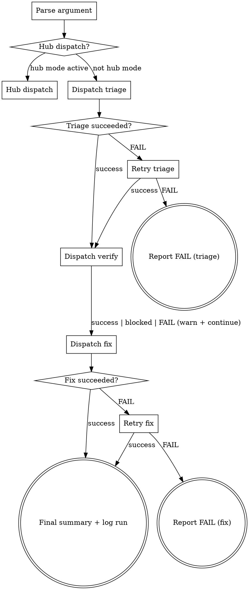
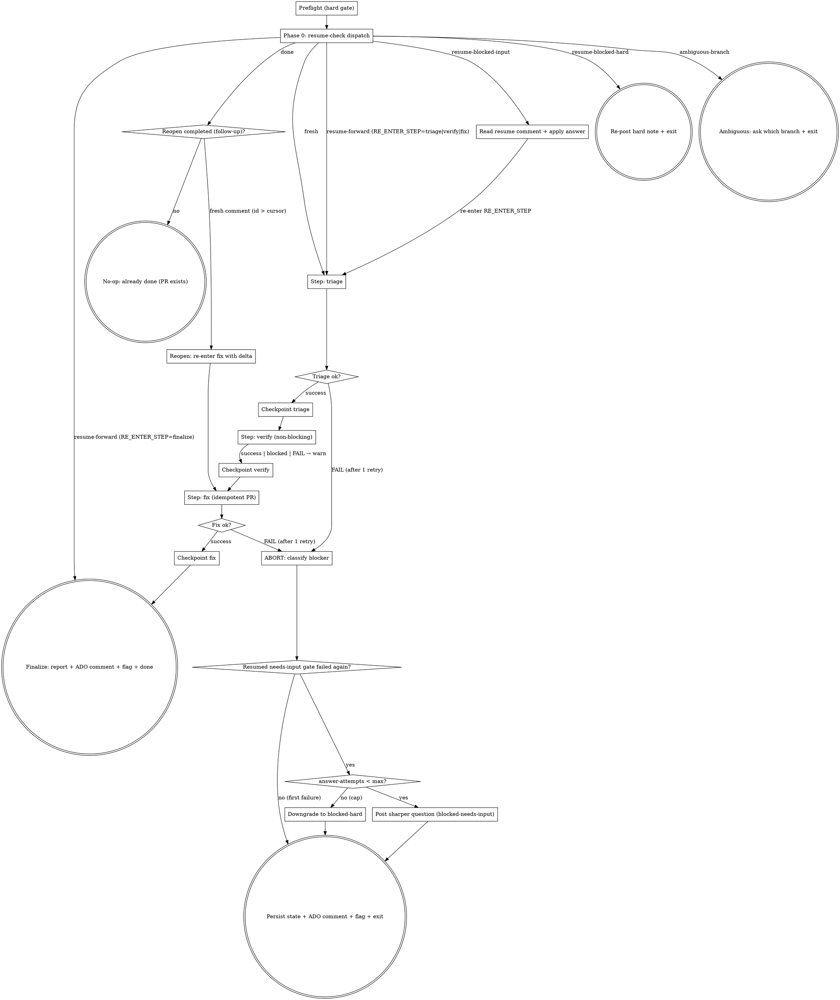

You are a coordinator for the bug pipeline. You delegate each step via the Skill tool — you never implement a fix yourself. You run in one of **two modes**, decided once up front:

- **Local / interactive** (`DX_PIPELINE_MODE` unset) — the original hands-on flow: parse the id, optional hub dispatch, run triage → verify → fix with `TaskList` progress and a retry-once on failure. **This mode is unchanged** from before recovery existed.
- **Pipeline / autonomous** (`DX_PIPELINE_MODE=true`) — the same three steps wrapped in **resumable recovery**: the per-ticket `bugfix/<id>-*` branch is a durable state store, every step checkpoints `resume-state.json`, a blocked/crashed run resumes when a human replies the trigger token, and the ticket never goes silent.

```bash
PIPELINE_MODE="${DX_PIPELINE_MODE:-}"   # "true" → autonomous; else local
```

If `PIPELINE_MODE` is `true`, follow **Pipeline mode** below and ignore the Local-mode section. Otherwise follow **Local mode**.

---

# Local mode (interactive — unchanged)

## Progress Tracking

Before creating tasks, use `TaskList` to check for existing tasks from a previous run. If stale tasks exist, cancel them so the list is clean. Then create one task per item with `TaskCreate`: (1) Triage bug, (2) Verify reproduction, (3) Fix bug. Mark each `in_progress` when starting and `completed` when done.

## Local flow



### Parse argument

The argument is the ADO work item ID — a numeric value (e.g., `2453532`). If the user provides a full ADO URL, extract the numeric ID. If no argument is provided, ask the user for the work item ID.

### Hub dispatch?

Read `shared/hub-dispatch.md`. Hub mode is active when: `DX_PIPELINE_MODE` is NOT set, `.ai/config.yaml` has `hub.enabled: true`, and the cwd is a `.hub/` directory. If active: print `Hub mode detected. Use /dx-hub-dispatch <ticket-id> to dispatch this bug to repo terminals.` and STOP. Otherwise proceed to triage.

### Dispatch triage / verify / fix

- `Skill(/dx-bug-triage <id>)` → print `Step 1/3 done —` + summary.
- `Skill(/dx-bug-verify <id>)` → print `Step 2/3 done —` + summary. **success / blocked / FAIL all continue** to fix (verify enhances confidence but is not required).
- `Skill(/dx-bug-fix <id>)` → print `Step 3/3 done —` + summary.

### Retry / Report FAIL

Retry a failed triage or fix **once** with the same skill. If still failing, print which step failed and what succeeded, suggest running the individual skill, and STOP. **Dependency rules:** triage FAIL → STOP (no bug data); verify FAIL → WARN + continue; fix FAIL → STOP after reporting.

### Final summary + log run

Find the spec directory and present the completion table (raw-bug.md / triage.md / verification.md / implement.md / verification-local.md, PR URL, what-was-done list). Then **log the run** (identical to before): append a record to `.ai/learning/raw/runs.jsonl` (`flow:"bug-all"`, severity, priority, component, verification, fix_result, local_verification, pr_created) and a pattern to `.ai/learning/raw/bugs.jsonl` (component, root_cause, files_changed). **Bug hotspot check:** if any component has ≥3 bugs in `bugs.jsonl`, print a learning note. **Known pattern check:** if `fixes.jsonl` exists and the root cause matches a known `error_type`, print a note. Skip silently if none.

---

# Pipeline mode (autonomous — resumable recovery)

Same three steps, wrapped in recovery. You DO read state and post ADO comments here (you do not in local mode). Coarse-step granularity: `triage` → `verify` → `fix` → `finalize`. The `bugfix/<id>-<slug>` branch (created by triage, pushed by every checkpoint) is the durable store; a crashed/blocked container resumes from the committed `resume-state.json`.

## Argument + USER_INPUT

`$ARGUMENTS` is `<id-or-url> [free text]`. Extract numeric `TICKET_ID`; trailing text is `INLINE_INPUT`. The free text after the trigger token is the **primary instruction** — exactly like `/dx-bug-all <id> <instruction>` locally. Resolve `USER_INPUT` once:

1. If `INLINE_INPUT` non-empty → `USER_INPUT="$INLINE_INPUT"`, `TRIGGER_COMMENT_ID=""`.
2. Else (fired by an ADO comment) fetch comments and pick the triggering one — `mcp__ado__wit_list_work_item_comments` with `workItemId=$TICKET_ID`; choose the comment that is (a) authored by a **non-bot** identity, (b) contains `$TRIGGER_TOKEN`, (c) has the **highest** ADO comment id. Strip the token → `USER_INPUT`; record its id as `TRIGGER_COMMENT_ID`.
3. `USER_INPUT` may be empty (bare `@<keyword>` with no words) — then only the bug body drives the work.

`USER_INPUT` is authoritative where it conflicts with the bug body. Pass it to triage/fix as extra context, and use it (with `TRIGGER_COMMENT_ID` vs `COMMENT_CURSOR`) on the `done`-reopen and blocked-answer paths.

## Recovery config (read once)

Never hardcode the token or the cap — read from `.ai/config.yaml` (defaults applied):

```bash
TRIGGER_TOKEN=$(bash .ai/lib/dx-common.sh yaml-val 'dx-bug-all.recovery.trigger-token'); TRIGGER_TOKEN=${TRIGGER_TOKEN:-@kai-bugfix}
KEYWORD=${TRIGGER_TOKEN#@}                  # bare form used in bot-emitted text
MAX_ATTEMPTS=$(bash .ai/lib/dx-common.sh yaml-val 'dx-bug-all.recovery.max-attempts'); MAX_ATTEMPTS=${MAX_ATTEMPTS:-3}
```

> The ADO Service Hook comment filter MUST equal `trigger-token` — single source of truth. The bot **never** emits the literal token (it writes the keyword bare and tells the human to prefix `@`), so its own comments can't self-trigger the hook.

## Pre-flight (HARD GATE)

```bash
bash $CLAUDE_PLUGIN_ROOT/skills/dx-bug-all/scripts/preflight.sh
```

If it exits non-zero, **STOP**: post the stderr to ADO (`mcp__ado__wit_add_work_item_comment`), touch `.ai/run-context/ado-comment-posted.flag`, exit non-zero. No other action.

**Then touch the orchestration flag — unconditionally, on EVERY pipeline run (fresh AND resume), before Phase 0:**
```bash
mkdir -p .ai/run-context && touch .ai/run-context/orchestrating.flag
```
This is what makes the fix step's PR **idempotent**: `/dx-pr-commit` reads this flag to set `ORCHESTRATED=1` and switch to update-mode when an Active PR already exists (no duplicate PR on a resume after a crash mid-fix). `.ai/run-context/` is runtime-only (not committed to the branch), so a fresh resume container must re-create the flag here — do NOT rely on the fresh-init touch alone.

## State files

| File | Created in | Purpose |
|---|---|---|
| `resume-state.json` | after triage (fresh) / read on resume | Durable status — `status`, `last-completed-step`, `blocked-at-step`, `blocker{}`, `answer-attempts`, `comment-cursor`, `run-history[]`. Phase 0 dispatches on it. Committed every checkpoint. |
| `raw-bug.md`, `triage.md` | triage | Bug dump + component analysis |
| `verification.md` | verify | Repro result + screenshots |
| `implement.md`, `verification-local.md` | fix | Fix plan + post-fix local check |
| `followup.md` | reopen path | Verbatim `USER_INPUT` that reopened a completed bug |
| `bug-progress.md` | initialized lazily; updated per step | Step status table |
| `report.md` | finalize / ABORT | Final human-readable report |

## Flow



## Node Details

### Phase 0: resume-check dispatch

```bash
RC=$(bash $CLAUDE_PLUGIN_ROOT/skills/dx-bug-all/scripts/resume-check.sh "$TICKET_ID")
val() { sed -n "s/^$1=//p" <<<"$RC" | head -1; }
DISPATCH=$(val DISPATCH); BRANCH=$(val BRANCH); SPEC_DIR=$(val SPEC_DIR)
STATUS=$(val STATUS); RE_ENTER_STEP=$(val RE_ENTER_STEP)
ANSWER_ATTEMPTS=$(val ANSWER_ATTEMPTS); LAST_COMPLETED_STEP=$(val LAST_COMPLETED_STEP)
BLOCKED_AT_STEP=$(val BLOCKED_AT_STEP); COMMENT_CURSOR=$(val COMMENT_CURSOR)
MAX_ATTEMPTS=$(val MAX_ATTEMPTS)
```

`resume-check.sh` owns anchored discovery (`bugfix/<id>-*` / `feature/<id>-*` — never a bare `*<id>*` substring), the 0 / 1 / >1 decision, and the reverse branch→spec-dir mapping. It is read-only w.r.t. `resume-state.json` (never bumps `answer-attempts`). Dispatch on `DISPATCH`:

| DISPATCH | meaning | action |
|---|---|---|
| `fresh` | no branch / no committed state | run **Step: triage** (it creates `bugfix/<id>-<slug>` + spec dir). After triage, init state (below). |
| `resume-forward` | prior run crashed (`in-progress`) | re-enter `RE_ENTER_STEP` (triage idempotently skips, verify/fix re-run). `RE_ENTER_STEP` may be **`finalize`** — a crash *after* the fix checkpoint (`last-completed-step=fix`) resumes straight at **Finalize** (reuse the committed `report.md`/PR; no re-triage/verify/fix). Reuse committed artifacts. Does NOT consume an answer-attempt. |
| `resume-blocked-input` | recoverable block awaiting a human answer | run **Read resume comment + apply answer**, then re-enter `RE_ENTER_STEP`. |
| `resume-blocked-hard` | unrecoverable, or `answer-attempts` cap reached | **Re-post hard note + exit** — re-post the "needs manual fix / re-tag `KAI-DEV-AUTOMATION`" note; exit non-zero. |
| `done` | finalize already succeeded | **Reopen completed work** (below) on a fresh follow-up comment, else no-op. |
| `ambiguous-branch` | >1 `(bugfix\|feature)/<id>-*` match | post a `needs-user-input` comment asking **which branch** to resume (loop-safe); set `blocked-needs-input`; exit. Do NOT pick one. |

> **git-rules.md exception.** Reusing the per-ticket branch for the **same bug, continued** is a deliberate, scoped exception, allowed only when the anchored match is **unique** (ambiguous → blocker, not reuse).

**Fresh-run state init (only on `fresh`, after triage creates the spec dir):**
```bash
SPEC_DIR=$(ls -d .ai/specs/${TICKET_ID}-*/ 2>/dev/null | head -1); SPEC_DIR="${SPEC_DIR%/}"
sed "s/{TICKET}/$TICKET_ID/" \
    "$CLAUDE_PLUGIN_ROOT/skills/dx-bug-all/templates/resume-state.json.tmpl" \
    > "$SPEC_DIR/resume-state.json"
```
(`orchestrating.flag` was already touched in Pre-flight.) On a resume dispatch `resume-state.json` already exists on the branch — read it, do not re-init.

### Step: triage

`Skill(/dx-bug-triage <id>)`, weaving `USER_INPUT` into the request if non-empty. On `resume-forward`/reopen, triage is idempotent (skips re-fetch when `raw-bug.md` is current). On **FAIL**, retry once; if still failing → **ABORT** with blocker class `needs-user-input` (component not identifiable) or `transient` (MCP/network). Triage FAIL is terminal for the run — no bug data, no fix.

### Checkpoint triage

```bash
bash $CLAUDE_PLUGIN_ROOT/skills/dx-bug-all/scripts/update-progress.sh "$SPEC_DIR" "triage" "done" "<component>"
bash $CLAUDE_PLUGIN_ROOT/skills/dx-bug-all/scripts/save-state.sh "$SPEC_DIR" "triage"
```
If `save-state.sh` exits 3 (`BRANCH-ADVANCED`), STOP — a concurrent resume is in flight; do not force-push.

### Step: verify (non-blocking)

`Skill(/dx-bug-verify <id>)`. Verify enhances confidence but is **not required**: `success`, `blocked` (no browser/URL/tools), and `FAIL` (could-not-reproduce) all **continue to fix** — record the result, never abort. Then **Checkpoint verify** (`save-state.sh "$SPEC_DIR" "verify"`).

### Step: fix (idempotent PR)

`Skill(/dx-bug-fix <id>)`. This plans (`implement.md`), executes, builds, and opens a PR via `/dx-pr-commit`. **Idempotency (M5):** `/dx-bug-fix`/`/dx-pr-commit` detect an existing open PR for `bugfix/<id>-*` and switch to **update-mode** (push commits + refresh description) instead of creating a second PR — so a re-trigger after a crash mid-fix never duplicates the PR. On **FAIL**, retry once; if still failing → **ABORT** (`hard` for build failures surviving the inner retries; `needs-user-input` if the fix is ambiguous and `/dx-bug-fix` asked a question). Then **Checkpoint fix**.

### Finalize: report + ADO comment + flag + done

1. Render `report.md` (completion table + PR URL + what-was-done + verify result).
2. **Log the run** exactly as Local mode does (`runs.jsonl` + `bugs.jsonl`; hotspot + known-pattern checks).
3. Post a truncated report to ADO (`mcp__ado__wit_add_work_item_comment`), then record it so the pipeline fallback doesn't double-post:
   ```bash
   mkdir -p .ai/run-context && touch .ai/run-context/ado-comment-posted.flag
   ```
4. Mark terminal + final checkpoint:
   ```bash
   jq '.status="done"' "$SPEC_DIR/resume-state.json" > "$SPEC_DIR/.rs.tmp" && mv "$SPEC_DIR/.rs.tmp" "$SPEC_DIR/resume-state.json"
   bash $CLAUDE_PLUGIN_ROOT/skills/dx-bug-all/scripts/save-state.sh "$SPEC_DIR" "finalize"
   rm -f .ai/run-context/orchestrating.flag
   ```

### Read resume comment + apply answer

Only on `resume-blocked-input` (or `ambiguous-branch` resolution). Fetch comments; select the one that is non-bot, contains `$TRIGGER_TOKEN`, has the highest id, and id > stored `comment-cursor`. If none qualifies → cheap exit (stray re-trigger). Strip the token → `continue-input`; apply it to `blocked-at-step` (e.g. component/repo hint for triage; repro URL for verify; file/anchor guidance for fix; the chosen branch for `ambiguous-branch`). **Commit the updated `comment-cursor` atomically before re-entering** (via `jq` into `resume-state.json` then `save-state.sh`), else a crash reprocesses the same comment. Re-enter `RE_ENTER_STEP`. If the gate fails again, see ABORT's re-ask loop. When quoting the human's prior answer, **never echo the literal token** — render `@<keyword>`.

### Reopen completed work (follow-up comment)

Only on `DISPATCH=done`. A completed run is normally a no-op, but a reviewer may want a small refinement on the same branch. Reopen **only if** `USER_INPUT` is non-empty **and** `TRIGGER_COMMENT_ID > COMMENT_CURSOR` (numeric; empty cursor = 0). Otherwise → no-op: post once "Already completed in PR. Reply `@<keyword> <change>` to request a follow-up, or open a new ticket." and exit 0.

To reopen: record `USER_INPUT` verbatim in `followup.md`; seed `status="in-progress"`, `last-completed-step="verify"`, advance `comment-cursor=$TRIGGER_COMMENT_ID`, append a `run-history` reopen entry; `save-state.sh "$SPEC_DIR" "verify"` (advancing the cursor **before** re-entry is the loop guard — once this run reaches `done`, the same comment is at/below the cursor and can't reopen again). Then re-enter **Step: fix** with the follow-up delta (reuse committed `triage.md`/`implement.md`; do not re-fetch or re-triage). This path does NOT touch `answer-attempts`.

## ABORT path (any terminal/blocked step)

**Order matters:** classify first, persist state, comment, flag, then exit.

1. **Classify the blocker** → set `blocker.class` (`needs-user-input` | `transient` | `hard`), `blocker.recoverable`, `blocker.reason`, `blocker.needs`, `blocked-at-step`, and `status` in `resume-state.json` (via `jq`). Use the taxonomy below.
   **Re-ask loop (resumed `needs-input` step that failed again):** if `answer-attempts < $MAX_ATTEMPTS`, bump it, set `status=blocked-needs-input`, post a *sharper* question (loop-safe — never echo the literal token). Else downgrade to `status=blocked-hard` and recommend re-tag `KAI-DEV-AUTOMATION`.
2. **Write the failure `report.md`** (`verified: false`, failing step marked, Recovery section using `@<keyword>`).
3. **Persist state — commit + push:**
   ```bash
   bash $CLAUDE_PLUGIN_ROOT/skills/dx-bug-all/scripts/save-state.sh "$SPEC_DIR" "$BLOCKED_AT_STEP"
   ```
   (Exit 3 = `BRANCH-ADVANCED` → concurrent resume; stop.)
4. **Discard uncommitted source edits** (spec files are committed and survive; the fix re-runs on resume):
   ```bash
   git checkout -- . 2>/dev/null || true
   ```
5. **Post the classified ADO comment** + record the flag so the pipeline fallback doesn't double-post:
   ```bash
   mkdir -p .ai/run-context && touch .ai/run-context/ado-comment-posted.flag
   ```
6. Clean up `orchestrating.flag` (leave `ado-comment-posted.flag` for the pipeline). Exit non-zero.

### Blocker taxonomy

| class | examples | recovery |
|-------|----------|----------|
| `needs-user-input` | component not identifiable in triage, ambiguous repro, missing repro URL, `/dx-bug-fix` asked a clarifying question, `ambiguous-branch` | human replies `@<keyword> <answer>` → resume at blocked step |
| `transient` | MAX_TURNS / step timeout / MCP unreachable / network blip — **infra only** | re-trigger (any `@<keyword>` reply, or re-run) → resume forward from `last-completed-step` |
| `hard` | build failure surviving `/dx-bug-fix`'s inner retries, fix not achievable as a small change, `answer-attempts` cap reached | not recoverable here → recommend re-tag `KAI-DEV-AUTOMATION` (full DevAgent) |

### Blocker comment format (loop-safe)

The literal trigger token **never appears** in the bot's own text — say the keyword **bare** and tell the user to prefix `@`. Holds even when quoting the human's prior answer.

```
⚠️ /dx-bug-all paused on #<id> — needs your input

**What failed:** <step> — <reason>.
**Recoverable:** yes (answer-attempt <n> of <max>)
**What I need:** reply on this Bug, beginning your comment with the kai-bugfix
   keyword (prefixed with @ so it re-triggers me), followed by <the specific input>, e.g.
   @<keyword> repro-url=https://qa.example.com/...

<!-- dx-bug-all:blocked step=<step> reason=<short> attempt=<n> comment-cursor=<id> -->
```

The HTML marker lets the next run parse `step`/`attempt`/`comment-cursor` deterministically. Render the keyword as `@<keyword>` in examples so the line can't self-trigger the hook.

## Return contract

When invoked from an orchestrator, emit at the end:

```markdown
## Return
verdict: pass | warn | fail
summary: <one sentence>
artifacts:
  - $SPEC_DIR/report.md
  - $SPEC_DIR/resume-state.json
next_action: <human-readable next step or "none">
```

---

## Rules

- **Coordinator only** — delegate every step via the Skill tool; never implement a fix yourself.
- **Mode gate is first** — decide Local vs Pipeline once; never mix (no checkpoints/ADO comments in Local mode, no `TaskList`-only flow in Pipeline mode).
- **Sequential dependencies** — never dispatch step N+1 until step N returns (except verify FAIL → continue to fix).
- **Strict checkpoints (Pipeline)** — checkpoint after every successful step; a `BRANCH-ADVANCED` (exit 3) means stop, never force-push.
- **Never go silent (Pipeline)** — every terminal path posts an ADO comment and touches `ado-comment-posted.flag`.
- **Loop-safe** — the bot never emits the literal trigger token.

## Platform Compatibility

`Skill()` calls work on Claude Code and Copilot CLI. **Copilot CLI / VS Code Chat fallback** (if subagent skill invocation fails): run the steps manually — `/dx-bug-triage <id>` → `/dx-bug-verify <id>` → `/dx-bug-fix <id>`.
