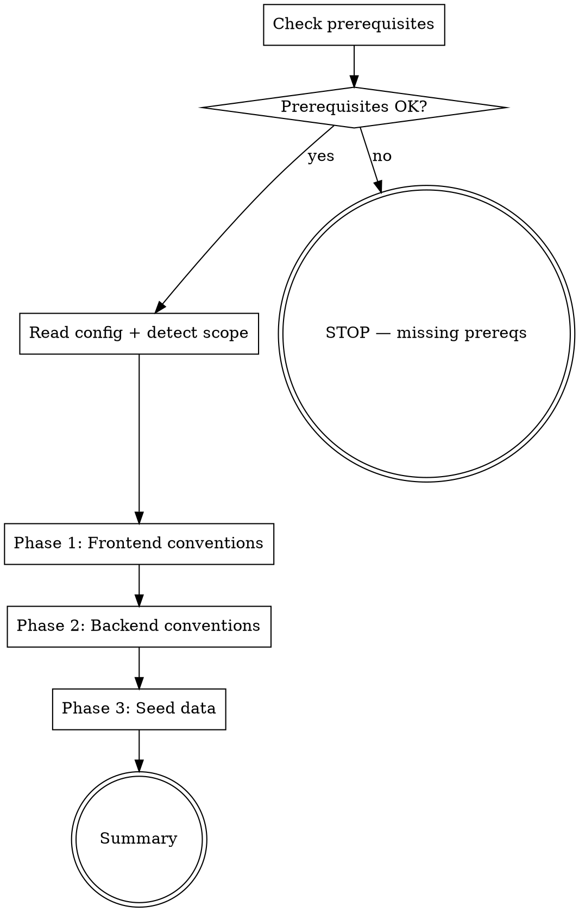

## Purpose

Scan the actual codebase to discover conventions, then interactively customize `.claude/rules/` with real values and generate `.ai/project/` seed data files. This is the "teach the AI about YOUR project" step.

**Before this skill:** `/dx-init` scaffolds config, `/dx-adapt` detects type/toolchain, `/aem-init` sets up AEM. After those, rules still have generic placeholders and seed data is empty.

**After this skill:** Rules contain real CSS variables, actual component patterns, discovered naming conventions. Seed data describes the architecture, features, and file patterns. Every AI skill benefits from this context.

## Prerequisites

1. `.ai/config.yaml` must exist (run `/dx-init` first)
2. `project.type` must be set (run `/dx-adapt` first)
3. For AEM projects: `aem:` section must exist (run `/aem-init` first)

If any prerequisite is missing, print which skill to run and STOP.

## Argument

Optional phase selector:
- `phase1` — frontend conventions only
- `phase2` — backend conventions only
- `phase3` — seed data only
- `all` or no argument — run all phases

## Flow



## Node Details

### Check prerequisites

Read `.ai/config.yaml`. Verify:
- File exists
- `project.type` is set
- If type starts with `aem-`: verify `aem:` section exists

### Read config + detect scope

From `.ai/config.yaml` read:
- `project.type` — determines which phases apply
- `project.role` — `frontend`, `backend`, `fullstack`, `config`
- `aem.component-path`, `aem.frontend-dir`, `aem.component-prefix` — for AEM scanning
- `toolchain.*` — build tool, CSS compiler, template engine
- `build.*` — build commands

Determine scope:
- **Has frontend:** type contains `frontend` OR role is `fullstack` OR `aem.frontend-dir` exists
- **Has backend:** type contains `fullstack` OR role is `backend` OR `aem.component-path` exists
- **Is AEM:** type starts with `aem-`

Print: `Project: <name> | Type: <type> | Role: <role> | FE: yes/no | BE: yes/no | AEM: yes/no`

### Phase 1: Frontend conventions

Skip if project has no frontend. Print: `Phase 1: Scanning frontend conventions...`

#### 1a. CSS/SCSS conventions

Scan for:
- **Variables/tokens:** Grep `*.scss` and `*.css` files for `$` variables and `--` custom properties. Group by category (colors, spacing, breakpoints, typography, z-index).
- **Breakpoints:** Search for `@media` queries, `$bp-` or `$breakpoint-` variables, or breakpoint maps.
- **Naming convention:** Sample 20+ class names from SCSS files. Detect pattern (BEM, utility-first, custom).

Present discoveries to user:

```
I found these CSS conventions:

**Breakpoints:**
  $bp-mobile: 768px
  $bp-tablet: 1024px
  $bp-desktop: 1200px

**Color tokens:** 12 variables (e.g., $color-primary: #1a1a1a, $color-accent: #0066cc)
**Spacing:** $spacing-xs through $spacing-xl (4px–48px scale)
**Naming:** BEM pattern detected (block__element--modifier)

Is this accurate? Anything to add or correct?
```

Wait for user confirmation. Then update `.claude/rules/fe-styles.md` with the confirmed values, replacing generic placeholders.

#### 1b. JavaScript/component conventions

Scan for:
- **Module system:** Check for `import`/`export` (ESM), `require` (CJS), or `define` (AMD)
- **Component registration:** Search for `customElements.define`, `React.createElement`, component class patterns
- **Base class:** Find the component base class (extends pattern)
- **Event handling:** How events are bound (addEventListener, delegation, framework-specific)
- **Template engine:** Handlebars (`*.hbs`), HTL (`*.html` with `data-sly-*`), JSX, etc.

Present discoveries, wait for confirmation. Update `.claude/rules/fe-javascript.md` and `.claude/rules/fe-components.md`.

#### 1c. Clientlib structure (AEM only)

If AEM project, scan for:
- **Clientlib categories:** Grep `*.content.xml` under clientlibs for `categories`
- **Embed patterns:** Grep for `embed` property in clientlib definitions
- **JS/CSS organization:** How files map to clientlib categories

Present discoveries, wait for confirmation. Update `.claude/rules/fe-clientlibs.md`.

### Phase 2: Backend conventions

Skip if project has no backend. Print: `Phase 2: Scanning backend conventions...`

#### 2a. Sling Model patterns (AEM only)

Scan for:
- **Model annotations:** Grep Java files for `@Model`, `@Inject`, `@ValueMapValue`, `@ChildResource`, `@ScriptVariable`
- **Exporter pattern:** Search for `@Exporter`, exporter name, selector
- **Injector usage:** Which injectors are used (ValueMap, Child, Script, OSGi, Self)
- **Null handling:** `@Default`, `@Optional`, nullable patterns

Present 2-3 example models with discovered patterns. Wait for confirmation. Update `.claude/rules/be-sling-models.md`.

#### 2b. Component structure (AEM only)

Scan for:
- **Component XML patterns:** Read 3-5 `.content.xml` files under component-path. Extract componentGroup, resourceSuperType, decoration patterns
- **Dialog structure:** Read 2-3 `_cq_dialog/.content.xml` files. Identify tab patterns, multifield usage, custom widgets
- **HTL patterns:** Scan `*.html` files for `data-sly-use`, `data-sly-template`, `data-sly-call` patterns

Present discoveries, wait for confirmation. Update `.claude/rules/be-components.md`, `.claude/rules/be-dialog.md`, `.claude/rules/be-htl.md`.

#### 2c. Testing patterns

Scan for:
- **Test framework:** JUnit 4 vs 5, Mockito, AEM Mocks, wcm.io
- **Test location:** `src/test/java/` structure
- **Naming convention:** `*Test.java`, `*IT.java`, `*Spec.java`
- **Frontend tests:** Jest, Karma, Mocha, Jasmine

Present discoveries, wait for confirmation. Update `.claude/rules/be-testing.md`.

#### 2d. Java conventions (non-AEM or AEM)

Scan for:
- **Package structure:** Scan `src/main/java/` tree, identify top-level packages
- **Service patterns:** `@Component`, `@Service`, `@Reference` (OSGi) or Spring annotations
- **Logging:** SLF4J, Log4j, pattern used

Present discoveries, wait for confirmation. Update relevant rule files.

### Phase 3: Seed data

Print: `Phase 3: Generating seed data...`

#### 3a. Architecture overview

Scan the project to build `architecture.md`:
- **Module structure:** List Maven modules (from pom.xml) or npm workspaces
- **Rendering pipeline:** For AEM: HTL → Sling Model → Exporter → JSON → FE Component chain
- **Key libraries:** Scan pom.xml/package.json for significant dependencies (not utilities)
- **Build pipeline:** How code goes from source to deployed artifact

Present the architecture summary. Wait for user to confirm or enrich with details the code can't reveal (e.g., "We also use a custom CDN layer" or "The FE components talk to a BFF service").

Write to `.ai/project/architecture.md`.

#### 3b. Features inventory

Scan the codebase to identify features:
- **AEM components:** List all components under component-path with their resourceSuperType and componentGroup
- **Services/APIs:** List OSGi services, servlets, filters
- **Frontend features:** List JS components, their registration names, and source paths
- **Cross-cutting:** Authentication, i18n, analytics integration

Present feature list grouped by layer. Ask user to confirm and add any domain-specific features.

Write to `.ai/project/features.md`.

#### 3c. File patterns

Generate `file-patterns.yaml` — how to find all source files for a given component:

```yaml
# Auto-generated by /dx-scan — maps component name to file locations
# <name> is replaced with the component name at runtime

patterns:
  dialog: "<apps-path>/<name>/_cq_dialog/.content.xml"
  component-xml: "<apps-path>/<name>/.content.xml"
  htl: "<apps-path>/<name>/<name>.html"
  sling-model: "<java-src>/**/models/<Name>Model.java"
  exporter: "<java-src>/**/models/<Name>Exporter.java"
  test: "<java-test>/**/models/<Name>ModelTest.java"
  scss: "<frontend-dir>/src/**/components/<name>/**/*.scss"
  js: "<frontend-dir>/src/**/components/<name>/**/*.js"
  template: "<frontend-dir>/src/**/components/<name>/**/*.hbs"
```

Discover actual paths from the codebase (don't assume — verify with Glob). Present to user, wait for confirmation.

Write to `.ai/project/file-patterns.yaml`.

#### 3d. Content paths (AEM only)

If AEM and `aem.content-paths` is set in config, use those. Otherwise:

- Search for `jcr_root/content/` directories in the project
- If AEM MCP is available, use `mcp__plugin_dx-aem_AEM__fetchSites` to discover live content trees
- List top-level content paths with brand/market structure

Present to user. Write to `.ai/project/content-paths.yaml`.

#### 3e. Component index check

Check if `.ai/project/component-index.md` already exists (created by `/aem-init`).

- **If exists:** Print `Component index already exists (created by /aem-init). Skipping.`
- **If missing and AEM MCP available:** Offer to run component discovery now
- **If missing and no AEM MCP:** Print guidance on how to generate it via `/aem-init`

Do NOT regenerate if it already exists.

### Summary

Print a summary of everything created/updated:

```markdown
## /dx-scan Complete

### Rules Updated
| File | What Changed |
|------|-------------|
| fe-styles.md | Added 12 CSS variables, 3 breakpoints, BEM naming |
| fe-javascript.md | ESM imports, BaseComponent class, CustomElements |
| ... | ... |

### Seed Data Created
| File | Content |
|------|---------|
| architecture.md | 4 modules, HTL→Model→Exporter pipeline |
| features.md | 23 components, 8 services, 12 FE features |
| file-patterns.yaml | 9 pattern templates |
| content-paths.yaml | 3 content roots, 2 brands |

### Next Steps
1. Review generated files in `.ai/project/`
2. Run `/dx-help` to test if AI can answer project questions
3. Run `/dx-req <ticket-id>` — AI will now use your project context
```

## Interactive Protocol

Every discovery is presented to the user before writing. The format:

1. **Present:** Show what was found with concrete examples from their code
2. **Ask:** "Is this accurate? Anything to add or correct?"
3. **Wait:** Do not proceed until user responds
4. **Apply:** Write confirmed values to the target file

If the user says "skip" for any phase, skip it entirely. If they say "auto" or "just do it", proceed without confirmation for remaining items in that phase.

## Idempotency

- **Rules:** If a rule file already has project-specific values (no placeholders remaining), ask: "This file appears customized. (A) Keep as-is, (B) Re-scan and update, (C) Show current"
- **Seed data:** If a seed data file already exists, ask: "This file already exists. (A) Keep, (B) Regenerate, (C) Merge new discoveries"

## Examples

1. `/dx-scan` — Full interactive scan. Discovers FE conventions (SCSS variables, JS patterns), BE conventions (Sling Model patterns, dialog structure), and generates all seed data files. Each discovery is confirmed interactively.

2. `/dx-scan phase1` — Frontend conventions only. Scans CSS/SCSS, JavaScript, clientlibs. Updates fe-styles.md, fe-javascript.md, fe-components.md, fe-clientlibs.md.

3. `/dx-scan phase3` — Seed data only. Generates architecture.md, features.md, file-patterns.yaml, content-paths.yaml. Skips rule customization.

## Error Handling

- **No source files found for a phase:** Print warning, skip that sub-phase. E.g., "No SCSS files found — skipping CSS convention scan."
- **Rule file doesn't exist:** Print: "Rule file <name>.md not found in .claude/rules/. Run /dx-init or /aem-init first to install rule templates."
- **AEM MCP not available:** Skip AEM-MCP-dependent steps (content-paths from live instance, component discovery). Fall back to filesystem analysis.

## Rules

- **Interactive first** — always present and confirm before writing
- **Never overwrite silently** — if a file exists with customizations, ask before replacing
- **Concrete examples** — show actual code snippets from their project, not generic descriptions
- **Skip gracefully** — if a phase finds nothing relevant, skip it with a clear message
- **Config-driven** — read project.type, project.role, aem.* to determine what to scan
