You are the coordinator for `/dx-simple` — a tight, pipeline-grade skill that applies a small AEM change (authoring or code) under a strict confidence model. You do NOT implement anything in main context except:

1. Parse the ADO story's `simple` block (Phase 1).
2. Dispatch parallel research subagents (Phase 2).
3. Apply authoring writes via AEM MCP (Phase 3a) — this is in main context because audit log + rollback record require it.
4. Read the work-plan to decide control flow.

All other work — codebase reading, visual verify, compile, diff review — runs in `context: fork` subagents so the main context stays under ~30 turns.

## Argument

The argument is the ADO work item ID (numeric, e.g., `9999999`). Accept a full URL and extract the numeric ID. If no argument, ask the user once; if still none in pipeline mode, exit non-zero.

## Pre-flight (HARD GATE — runs before anything else)

```bash
bash $CLAUDE_PLUGIN_ROOT/skills/dx-simple/scripts/preflight.sh
```

If it exits non-zero, **STOP**. Post the stderr to ADO as a comment:

```
mcp__ado__wit_add_work_item_comment with the preflight error text
```

Exit non-zero. **No other action.**

## Recovery config (read once, after pre-flight)

Resumable recovery (TODO #141) is config-driven — never hardcode the token or the
attempt cap. Read both from `.ai/config.yaml` (defaults applied if unset):

```bash
# Trigger keyword (default @kai-simple). The bot NEVER emits the literal token —
# it writes the keyword bare and instructs the human to prefix it with @.
TRIGGER_TOKEN=$(bash .ai/lib/dx-common.sh yaml-val 'dx-simple.recovery.trigger-token'); TRIGGER_TOKEN=${TRIGGER_TOKEN:-@kai-simple}
KEYWORD=${TRIGGER_TOKEN#@}                 # bare form used in bot-emitted text
MAX_ATTEMPTS=$(bash .ai/lib/dx-common.sh yaml-val 'dx-simple.recovery.max-attempts'); MAX_ATTEMPTS=${MAX_ATTEMPTS:-3}
```

> The documented ADO Service Hook filter string MUST match `trigger-token` — this
> is the single source of truth (see the pipeline + website docs). The comment
> hook fires only on comments containing the token; the bot's own comments never
> contain the literal token, so they cannot self-trigger.

## Spec directory + branch (established by Phase 0)

`SPEC_DIR` and the per-ticket `BRANCH` are NOT computed here — **Phase 0**
(`resume-check.sh`) establishes them, because a fresh pipeline container can't
recompute run 1's slug and must discover the ticket's existing branch + committed
state. Phase 0 emits `SPEC_DIR=…` / `BRANCH=…`; capture those values.

**Fresh-run state init (only when Phase 0 dispatch is `fresh`):**
```bash
bash $CLAUDE_PLUGIN_ROOT/skills/dx-simple/scripts/update-progress.sh "$SPEC_DIR" "Preflight" "done"
echo '{"gates":{}}' > "$SPEC_DIR/confidence.json"
# resume-state.json — the durable status the next run dispatches on.
sed "s/{TICKET}/$ARGUMENTS/" \
    "$CLAUDE_PLUGIN_ROOT/skills/dx-simple/templates/resume-state.json.tmpl" \
    > "$SPEC_DIR/resume-state.json"
# authoring-diff.json is created lazily by Phase 3a when the first write happens
```
On a **resume** dispatch, these files already exist on the branch (committed by a
prior run) — do NOT re-initialize them; read them.

Touch the orchestration flag (in case a future orchestrator wraps this skill):
```bash
mkdir -p .ai/run-context
touch .ai/run-context/orchestrating.flag
```

**State files written during the run** (the skill creates these as it goes):

| File | Created in | Purpose |
|---|---|---|
| `resume-state.json` | Phase 0 (fresh) / read on resume | Durable recovery status — `status`, `last-completed-phase`, `blocked-at-phase`, `blocker{}`, `answer-attempts`, `comment-cursor`, `run-history[]`. Phase 0 dispatches on it. Committed every checkpoint. |
| `raw-story.md` | Phase 1 | ADO story dump |
| `simple-block.yaml` | Phase 1 (after parse) | Parsed DoR block |
| `before.png` | Phase 1 (after G1) | Pre-change Chrome screenshot |
| `locator-bbox.json` | Phase 1 (after G1) | `{x, y, w, h}` of locator's bounding box |
| `confidence.json` | initialized in pre-flight; appended per gate | `{"gates":{"G1":{"score":1,"status":"pass"}, ...}}` |
| `dialog-map.json` | Phase 2 (from dialog-inspector subagent) | Field name → type + values |
| `file-list.json` | Phase 2 (from file-resolver subagent) | Source file paths |
| `work-plan.json` | Phase 2 (classify-work.sh) | Authoring + code arrays |
| `authoring-diff.json` | Phase 3a (per write) | Before/after for rollback |
| `compile.log` | Phase 4 (per retry, overwritten) | Build output, tail in report |
| `after.png` | Phase 5 | Post-change Chrome screenshot |
| `visual-diff.json` | Phase 5 (visual-diff.sh) | Overall + region pixel scores |
| `diff-review.md` | Phase 5.5 (from dx-pr-reviewer) | Reviewer findings |
| `simple-progress.md` | initialized in pre-flight; updated per phase | Phase status table |
| `report.md` | Phase 7 (rendered from template) | Final human-readable report |

## Confidence model (gates G1, G3–G9)

This skill enforces 8 confidence gates. **Any gate failure → ABORT path: classify the blocker, conditionally roll back authoring (terminal only — C3), persist state, ADO comment, verdict: fail (pipeline exits non-zero).** Track scores in `$SPEC_DIR/confidence.json`; the final report quotes them. A blocker on a **resumed** run feeds the re-ask loop (see ABORT path) instead of a flat abort.

| Gate | Phase | Threshold |
|---|---|---|
| G1 Locator match | 1 | exactly 1 DOM match for component-locator |
| G3 Classification | 2 | high or medium |
| G4 Per-file edit confidence | 3b | ≥ 0.85 |
| G5 Visual non-target identical | 5 | ≥ 99% |
| G6 Visual target changed | 5 | ≥ 5% |
| G7 Review blockers @ ≥80% conf | 5.5 | 0 |
| G8 Cost | global | ≤ $2 (configurable) |
| G9 Time | global | ≤ 12 min |

> **Note:** G2 (resource-type allowlist) was removed — the skill now runs on
> any component. The G* numbering is preserved for backwards compatibility
> with existing reports.

## Flow

```dot
digraph dx_simple {
    "Preflight" [shape=box];
    "Phase 0: Resume (branch + dispatch)" [shape=box];
    "Read resume comment + apply answer" [shape=box];
    "Replay code edits from work-plan.json" [shape=box];
    "Phase 1: Fetch + extract change details" [shape=box];
    "G1: locator match exactly 1?" [shape=diamond];
    "Phase 2: Classify (parallel subagents)" [shape=box];
    "G3: classification high or medium?" [shape=diamond];
    "Phase 3a: Apply authoring writes" [shape=box];
    "Phase 3b: Apply code edits" [shape=box];
    "G4: per-file edit confidence ≥85%?" [shape=diamond];
    "Scope-check ok?" [shape=diamond];
    "Phase 4: Compile (≤3 retries)" [shape=box];
    "Compile passed?" [shape=diamond];
    "Phase 5: Visual verify" [shape=box];
    "G5+G6: visual gates pass?" [shape=diamond];
    "One re-edit retry left?" [shape=diamond];
    "Re-edit with screenshot context" [shape=box];
    "Phase 5.5: Diff review (dx-pr-reviewer)" [shape=box];
    "G7: zero blockers ≥80% conf?" [shape=diamond];
    "Phase 6: Activate + Commit + PR" [shape=box];
    "Phase 7: Write report + ADO comment" [shape=doublecircle];

    // --- ABORT, expanded (classify → conditional rollback → persist → comment) ---
    "ABORT: classify blocker" [shape=box];
    "Terminal (hard/final)?" [shape=diamond];
    "Rollback authoring (terminal only)" [shape=box];
    "Keep authoring (recoverable)" [shape=box];
    "Write report.md (Recovery section)" [shape=box];
    "save-state.sh: commit + push state" [shape=box];
    "git checkout -- . (discard source edits)" [shape=box];
    "Post classified ADO comment + exit" [shape=doublecircle];

    // --- re-ask loop on a failed RESUMED gate ---
    "Resumed gate still fails?" [shape=diamond];
    "answer-attempts < max?" [shape=diamond];
    "Post sharper question (blocked-needs-input)" [shape=box];
    "Downgrade to blocked-hard → DevAgent" [shape=box];

    // --- terminal resume exits ---
    "Re-post hard note + exit" [shape=doublecircle];
    "No-op: already done (PR exists)" [shape=doublecircle];

    "Preflight" -> "Phase 0: Resume (branch + dispatch)";

    // Phase 0 dispatch out-edges
    "Phase 0: Resume (branch + dispatch)" -> "Phase 1: Fetch + extract change details" [label="fresh"];
    "Phase 0: Resume (branch + dispatch)" -> "Replay code edits from work-plan.json" [label="in-progress (past 3b)"];
    "Phase 0: Resume (branch + dispatch)" -> "Phase 1: Fetch + extract change details" [label="in-progress (at/before 3b) → last+1"];
    "Phase 0: Resume (branch + dispatch)" -> "Read resume comment + apply answer" [label="blocked-needs-input"];
    "Phase 0: Resume (branch + dispatch)" -> "Re-post hard note + exit" [label="blocked-hard"];
    "Phase 0: Resume (branch + dispatch)" -> "No-op: already done (PR exists)" [label="done"];
    "Phase 0: Resume (branch + dispatch)" -> "Read resume comment + apply answer" [label="ambiguous-branch (asks which branch)"];

    "Read resume comment + apply answer" -> "Replay code edits from work-plan.json" [label="re-enter past 3b"];
    "Read resume comment + apply answer" -> "Phase 1: Fetch + extract change details" [label="re-enter ≤ 3b"];
    "Replay code edits from work-plan.json" -> "Phase 4: Compile (≤3 retries)" [label="re-enter target phase"];

    "Phase 1: Fetch + extract change details" -> "G1: locator match exactly 1?";
    "G1: locator match exactly 1?" -> "ABORT: classify blocker" [label="no"];
    "G1: locator match exactly 1?" -> "Phase 2: Classify (parallel subagents)" [label="yes"];
    "Phase 2: Classify (parallel subagents)" -> "G3: classification high or medium?";
    "G3: classification high or medium?" -> "ABORT: classify blocker" [label="no — abort"];
    "G3: classification high or medium?" -> "Phase 3a: Apply authoring writes" [label="yes — if authoring items"];
    "G3: classification high or medium?" -> "Phase 3b: Apply code edits" [label="yes — if code items"];
    "Phase 3a: Apply authoring writes" -> "Phase 5: Visual verify" [label="if no code items"];
    "Phase 3a: Apply authoring writes" -> "G4: per-file edit confidence ≥85%?" [label="if code items also queued"];
    "Phase 3b: Apply code edits" -> "G4: per-file edit confidence ≥85%?";
    "G4: per-file edit confidence ≥85%?" -> "ABORT: classify blocker" [label="no"];
    "G4: per-file edit confidence ≥85%?" -> "Scope-check ok?" [label="yes"];
    "Scope-check ok?" -> "ABORT: classify blocker" [label="no"];
    "Scope-check ok?" -> "Phase 4: Compile (≤3 retries)" [label="yes"];
    "Phase 4: Compile (≤3 retries)" -> "Compile passed?";
    "Compile passed?" -> "Phase 5: Visual verify" [label="yes"];
    "Compile passed?" -> "ABORT: classify blocker" [label="no (hard — after 3 retries)"];
    "Phase 5: Visual verify" -> "G5+G6: visual gates pass?";
    "G5+G6: visual gates pass?" -> "Phase 5.5: Diff review (dx-pr-reviewer)" [label="yes"];
    "G5+G6: visual gates pass?" -> "One re-edit retry left?" [label="no"];
    "One re-edit retry left?" -> "Re-edit with screenshot context" [label="yes"];
    "One re-edit retry left?" -> "ABORT: classify blocker" [label="no"];
    "Re-edit with screenshot context" -> "Phase 4: Compile (≤3 retries)";
    "Phase 5.5: Diff review (dx-pr-reviewer)" -> "G7: zero blockers ≥80% conf?";
    "G7: zero blockers ≥80% conf?" -> "ABORT: classify blocker" [label="no"];
    "G7: zero blockers ≥80% conf?" -> "Phase 6: Activate + Commit + PR" [label="yes"];
    "Phase 6: Activate + Commit + PR" -> "Phase 7: Write report + ADO comment";

    // A gate that fails on a RESUMED run feeds the re-ask loop instead of a flat abort.
    "ABORT: classify blocker" -> "Resumed gate still fails?";
    "Resumed gate still fails?" -> "answer-attempts < max?" [label="yes (this was a needs-input resume)"];
    "Resumed gate still fails?" -> "Terminal (hard/final)?" [label="no (first failure / non-input)"];
    "answer-attempts < max?" -> "Post sharper question (blocked-needs-input)" [label="yes"];
    "answer-attempts < max?" -> "Downgrade to blocked-hard → DevAgent" [label="no (cap reached)"];
    "Post sharper question (blocked-needs-input)" -> "Terminal (hard/final)?" [label="recoverable"];
    "Downgrade to blocked-hard → DevAgent" -> "Terminal (hard/final)?" [label="terminal"];

    "Terminal (hard/final)?" -> "Rollback authoring (terminal only)" [label="yes"];
    "Terminal (hard/final)?" -> "Keep authoring (recoverable)" [label="no"];
    "Rollback authoring (terminal only)" -> "Write report.md (Recovery section)";
    "Keep authoring (recoverable)" -> "Write report.md (Recovery section)";
    "Write report.md (Recovery section)" -> "save-state.sh: commit + push state";
    "save-state.sh: commit + push state" -> "git checkout -- . (discard source edits)";
    "git checkout -- . (discard source edits)" -> "Post classified ADO comment + exit";
}
```



## Node Details

### Phase 0: Resume (branch + dispatch)

Runs immediately after pre-flight, **before Phase 1**. It establishes the
per-ticket branch (created early — decision #5), reverse-maps it to the committed
spec dir, reads `resume-state.json`, and decides how to proceed. The per-ticket
branch is the durable state store, so a crashed/blocked prior run is recoverable.

```bash
# Capture the key=value lines, then read each value (values like "Phase 2" contain
# spaces, so DON'T `eval` the block — read fields explicitly).
RC=$(bash $CLAUDE_PLUGIN_ROOT/skills/dx-simple/scripts/resume-check.sh "$ARGUMENTS")
val() { sed -n "s/^$1=//p" <<<"$RC" | head -1; }
DISPATCH=$(val DISPATCH); BRANCH=$(val BRANCH); SPEC_DIR=$(val SPEC_DIR)
STATUS=$(val STATUS); RE_ENTER_PHASE=$(val RE_ENTER_PHASE)
REPLAY_CODE_EDITS=$(val REPLAY_CODE_EDITS); ANSWER_ATTEMPTS=$(val ANSWER_ATTEMPTS)
LAST_COMPLETED_PHASE=$(val LAST_COMPLETED_PHASE); BLOCKED_AT_PHASE=$(val BLOCKED_AT_PHASE)
```

`resume-check.sh` owns anchored discovery (`feature/<id>-*` / `bugfix/<id>-*` —
never a bare `*<id>*` substring, so `123` can't match `1234`), the 0 / 1 / >1
branch decision, and the reverse branch→spec-dir mapping. It delegates **only the
create-fresh path** to `shared/ensure-feature-branch.sh` (M2 — the shared helper's
contract is unchanged for its other consumers). It is **read-only** w.r.t.
`resume-state.json` (never bumps `answer-attempts` — a crash must not burn the
needs-input cap, M4).

Dispatch on `DISPATCH`:

| DISPATCH | meaning | action |
|---|---|---|
| `fresh` | no branch / no committed state | run fresh-run state init (above), proceed to **Phase 1**. |
| `resume-forward` | prior run **crashed** (`in-progress`) | if `REPLAY_CODE_EDITS=true`, run **Replay code edits** first, then re-enter `RE_ENTER_PHASE`. Reuse committed discovery artifacts. Does NOT consume an answer-attempt. |
| `resume-blocked-input` | recoverable block awaiting a human answer | run **Read resume comment + apply answer**, then (replay if past 3b) re-enter `RE_ENTER_PHASE`. |
| `resume-blocked-hard` | unrecoverable, or `answer-attempts` cap reached | **Re-post hard note + exit** — re-post the "needs manual fix / re-tag DevAgent" note; exit non-zero. |
| `done` | Phase 7 already succeeded | **No-op** — comment "already completed in PR; open a new ticket for further changes"; exit 0. |
| `ambiguous-branch` | >1 `feature/<id>-*` match | post a `needs-user-input` comment asking **which branch** to resume (loop-safe format); set `blocked-needs-input`; exit. Do NOT pick one. |

> **git-rules.md exception.** `git-rules.md` says "never reuse old feature/bugfix
> branches for new work." `/dx-simple` resume is a deliberate, scoped exception —
> it reuses the branch for the **same ticket, same work, continued**, only when the
> anchored match is **unique** (ambiguous → blocker, not reuse).

### Read resume comment + apply answer

Only on `resume-blocked-input` (or `ambiguous-branch` resolution). Select the
human's answer and apply it before re-entering the blocked phase.

1. Fetch comments (`mcp__ado__wit_list_work_item_comments`). Select the comment
   that is: (a) authored by a **non-bot** identity, (b) contains the trigger token
   (`$TRIGGER_TOKEN`), (c) has the **highest ADO comment id** (ids are monotonic —
   order by id, not timestamp), and (d) id > the stored `comment-cursor`. If none
   qualifies → cheap exit (stray re-trigger; nothing to do).
2. Strip the token; the remainder is `continue-input`. Apply it to
   `blocked-at-phase` (e.g. set `simple-block.yaml` `component-locator` for a G1
   ambiguity; add a file/line/anchor hint for G4; pick the branch for
   `ambiguous-branch`).
3. **Commit the updated `comment-cursor` atomically with / before re-entering the
   phase** (L2) — via `jq` into `resume-state.json` then `save-state.sh` —
   otherwise a crash after applying the answer reprocesses the same comment.
4. Re-enter `RE_ENTER_PHASE` (replaying code edits first if past 3b). **If the gate
   still fails:** `answer-attempts++`, post a *sharper* question. **When quoting the
   prior answer, never echo the literal token** — render it as `@<keyword>` (H4).
   Set `blocked-needs-input` again; update `comment-cursor`. After the
   `$MAX_ATTEMPTS`-th failed cycle, downgrade to `blocked-hard` and recommend
   DevAgent (M4 — prevents infinite human↔bot ping-pong). Crashes/transient
   resumes never count against this cap.

### Replay code edits from work-plan.json

Code edits are **never committed** (decision #3), so on any resume the working tree
has none of them. Before re-entering **any phase after Phase 3b** (C2), deterministically
re-apply them from `work-plan.json` onto the clean committed base:

For each item in `work-plan.code[]` (which carries filled `match-context` /
`replacement` from run 1): `Edit(file=<path>, old_string=<match-context>,
new_string=<replacement>)`. Same base + unique `match-context` → identical diff.

**Authoring is the opposite** — JCR writes persist in AEM, so resume **skips**
Phase 3a and reconciles via the committed `authoring-diff.json` (the Phase 3a
before-check treats `actual == target-after` as already-applied → skip). The two
halves of the resume contract are asymmetric: **code replays, authoring reconciles.**

Re-entering Phase 3b itself does NOT need a separate replay — 3b re-fills and
re-applies the work-plan as part of its normal flow.

### Phase 1: Fetch + extract change details

1. Fetch the work item:
   ```
   mcp__ado__wit_get_work_item with id=$ARGUMENTS
   ```
   Write the description + comments to `$SPEC_DIR/raw-story.md` with provenance frontmatter.

2. Parse the `simple` block (recommended but not required):
   ```bash
   bash $CLAUDE_PLUGIN_ROOT/skills/dx-simple/scripts/parse-simple-block.sh \
        "$SPEC_DIR/raw-story.md" "$SPEC_DIR/simple-block.yaml"
   ```
   - Exit 0 (parsed) → continue to step 2a (fill in inferred fields if any are missing).
   - Exit 2 (no block) → fall through to step 2b (LLM extraction from story prose).
   - Exit 3 (malformed: missing `page-url`, duplicate field, or unclosed fence) → post the specific error from stderr as an ADO comment. STOP.

2a. **Fill in missing fields** (block was present but partial):
    Read `simple-block.yaml`. For each missing optional field, infer it
    from the surrounding story text and overwrite `simple-block.yaml`:
    - `component-locator` missing → infer from the story's element references.
      Examples: "Language Selector button" → `dialog-title="Language Selector"`;
      "Get started heading" → `heading-text="Get started"`. If the story
      gives a JCR path, use `jcr-path=...`.
    - `change-value` missing → use the story's natural-language description
      of the change in plain English (this is the input the model uses to
      decide whether the change is content, code, or both).
    The classifier (Phase 2) uses these as hints; nothing here gates execution.

2b. **LLM extraction** (no block found): read `raw-story.md` and extract
    the same fields directly from the story description, acceptance
    criteria, and comments:
    - `page-url` (REQUIRED): find the QA author URL in the story. If
      multiple, prefer the one nearest the change description; if still
      ambiguous, post the template at
      `$CLAUDE_PLUGIN_ROOT/skills/dx-simple/templates/simple-block.md.tmpl`
      as an ADO comment and STOP.
    - `component-locator`: derive from the story's element references
      (visible text, dialog title, JCR path).
    - `change-value`: take the most specific change description in the story.
      Keep it as natural language — the model decides downstream whether each
      part is a content edit or a code edit.
    Write the inferred values to `$SPEC_DIR/simple-block.yaml` with a
    `# inferred: true` comment at the top so downstream phases can flag
    lower confidence in the report.

3. Semantic validation (Safeguard #1):
   - Read `simple-block.yaml`; extract `page-url`, `component-locator`, `change-value`.
   - Navigate Chrome to `page-url`:
     ```
     mcp__plugin_dx-aem_chrome-devtools-mcp__navigate_page with url=<page-url>
     ```
   - Take a snapshot:
     ```
     mcp__plugin_dx-aem_chrome-devtools-mcp__take_snapshot
     ```
   - Match the locator. The locator is one of:
     - `heading-text="..."` / `button-text="..."` / `link-text="..."` → look for elements with that exact visible text
     - `jcr-path=...` → use AEM MCP `getNodeContent` to confirm node exists; locator match count = 1 if node exists, 0 if not
     - `dialog-title="..."` → ambiguous on its own; require AEM MCP `scanPageComponents` to resolve to a unique component instance
     - free-form description (from LLM extraction) → use the Chrome snapshot + scanPageComponents to find the single best match; if more than one element matches, ABORT G1 with the ambiguous-locator message

4. **Take BEFORE screenshot** (Safeguard #6): capture and save as `$SPEC_DIR/before.png`:
   ```
   mcp__plugin_dx-aem_chrome-devtools-mcp__take_screenshot with filePath=$SPEC_DIR/before.png
   ```
   Also record the locator's bounding box (from snapshot) to `$SPEC_DIR/locator-bbox.json` for the visual-diff step.

5. **G1 — Locator match (HARD GATE):**
   - If 0 matches: post ADO comment "Component not found on page. Verified by: <snapshot-id>. Check page-url + the element you wanted to change." Exit non-zero. NO file reads beyond this point.
   - If >1 matches: post "Ambiguous locator: <N> matches. Add a `jcr-path=...` to the `simple` block, or describe the element more specifically." Exit non-zero.
   - If exactly 1: continue. Record `G1 = 1 match` in `confidence.json`.

6. Update progress + **checkpoint** (commit + push recovery state to the branch):
   ```bash
   bash $CLAUDE_PLUGIN_ROOT/skills/dx-simple/scripts/update-progress.sh \
        "$SPEC_DIR" "Phase 1: Extract + locate" "done" "G1 passed"
   bash $CLAUDE_PLUGIN_ROOT/skills/dx-simple/scripts/save-state.sh "$SPEC_DIR" "Phase 1"
   ```
   If `save-state.sh` exits 3 (`BRANCH-ADVANCED`), STOP — a concurrent resume is
   in flight (H2); do not force-push.

### Phase 2: Classify (parallel subagents)

Dispatch THREE subagents in a single message (parallel):

1. **Page resolver** (reuse `aem-page-finder`, model: haiku):
   ```
   Agent(subagent_type: aem-page-finder, prompt: "Resolve page-url <page-url> to its JCR content path. Confirm the page exists on QA. Return JSON: {\"jcr-path\": \"/content/...\", \"language-master\": \"<path or null>\"}.")
   ```

2. **Dialog inspector** (reuse `aem-inspector`, model: sonnet):
   ```
   Agent(subagent_type: aem-inspector, prompt: "For component at JCR path <jcr-path>, read sling:resourceType, then fetch /apps/<resource-type>/cq:dialog. Walk the dialog fields and return JSON:
   {
     \"jcr-path\": \"<jcr>\",
     \"resource-type\": \"<rtype>\",
     \"fields\": { \"<name>\": \"<type>\", ... },
     \"values\": { \"<name>\": \"<current value>\", ... }
   }
   Return only the JSON, no prose.")
   ```

3. **File resolver** (reuse `aem-file-resolver`, model: haiku):
   ```
   Agent(subagent_type: aem-file-resolver, prompt: "Resolve source files for resource type <resource-type>. Return JSON: {\"files\": [{\"path\": \"...\"}, ...]}.")
   ```

Synthesize the three returns into `$SPEC_DIR/dialog-map.json` and `$SPEC_DIR/file-list.json`. Then build a **baseline** work-plan with the deterministic heuristic:

```bash
bash $CLAUDE_PLUGIN_ROOT/skills/dx-simple/scripts/classify-work.sh \
     "$SPEC_DIR/simple-block.yaml" \
     "$SPEC_DIR/dialog-map.json" \
     "$SPEC_DIR/file-list.json" \
     "$SPEC_DIR/work-plan.json"
```

`classify-work.sh` only suggests obvious matches based on keywords in
`change-value` against dialog field names. **You — the orchestrator — are
responsible for the final classification.** Read `work-plan.json`, read
`change-value` and `raw-story.md`, and decide what to do:

- The change is a content edit that matches a dialog field → keep / add
  an item in `.authoring[]`.
- The change involves hardcoded strings, JS behavior (focus traps,
  keyboard handlers, click handlers), HTL templates, or CSS classes →
  keep / add items in `.code[]`.
- The change requires **both** (e.g. "rename the heading **and** trap
  focus in the modal") → populate **both** arrays. Phase 3a and Phase 3b
  will both run.
- The locator pointed at a component whose dialog has no matching field,
  but the change-value clearly describes a content change → that string
  is hardcoded; route to `.code[]` and let the file-resolver candidates
  in there carry it.

If the deterministic baseline missed items, append them to `work-plan.json`
via `Write`. If the baseline included items the model rejects on inspection,
remove them. Once `work-plan.json` reflects the model's final plan, set
`confidence."G3-classification"` to one of:

- `high` — at least one path (authoring or code) has an unambiguous target
- `medium` — at least one path has a target, but with ambiguity worth noting
  in the report
- `low` — neither path has a workable target → abort with G3 fail

Update progress + **checkpoint**:
```bash
bash $CLAUDE_PLUGIN_ROOT/skills/dx-simple/scripts/update-progress.sh \
     "$SPEC_DIR" "Phase 2: Classify" "done" "G3=<level>, authoring=<n>, code=<n>"
bash $CLAUDE_PLUGIN_ROOT/skills/dx-simple/scripts/save-state.sh "$SPEC_DIR" "Phase 2"
```

### Phase 3a: Apply authoring writes

**Runs whenever `work-plan.authoring[]` is non-empty.** If `work-plan.code[]`
is also non-empty, Phase 3b runs immediately after Phase 3a (sequential, not
parallel — Phase 3a must record the JCR before-state in main context for
rollback before Phase 3b touches anything).

For each item in `work-plan.authoring[]`:

1. Read current value:
   ```
   mcp__plugin_dx-aem_AEM__getNodeContent with path=<jcr-path>
   ```
   Confirm `item.before` matches the actual current value. **Idempotent re-entry
   (H1):** if `actual == item.after`, this write was **already applied** by a prior
   run that crashed mid-Phase-3a → record it as applied and **skip** (do NOT abort
   with `value drifted`). Only abort `"value drifted: expected <before>, got <actual>"`
   when `actual` is neither `before` nor `after`.

2. Apply the write:
   ```
   mcp__plugin_dx-aem_AEM__updateComponent with path=<jcr-path>, properties={<property>: <after>}
   ```

3. Append to `$SPEC_DIR/authoring-diff.json`:
   ```json
   { "writes": [{ "jcr-path": "...", "property": "...", "before": "...", "after": "...", "applied": true, "applied-at": "<ISO>" }] }
   ```

4. Log to audit:
   ```bash
   AUDIT_LOG_PREFIX=simple source .ai/lib/audit.sh
   _audit_append '{"ts":"<ISO>","action":"updateComponent","path":"<jcr>","property":"<prop>","ticket":"<id>"}'
   ```

5. **Checkpoint per JCR write (H1).** AEM writes are external side-effects not
   transactional with the git commit. Commit `authoring-diff.json` **after each
   write**, not once at end of phase — otherwise a crash after write 2 of 3 leaves
   the writes live on AEM but the diff uncommitted, and resume's before-check
   (now idempotent, step 1) would have no record of them:
   ```bash
   bash $CLAUDE_PLUGIN_ROOT/skills/dx-simple/scripts/save-state.sh "$SPEC_DIR" "Phase 3a"
   ```

If ANY write fails partway through:
- Mark all subsequent items as `applied: false`
- Classify the blocker and follow the **ABORT path** (authoring is kept on a
  recoverable block, rolled back only on terminal failure — C3)
- Post ADO comment, exit non-zero

Update progress.

### Phase 3b: Apply code edits

**Runs whenever `work-plan.code[]` is non-empty** — independently of whether
Phase 3a ran. The code path now covers any change that touches source
files: hardcoded strings, HTL templates, CSS classes, focus traps and
other JS behavior, click/keyboard handlers, etc. The model chose this
path in Phase 2 based on the change-value text and dialog map.

`classify-work.sh` populates `.code[]` with placeholder items (confidence=0, empty contexts) for each candidate file. The agent MUST fill them in (or remove them) and rewrite `work-plan.json` to disk BEFORE the G4 gate runs. For changes that add new code (focus traps, new event listeners) rather than replace an existing line, set `match-context` to the anchor line you're inserting **after**, and `replacement` to the anchor line followed by the new code.

For each item in `work-plan.code[]`:

1. Read the file:
   ```
   Read(file=<path>)
   ```

2. Identify the exact match line. Fill in `match-line`, `match-context`, `replacement`, `rationale`, and `confidence` (LLM self-rated, 0.0–1.0):
   - High confidence (≥0.85): one unambiguous match in the file for the locator's context. Rationale example: "only `color: red` occurrence inside .hero-cta selector".
   - Below 0.85: multiple matches with unclear precedence, or no clear anchor. Do NOT guess.

3. **Persist the updated work-plan to disk** (the deterministic G4 check reads this file):
   ```
   Write(file=$SPEC_DIR/work-plan.json, content=<work-plan JSON with all .code[] items populated>)
   ```

4. **G4 — Per-file edit confidence (HARD GATE):**
   ```bash
   bash $CLAUDE_PLUGIN_ROOT/skills/dx-simple/scripts/check-g4.sh "$SPEC_DIR/work-plan.json" 0.85
   ```
   Exit 4 → rollback authoring + exit non-zero. Record `G4` status in `confidence.json`.

5. Apply the Edits (only after G4 passes):
   ```
   Edit(file=<path>, old_string=<match-context>, new_string=<replacement>)
   ```

6. After all code items applied: run scope-check:
   ```bash
   bash $CLAUDE_PLUGIN_ROOT/skills/dx-simple/scripts/scope-check.sh "$SPEC_DIR/work-plan.json"
   ```
   Exit 4 → ABORT (scope exceeded is `hard`).

Update progress + **checkpoint** (commits the filled `work-plan.json` so a later
resume can replay the code edits — C2; the edits themselves stay uncommitted):
```bash
bash $CLAUDE_PLUGIN_ROOT/skills/dx-simple/scripts/save-state.sh "$SPEC_DIR" "Phase 3b"
```

### Phase 4: Compile (≤3 retries)

**Only if Phase 3b ran (code edits were applied).** Skip if authoring-only.

Read build command from `.ai/config.yaml`:
- Prefer `dx-simple.build-compile-fast` if set
- Else `build.compile-fast`
- Else `build.compile`
- Else abort: "no compile command configured"

```bash
COMPILE=$(bash .ai/lib/dx-common.sh yaml-val 'dx-simple.build-compile-fast' || \
          bash .ai/lib/dx-common.sh yaml-val 'build.compile-fast' || \
          bash .ai/lib/dx-common.sh yaml-val 'build.compile')
```

Run the compile, capturing output to `$SPEC_DIR/compile.log`. Loop up to 3 attempts:

```bash
for ATTEMPT in 1 2 3; do
  $COMPILE > "$SPEC_DIR/compile.log" 2>&1 && break
  if [[ "$ATTEMPT" -eq 3 ]]; then
    # Rollback + exit
    bash $CLAUDE_PLUGIN_ROOT/skills/dx-simple/scripts/rollback-authoring.sh "$SPEC_DIR/authoring-diff.json"
    exit 1
  fi
  # Read the last 50 lines of compile.log, identify the error, edit the file, retry.
done
```

The agent's job between attempts: read `compile.log` tail, identify which file/line caused the error, Edit it, then re-loop.

Update progress with attempt count.

### Phase 5: Visual verify

The classifier produces EITHER authoring OR code items, never both — `classify-work.sh` routes by G3 confidence. Visual-verify rules differ by path:

**Authoring path (Phase 3a ran):** mandatory if `activate: true` in the simple block (writes are visible on author immediately). Skip only when `activate: false` AND no rendered preview is expected.

**Code path (Phase 3b ran):** **visual verify is skipped in pipeline mode** because `mvn compile` (the only build allowed by `block-mvn-deploy.sh`) does NOT deploy to AEM. The QA author serves the old bundle, so `before.png` and `after.png` would be identical and G6 (target changed ≥5%) would always fail. The change is verified post-merge by the normal CI deploy + QA cycle.

  - To request visual verify for a code-path run anyway, add `force-visual-verify: true` to the simple block. The pipeline will navigate and screenshot, but G5/G6 are downgraded to WARN (recorded in report.md, do not abort). Useful only when an external job pre-deploys the branch to QA before SimpleAgent runs.
  - Local dev (non-pipeline) is free to run visual verify when the developer has deployed locally — the same `force-visual-verify: true` flag opts in.

**When skipped:** code-only non-visual changes (aria-label edits, copy in HTL, etc.) — recorded as "verify-deferred-to-qa" in the report.

If running:

1. Navigate Chrome to the page (note: same QA author URL, NOT publish, so authoring writes are visible):
   ```
   mcp__plugin_dx-aem_chrome-devtools-mcp__navigate_page with url=<page-url>
   ```

2. Take AFTER screenshot:
   ```
   mcp__plugin_dx-aem_chrome-devtools-mcp__take_screenshot with filePath=$SPEC_DIR/after.png
   ```

3. Run visual-diff:
   ```bash
   BBOX=$(cat $SPEC_DIR/locator-bbox.json | jq -r '"\(.x),\(.y),\(.w),\(.h)"')
   bash $CLAUDE_PLUGIN_ROOT/skills/dx-simple/scripts/visual-diff.sh \
        "$SPEC_DIR/before.png" "$SPEC_DIR/after.png" "$BBOX" \
        > "$SPEC_DIR/visual-diff.json"
   ```

4. **G5 — Visual non-target identical:** `non-target-identical ≥ 99%`
5. **G6 — Visual target changed:** `region-diff ≥ 5%`

Either gate fail:
- Authoring path → rollback authoring + exit non-zero.
- Code path with `force-visual-verify: true` AND re-edit budget remaining → invoke ONE re-edit cycle: open the staged file, show the agent the screenshot diff, ask "this change didn't render as expected — re-edit." Then loop back to Phase 4 (recompile).
- Code path WITHOUT `force-visual-verify` → unreachable (Phase 5 skipped — see selection rules above).

### Phase 5.5: Diff review (only if code path)

If Phase 3b ran (code edits applied), invoke `dx-pr-reviewer` for a single-pass review on the working tree:

```
Agent(subagent_type: dx-pr-reviewer, prompt: "Review the staged diff (git diff HEAD) for the following changes. Context: this is a small ≤50-line tweak via /dx-simple on component <resource-type> — change described as <change-value>. Focus on:
- Does the change actually accomplish what the requirement says?
- Any obvious bug (wrong variable, missing semicolon, off-by-one)?
- Any accessibility regression (e.g., removing existing aria text)?
Return findings as JSON: [{ \"severity\": \"blocker|suggestion\", \"confidence\": 0.0-1.0, \"file\": \"...\", \"line\": N, \"comment\": \"...\" }]
")
```

Write the review to `$SPEC_DIR/diff-review.md`.

**G7 — Zero blockers at ≥80% confidence:**
- Any `severity: blocker AND confidence ≥ 0.8` → rollback authoring + exit non-zero, no PR.
- Suggestions are recorded in PR description as "Reviewer notes" but do not block.

### Phase 6: Activate + Commit + PR

1. **Activate authoring** (only if work-plan has authoring items AND `simple-block.yaml` `activate: true` AND all gates passed):
   For each unique JCR path in `authoring-diff.json`:
   ```
   mcp__plugin_dx-aem_AEM__activatePage with path=<jcr-path>
   ```
   Log each activation to audit. Update `authoring-diff.json` to set `activated: true` per item.

2. **Commit + PR** (only if Phase 3b ran):

   **Idempotent (M5).** PR creation is irreversible, so:
   - **Checkpoint `last-completed = Phase 6` BEFORE the create** so a crash during
     create resumes back into Phase 6 (not past it):
     ```bash
     bash $CLAUDE_PLUGIN_ROOT/skills/dx-simple/scripts/save-state.sh "$SPEC_DIR" "Phase 6"
     ```
   - **Detect an existing open PR** for this branch first
     (`mcp__ado__repo_list_pull_requests_by_repo_or_project` with
     `sourceRefName: refs/heads/<branch>`, `status: Active`). If one exists, switch
     `/dx-pr-commit` to **update-mode** (push new commits + update the description)
     instead of creating a second PR — a crash between PR-create and the post-create
     checkpoint must not duplicate the PR.

   Delegate to `/dx-pr-commit`:
   ```
   Skill(/dx-pr-commit)
   ```
   The conventional commit message: `feat(<scope>): <change-value summary>`. Include in the PR body:
   - Link to `report.md`
   - Reviewer notes from Phase 5.5 (if any)
   - Authoring changes summary (if any, with "activated: yes" flag)
   - Before/after screenshots

### Phase 7: Write report + ADO comment

Render `$CLAUDE_PLUGIN_ROOT/skills/dx-simple/templates/report.md.tmpl` into `$SPEC_DIR/report.md`, substituting all `{PLACEHOLDER}` tokens from `confidence.json`, `work-plan.json`, `authoring-diff.json`. Also substitute `{PLUGIN_ROOT}` with the literal value of `$CLAUDE_PLUGIN_ROOT` (so the printed revert command is copy-pasteable) and `{SPEC_DIR}` with the absolute spec directory.

Post a truncated version to ADO:
```
mcp__ado__wit_add_work_item_comment with id=<ticket>, comment=<truncated report>
```

After the comment posts successfully, record it so the pipeline's fallback step
does not post a duplicate failure note:
```bash
mkdir -p .ai/run-context && touch .ai/run-context/ado-comment-posted.flag
```

Update final progress row to `done`, mark recovery state terminal, and checkpoint
so a stray re-trigger short-circuits to the `done` no-op:
```bash
jq '.status = "done"' "$SPEC_DIR/resume-state.json" > "$SPEC_DIR/.rs.tmp" && mv "$SPEC_DIR/.rs.tmp" "$SPEC_DIR/resume-state.json"
bash $CLAUDE_PLUGIN_ROOT/skills/dx-simple/scripts/save-state.sh "$SPEC_DIR" "Phase 7"
```

Clean up (leave `ado-comment-posted.flag` in place — the pipeline inspects it):
```bash
rm -f .ai/run-context/orchestrating.flag
```

## Return contract

When this skill is invoked from an orchestrator (future composition), emit at the end:

```markdown
## Return
verdict: pass | warn | fail
summary: <one sentence>
artifacts:
  - $SPEC_DIR/report.md
  - $SPEC_DIR/work-plan.json
  - $SPEC_DIR/authoring-diff.json
next_action: <human-readable next step or "none">
```

If running standalone (no `orchestrating.flag`), also print a human summary above the Return block.

## ABORT path (any gate failure)

**Order matters.** Classify first, then roll back authoring *only if terminal*
(C3), then persist state **before** discarding the source edits (today's
`git checkout -- .` wipes the uncommitted report + state — that is the bug this
fixes).

1. **Classify the blocker** → set `blocker.class` (`needs-user-input` | `transient`
   | `hard`), `blocker.recoverable`, `blocker.reason`, `blocker.needs`,
   `blocked-at-phase`, and `status` in `resume-state.json` (via `jq`). Use the
   **Blocker taxonomy** below.

   **Re-ask loop (if this is a resumed `needs-input` run whose gate failed again):**
   if `answer-attempts < $MAX_ATTEMPTS`, bump `answer-attempts`, set
   `status=blocked-needs-input`, and post a *sharper* question (loop-safe — see
   comment format; never echo the literal token). Otherwise downgrade to
   `status=blocked-hard` and recommend DevAgent (M4).

2. **Conditional authoring rollback (C3).** Roll back JCR writes **only when the
   blocker is terminal** (`hard`, or final fail):
   ```bash
   # terminal only:
   bash $CLAUDE_PLUGIN_ROOT/skills/dx-simple/scripts/rollback-authoring.sh "$SPEC_DIR/authoring-diff.json"
   ```
   On a **recoverable** block (`needs-input` / `transient`), **leave the authoring
   writes in place** — they are recorded in the committed `authoring-diff.json`, and
   the resume run skips Phase 3a. (Rolling back here would lose the authoring half of
   a combined authoring+code change, since resume re-enters at Phase 3b, past 3a.)

3. **Write the failure `report.md`** (same template; `verified: false`, failing
   gate row marked `fail`, **Recovery section populated** — never the literal token,
   use `@<keyword>`).

4. **Persist state — commit + push** (the report + resume-state + authoring-diff):
   ```bash
   bash $CLAUDE_PLUGIN_ROOT/skills/dx-simple/scripts/save-state.sh "$SPEC_DIR" "<blocked-phase>"
   ```
   (Exit 3 = `BRANCH-ADVANCED` → a concurrent resume is in flight; stop.)

5. **Then** discard the now-irrelevant *source* edits — spec files are committed, so
   they survive; code edits are replayed from `work-plan.json` on resume (C2):
   ```bash
   git checkout -- .
   ```

6. **Post the classified ADO comment** (loop-safe format below) + record the flag so
   the pipeline fallback does not double-post:
   ```bash
   mkdir -p .ai/run-context && touch .ai/run-context/ado-comment-posted.flag
   ```

7. Clean up orchestrating flag (leave `ado-comment-posted.flag` for the pipeline).

8. Exit non-zero.

### Blocker taxonomy

| class | examples | recovery |
|-------|----------|----------|
| `needs-user-input` | G1 ambiguous/no match, missing `page-url`, G3 low classification, authoring value drifted, `ambiguous-branch` (M1) | human replies `@<keyword> <answer>` → resume at blocked phase |
| `transient` | MAX_TURNS / step timeout / MCP unreachable / network blip — **infra only** | re-trigger (any `@<keyword>` reply, or re-run) → resume forward from `last-completed-phase` (replaying code edits if past 3b) |
| `hard` | scope-check exceeded (>5 files / >50 lines / >10 writes), G7 real review blocker, **any compile failure surviving Phase 4's in-run 3× retry (M3)**, `answer-attempts` cap reached | not recoverable here → recommend re-tag `KAI-DEV-AUTOMATION` (DevAgent) |

> **Compile is `hard`, not `transient` (M3).** Phase 4 already retries compile 3×
> against a *deterministic* edit; a cross-run re-trigger replays the identical edit,
> so it won't compile any better. `transient` is reserved for infra (MCP/network)
> and MAX_TURNS, which a genuinely fresh run can fix.

### Resume jump table

| blocked at | needs from human | re-enters at | reuses / notes |
|------------|------------------|--------------|--------|
| G1 (0 or >1 locator matches) | jcr-path / exact visible text | Phase 1 (re-locate) | — |
| `ambiguous-branch` (M1) | which branch to resume | Phase 0 discovery | — |
| G3 (classification low) | content vs code | Phase 2 | persisted `dialog-map.json`, `file-list.json` |
| G4 (edit confidence <0.85) | file / line / anchor | Phase 3b (re-fill + re-apply) | `work-plan.json`. **If 3a authoring was applied: NOT rolled back (C3); reconcile via committed `authoring-diff.json`.** |
| compile fails (survives 3× retry) | `hard` → DevAgent (M3) | — | — |
| G7 (review blocker) | guidance, or `hard` | Phase 3b re-edit (**replay code edits first — C2**) | `work-plan.json` |
| crashed after 3b (`in-progress`) | nothing (transient) | `last-completed-phase` + 1 | committed artifacts **+ replay code edits (C2)** |
| crashed at/before 3b (`in-progress`) | nothing (transient) | `last-completed-phase` + 1 | committed artifacts (no code edits exist yet) |
| crashed after Phase 6 PR-create (`in-progress`) | nothing (transient) | Phase 6 | **update-mode, not a second create (M5)** |

### Blocker comment format (human + machine, loop-safe)

The literal trigger token **never appears** in the bot's own text (loop safety) —
the bot says the keyword **bare** and instructs the user to prefix it with `@`.
This holds **even when quoting the human's prior answer** in a re-ask (H4).

```
⚠️ /dx-simple paused on #<id> — needs your input

**What failed:** G1 locator — "Language Selector" matched 3 elements on the page.
**Recoverable:** yes (answer-attempt 1 of <max-attempts>)
**What I need:** reply on this ticket, beginning your comment with the kai-simple
   keyword (prefixed with @ so it re-triggers me), followed by a precise target, e.g.
   @<keyword> jcr-path=/content/site/.../languagenavigation

<!-- dx-simple:blocked phase=G1 reason=ambiguous-locator attempt=1 comment-cursor=<id> -->
```

The HTML marker lets the next run parse `phase` / `attempt` / `comment-cursor`
deterministically without re-reading its own prose. Render the keyword in examples
as `@<keyword>` (placeholder) so the example line cannot self-trigger the hook.

## Examples

1. `/dx-simple 9999999` — runs the full pipeline against ticket 9999999. Pauses only on errors.

2. `/dx-simple https://dev.azure.com/org/proj/_workitems/edit/9999999` — same, but parses the ID from the URL.

## Troubleshooting

- **"Component not found on page"** — Locator did not match anything in Chrome snapshot. Check `page-url` (loads on QA author?), `component-locator` (matches visible element?), QA content sync (component exists on QA?).

- **"Ambiguous locator"** — Multiple DOM matches. Use `jcr-path=...` form for unambiguous targeting, or describe the element more specifically (e.g. add the surrounding section name).

- **"Edit confidence too low (G4)"** — Agent couldn't identify which file/line to edit unambiguously. Either the source isn't deterministic from the locator, or the change is too ambiguous for /dx-simple. Re-tag as `KAI-DEV-AUTOMATION` to use full DevAgent.

- **"Visual verify failed (G5 or G6)"** — Either the change caused side-effects (G5 fail: page-wide change) or no visible change rendered (G6 fail: edit was a no-op). Check the visual-diff.json + the before/after screenshots in spec dir.

## Rules

- **Coordinator only** — read state, dispatch subagents, never directly read codebase or write code outside the well-defined phases.
- **Strict gate enforcement** — never proceed past a failing gate; never "best effort" guess.
- **Audit every AEM write** — `audit.sh` with `AUDIT_LOG_PREFIX=simple`.
- **Don't echo file content** — reference paths instead.
