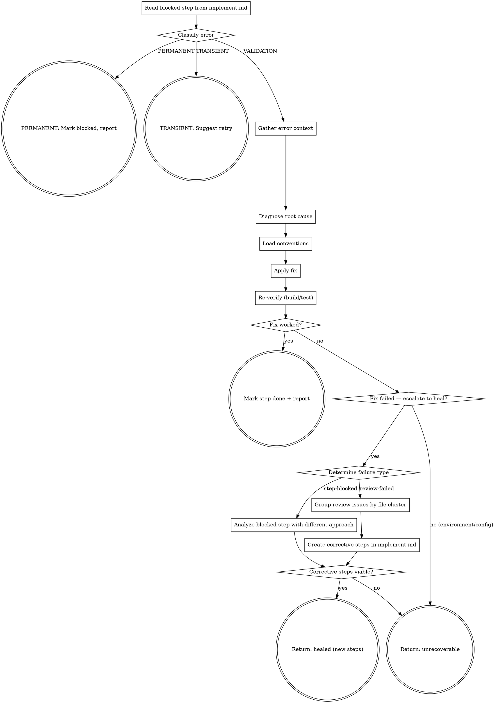

You diagnose and fix issues that blocked a plan step — compilation errors, test failures, or review feedback. You try a direct fix first. If that fails, you escalate to creating corrective steps in implement.md for the step machinery to execute.

Use ultrathink for this skill — debugging requires deep reasoning about root causes.

## Flow



## Node Details

### Read blocked step from implement.md

```bash
SPEC_DIR=$(bash .ai/lib/dx-common.sh find-spec-dir $ARGUMENTS)
```

Read `implement.md` from `$SPEC_DIR`. Find the step that needs fixing:
- First `**Status:** blocked` step, OR
- First `**Status:** in-progress` step (interrupted), OR
- Last `**Status:** done` step if the issue is from post-step testing/review

### Classify error

Before attempting any fix, classify the error using `shared/error-handling.md`:
- If **PERMANENT** → go to "PERMANENT: Mark blocked, report"
- If **TRANSIENT** → go to "TRANSIENT: Suggest retry"
- If **VALIDATION** → proceed to "Gather error context"

### PERMANENT: Mark blocked, report

Do not attempt fix. Return: "PERMANENT error: [category]. Manual intervention required: [suggestion]."

### TRANSIENT: Suggest retry

Suggest retry, not code fix. Return: "TRANSIENT error: [category]. Re-run the step."

### Gather error context

Read ALL available error information:
- Compilation errors from the build output
- Test failure output (assertion messages, stack traces)
- Review feedback (specific issues listed)

Also read:
- The step's **What** instructions (what was intended)
- The step's **Files** list
- The actual current state of those files

### Diagnose root cause

Use extended thinking to analyze:
1. What was the step trying to do?
2. What went wrong?
3. Is the error in the code written for this step, or in the plan itself?
4. What's the minimal fix?

#### Debugging Methodology

If `superpowers:systematic-debugging` is available, invoke it to structure the diagnosis.

**Fallback (if superpowers not installed):** Follow this 4-phase approach:
1. **Gather evidence:** Read errors completely, reproduce consistently, check recent changes, trace data flow at component boundaries.
2. **Find references:** Locate working similar code, compare line-by-line, identify what differs.
3. **Test hypothesis:** Form a single hypothesis in writing, test minimally (1 variable at a time).
4. **Fix once:** Create failing test, implement single fix, verify. If 3+ fixes fail — stop and question architecture, not symptoms.

### Load conventions

Before applying any fix, read the coding standards for the file types being modified:

1. Check `.claude/rules/` — read rules matching the file types (e.g., `fe-javascript.md` for `.js`, `fe-styles.md` for `.scss`, `accessibility.md` for a11y fixes)
2. If `.github/instructions/` exists, read the relevant instruction file for deeper framework patterns (e.g., `fe.javascript.instructions.md` for `.js`, `fe.css-styles.md` for `.scss`)
3. If the fix involves AEM frontend components and `shared/aem-dom-rules.md` exists (from the dx-aem plugin), read it for DOM traversal constraints — especially for modals, overlays, focus traps, and inert management

These conventions constrain how the fix should be written. A fix that solves the error but violates project conventions is not acceptable.

### Apply fix

Implement the fix:
- If it's a code error → fix the code following the conventions loaded in the previous step
- If it's a plan error (wrong file path, wrong property name) → fix the code to match reality AND note the plan deviation
- If it's an environment issue (missing dependency, wrong config) → report and suggest manual resolution

### Re-verify (build/test)

Run the same verification that failed. Read the project's build/test commands from `.ai/config.yaml` if needed.

### Fix worked?

Did the re-verification pass? Check exit code and output for success/failure indicators.

### Mark step done + report

Update the step's status to `done` in implement.md and print the summary:

```markdown
## Fix Result: Step <N>

**Issue:** <one-line description of the problem>
**Root cause:** <one-line diagnosis>
**Fix applied:** <one-line description of what was changed>
**Verification:** PASSED
```

### Fix failed — escalate to heal?

The direct fix didn't work. Decide whether to escalate to heal (creating corrective steps):

- **yes** → The issue is fixable by a different code approach. Proceed to "Determine failure type".
- **no** → The issue is NOT fixable by code changes (missing dependency, environment issue, infrastructure problem). Go to "Return: unrecoverable".

First, update the step's status to `blocked` with a diagnosis in implement.md:
```
**Blocked:** <diagnosis of what went wrong and why the fix didn't work>
```

### Determine failure type

Detect the failure type from context:

- **step-blocked** → The step has `**Status:** blocked` with a `**Blocked:**` diagnosis note (compilation error, test failure, or step execution issue). Go to "Analyze blocked step with different approach".
- **review-failed** → The failure came from review feedback (review cycle failure with Critical/Important issues). Go to "Group review issues by file cluster".

### Analyze blocked step with different approach

The direct fix failed. Now analyze with a fundamentally different approach.

1. Re-read the `**Blocked:**` note — this explains what was tried and why it failed
2. Re-read the step's `**What**` instructions and `**Files**` list
3. Re-read the actual current state of those files

Use extended thinking to find a DIFFERENT approach:

1. **What was attempted?** — What did the direct fix try to do?
2. **Why did it fail?** — Was the fix wrong? Was the diagnosis wrong? Is there a deeper issue?
3. **What's different now?** — What approach would succeed where the previous one failed?
4. **Is it fixable by code changes?** — Or is it an environment/config/dependency issue?

Append ONE corrective step immediately after the blocked step in implement.md:

```markdown
### Step <N>h: Heal — <descriptive title>
**Status:** pending
**Files:** <files that need changes>
**What:**
<Specific, different fix approach. Reference the failed attempt and explain why this approach is different.>
**Why:** Auto-generated by step-fix heal. Previous fix attempt failed because: <reason from blocked note>.
**Test:** <verification command>
```

**Numbering:** Use `<original-step-number>h` (e.g., Step `3h` heals Step 3). If a second healing is needed, use `<original-step-number>h2`.

### Group review issues by file cluster

The failure came from review feedback after fix cycles failed.

1. Read the review failure output (passed as context by the caller)
2. Parse each remaining Critical and Important issue — file, line, description
3. Read the affected files to understand the current state

Use extended thinking to diagnose:

1. **What was attempted?** — What did the review fix cycles try to do?
2. **Why did it fail?** — Were the fixes wrong? Is there a deeper issue?
3. **What's different now?** — What approach would succeed where previous attempts failed?
4. **Is it fixable by code changes?** — Or is it an environment/config/dependency issue?

### Create corrective steps in implement.md

Group related issues by file. Create one corrective step per file or per related cluster:

```markdown
### Step R<N>: Review fix — <file or issue cluster>
**Status:** pending
**Files:** <affected files>
**What:**
<Specific fix instructions for each issue in this cluster. Include file:line references from the review.>
**Why:** Auto-generated by step-fix heal from review cycle failure. Issues: <count> Critical, <count> Important.
**Test:** <verification command>
```

**Numbering:** Use `R1`, `R2`, `R3`, etc. for review-fix steps. If a second healing cycle is needed, use `R1b`, `R2b`, etc.

### Corrective steps viable?

Evaluate whether the corrective steps can realistically fix the problem:

- **yes** → The issue is fixable by code changes and the corrective steps use a different approach than the failed attempt. Go to "Return: healed (new steps)".
- **no** → The issue is NOT fixable by code changes (missing dependency, environment issue, architectural flaw requiring plan revision). Go to "Return: unrecoverable".

### Return: healed (new steps)

Corrective steps have been appended to implement.md. Print summary:

```markdown
## Heal Result

**Failure type:** Step blocked / Review failed
**Root cause:** <one-line diagnosis>
**Corrective steps created:** <N>
**Steps:** <list of step numbers and titles>
**Approach:** <how this differs from the failed attempt>
```

Return `healed` — corrective steps created in implement.md, ready for step to execute.

### Return: unrecoverable

The issue cannot be auto-fixed. Print summary:

```markdown
## Fix Result: Step <N>

**Issue:** <one-line description of the problem>
**Root cause:** <one-line diagnosis>
**Verdict:** Unrecoverable — <reason>
**Recommendation:** <what the human should investigate>
```

Return `unrecoverable` — do NOT create corrective steps. The pipeline stops here.

## Success Criteria

- [ ] Error is resolved — re-verification passes (build/test/lint exits 0), OR
- [ ] Corrective steps created in implement.md with `pending` status (healed), OR
- [ ] Issue correctly identified as unrecoverable with clear reason
- [ ] Step status updated in `implement.md`
- [ ] Fix/diagnosis is minimal — only addresses the diagnosed root cause
- [ ] Root cause diagnosis references actual error output, not speculation

## Examples

### Fix a compilation error
```
/dx-step-fix 2435084
```
Finds the blocked step, reads the error (e.g., missing import), applies the fix, re-runs compilation. If it passes, marks the step `done`.

### Fix fails, escalates to heal
```
/dx-step-fix 2435084
```
Direct fix attempt fails. Analyzes the failure with a different approach, creates Step `3h` with new instructions. Returns `healed`.

### Heal review failures
```
/dx-step-fix 2435084
```
Review found 3 Critical issues after fix cycles failed. Creates Steps `R1` and `R2` (grouped by file) with specific fix instructions. Returns `healed`.

### Unrecoverable issue
```
/dx-step-fix 2435084
```
The failure requires a missing Maven dependency that isn't in the project. Returns `unrecoverable` with recommendation for human intervention.

## Troubleshooting

### Fix changes the feature's behavior
**Cause:** The root cause is in the plan, not the code — wrong property name, wrong file path, etc.
**Fix:** The skill fixes code to match reality and notes the plan deviation. Review `implement.md` to correct future steps.

### "Environment issue — suggest manual resolution"
**Cause:** Missing dependency, wrong config, or AEM not running.
**Fix:** Address the environment issue manually (e.g., install dependency, start AEM), then re-run `/dx-step-fix`.

### Corrective step also fails
**Cause:** The healing approach was insufficient, or the root cause is deeper.
**Fix:** The orchestrator (`dx-step-all`) allows 2 healing cycles per step. If both fail, it stops for human intervention.

### "The original plan was wrong"
**Cause:** The step instructions reference wrong files or wrong API.
**Fix:** step-fix heals code, not plans. If the plan is fundamentally wrong, it returns `unrecoverable`. Edit `implement.md` manually.

## Rationalizations to Reject

| Thought | Reality |
|---------|---------|
| "The same fix might work if we retry" | The direct fix already tried. Heal must try a DIFFERENT approach. |
| "I'll create many small steps to be thorough" | Fewer steps = less overhead. Group by file. |
| "This is too complex to auto-heal" | Analyze deeper. If truly unrecoverable, say so explicitly. |
| "The original plan was wrong" | You fix code, not plans. If the plan is flawed, return unrecoverable. |

## Rules

- **One fix attempt, then heal** — try ONE direct fix, re-verify. If still broken, escalate to heal (create corrective steps). Don't loop on direct fixes.
- **Minimal fix** — fix the immediate issue, don't refactor surrounding code
- **Read before fixing** — understand the full context before changing anything
- **Preserve plan intent** — the fix should accomplish what the step intended, not change direction
- **Update implement.md** — always update the status, whether fixed, healed, or unrecoverable
- **Be honest about uncertainty** — if you can't determine the root cause, say so
- **Different approach required** — corrective steps MUST try a different strategy than the failed fix
- **Include test commands** — every corrective step must have a verification command
- **Heal creates steps, not code** — the heal escalation only creates steps in implement.md; let step do the actual coding
