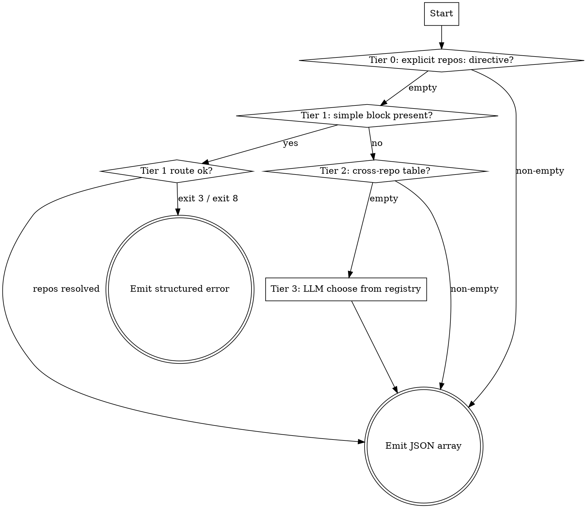

# dx-discover-repos

Resolve the set of repos a work item touches and emit a structured JSON array
the KAI-HUB router uses to fan a worker pipeline out — one run per repo.

This skill is the multi-repo brain of the hub model. Single-repo projects never
call it: their worker fires directly via its own webhook (dual-mode workers).

## Inputs

| Input | Source | Notes |
|-------|--------|-------|
| `workItemId` | skill argument | the ticket being routed |
| trigger-comment text | `.ai/run-context/trigger-comment.txt` if present, else fetch from the work item | the human comment that fired the hook (after `@kai-<agent>`) |
| repo registry | `$DX_REPOS_REGISTRY` (default `.ai/automation/registries/repos.json`) | alias → metadata; see `dx-hub/shared/registry-format.md` |

## Output (StructuredOutput)

A JSON array, constrained to known registry aliases — **never invent repos**:

```json
[
  { "alias": "brand-one", "repoId": "…", "adoProject": "Example Project",
    "cloneUrl": "https://…/_git/brand-one", "branch": "development",
    "reason": "explicit 'repos:' directive in trigger comment" }
]
```

On ambiguity or no match the skill emits a structured error object instead of an
array, which the hub turns into a clarification comment on the work item:

```json
{ "error": "ambiguous", "code": 3, "message": "project spans 2 platforms — add 'platform:' …" }
{ "error": "no-match", "code": 8, "message": "no candidate repo matched platform=… scope=… brand=…" }
```

## The cascade

First non-empty tier wins. Tiers 0–2 are deterministic (fully testable offline);
tier 3 is the LLM fallback, constrained to registry aliases.



## Node Details

### Tier 0: explicit repos: directive?

Run `scripts/parse-explicit-repos.sh <comment-file> $DX_REPOS_REGISTRY`. It reads
a `repos: a, b` directive a human typed after the `@kai-<agent>` tag and maps
each alias to its registry entry. Deterministic, no LLM. Unknown aliases are
skipped with a warning. A non-empty array wins the cascade immediately.

### Tier 1: simple block present?

If the story has a ` ```simple ` block, this is a `/dx-simple` ticket — route by
its declared platform/brand/scope:

1. `dx-simple/scripts/parse-simple-block.sh <raw-story.md> /tmp/block.yaml`
   (resolve via `$PLUGIN_BASE_DIR/dx-core/skills/dx-simple/scripts/…` in the
   pipeline; the worker keeps this script — only the routing brain moved here).
2. **Bridge:** synthesize a `config.yaml`-shaped `repos:` block from the registry
   so `route-targets.sh` (which reads YAML via `repos_table`, not JSON) can
   consume it. `repos.json` stays the single source of truth:

   ```bash
   jq -r '"repos:", (to_entries[] | "  - name: \(.key)\n    role: \(.value.role)" +
          (if .value.platform then "\n    platform: \(.value.platform)" else "" end) +
          (if .value.brand then "\n    brand: \(.value.brand)" else "" end) +
          (if .value.adoProject then "\n    ado-project: \(.value.adoProject)" else "" end))' \
     "$DX_REPOS_REGISTRY" > /tmp/discover-repos.yaml
   ```

3. Build a reachability map (every alias → placeholder id; the real worker id
   comes from `agents.json` at queue time, so the value is a filter-only stub):

   ```bash
   MAP=$(jq -c 'to_entries | map({(.key): "x"}) | add' "$DX_REPOS_REGISTRY")
   ```

4. `scripts/route-targets.sh /tmp/block.yaml /tmp/discover-repos.yaml "$MAP"`.
   - exit 0 → map the emitted `.repo` aliases back to full registry entries and
     emit the JSON array.
   - **exit 3** (ambiguous — missing platform/brand) → emit the `ambiguous`
     structured error with the script's stderr message.
   - **exit 8** (no candidate matched) → emit the `no-match` structured error.

### Tier 1 route ok?

Branch on route-targets' exit code (handled above). Errors stop the cascade —
do not fall through to tier 2/3; the hub needs the human to clarify.

### Tier 2: cross-repo table?

Run `scripts/parse-crossrepo-table.sh <triage.md|research.md> $DX_REPOS_REGISTRY`.
It extracts repo aliases from the `## Cross-Repo Scope` markdown table that
triage/research emit (see `dx-core/shared/repo-discovery.md`). Non-matching rows
are skipped. A non-empty array wins.

### Tier 3: LLM choose from registry

Only if every deterministic tier was empty. Read the work item title +
description and choose the touched repos **from the registry aliases only**.
List the available aliases (`jq -r 'keys[]' $DX_REPOS_REGISTRY`) and pick the
subset the change clearly touches. Never emit an alias not in the registry. If
nothing clearly matches, emit the `no-match` structured error rather than
guessing.

### Emit JSON array

Each entry must carry `alias, repoId, adoProject, cloneUrl, branch, reason`.
Write to the run-context output file the hub reads, and return it as the
StructuredOutput result.

### Emit structured error

`{ error, code, message }`. The hub posts the message to the work item as a
clarification comment and queues nothing.
